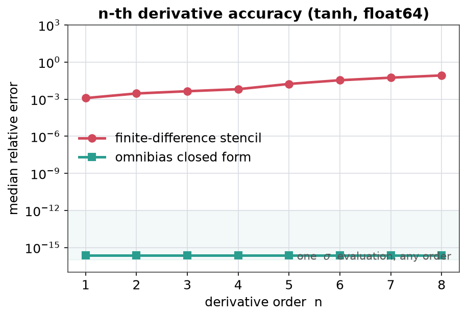
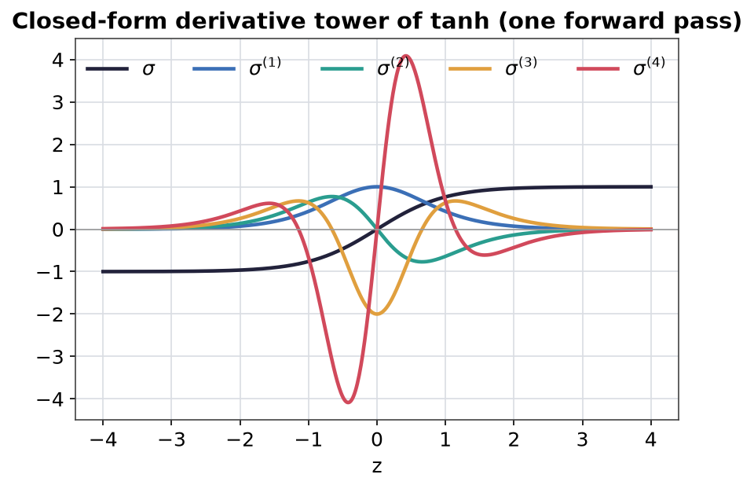
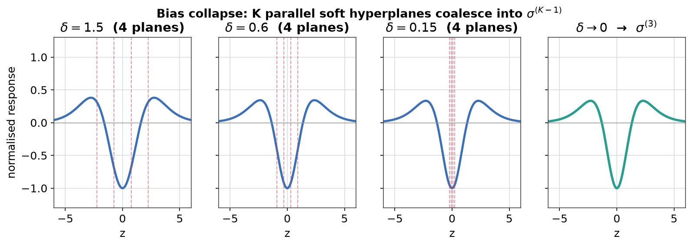
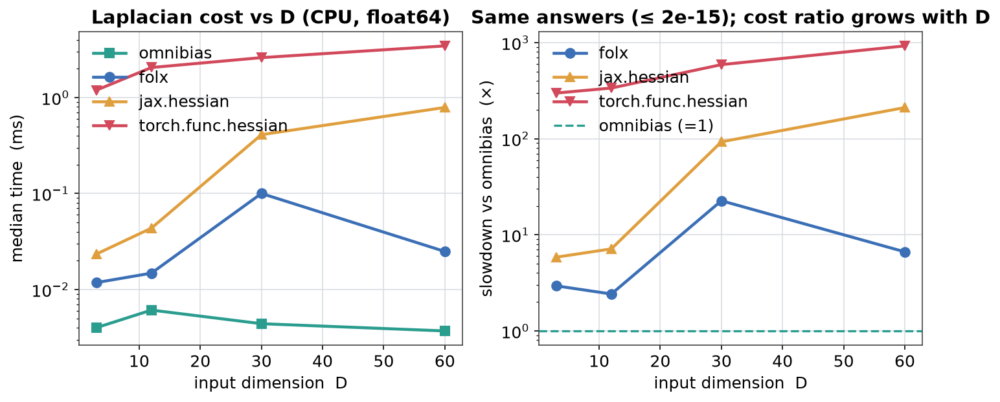
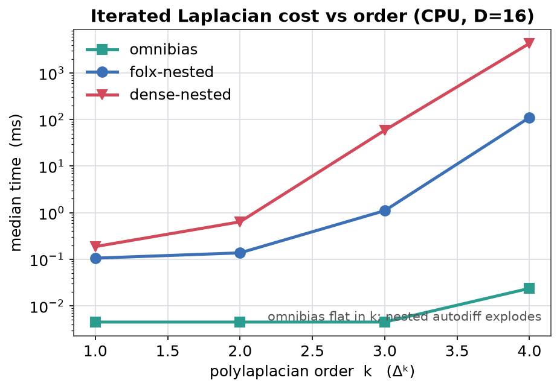
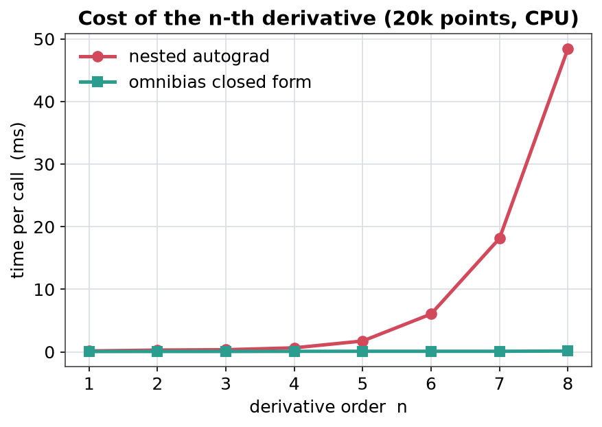
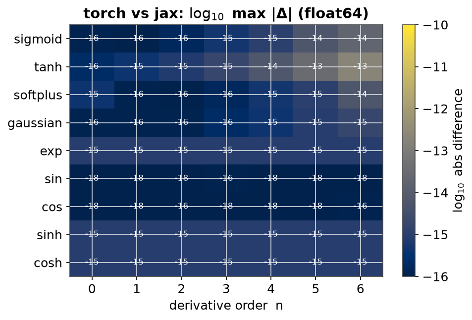
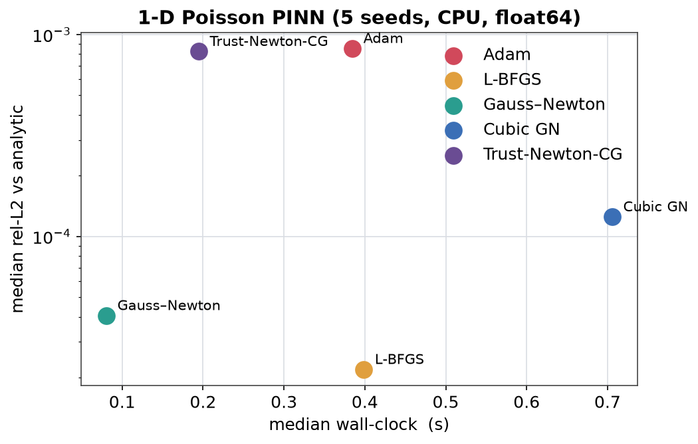
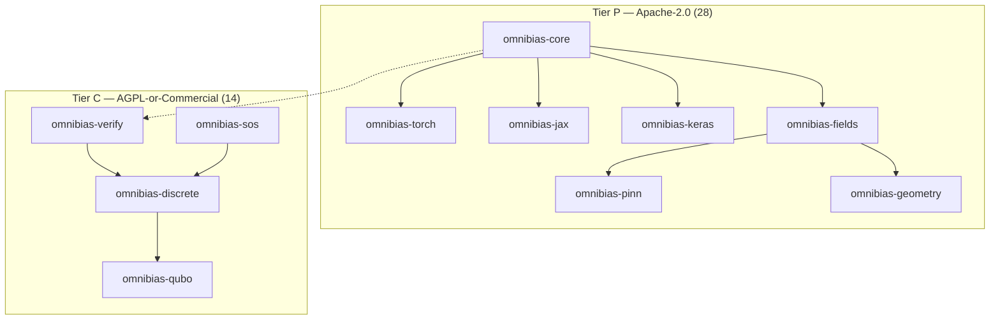

# omnibias

[](https://github.com/derivon-ai/omnibias/actions/workflows/ci.yml)
[](https://omnibias.ai/)
[](https://derivon.ai/)
[](LICENSES/Apache-2.0.txt)
[](LICENSING.md)
[](pyproject.toml)
[](https://pypi.org/search/?q=omnibias)

> **Closed-form n-th derivatives of activations — bit-identical on PyTorch, JAX, and Keras 3.**

omnibias computes `σ^(n)(z)` — the *n*-th derivative of a base activation — in
**one forward pass**, for arbitrary `n`, at float64 machine precision. Nested
autodiff grows exponentially in cost and accumulates round-off; finite
differences lose roughly *n* digits by the *n*-th derivative. The same
polynomial coefficients ship from a pure-Python core, so every backend is
**bit-identical by construction**.

<p align="center">
  
  
</p>

**Left:** finite differences fall off a cliff; the closed form stays at machine
epsilon. **Right:** the entire derivative tower of `tanh` from a single forward
pass.

---

## The idea: bias collapse

Trainable *K* soft decision planes, spaced by a bias gap `δ`. As `δ → 0` they
coalesce into a **single** hyperplane whose response is exactly
`σ^(K−1)` — the founding limit of the library. (A different limit,
`β → ∞` temperature collapse, hardens soft gates to 0/1 decisions; the two
must never be conflated.)

<p align="center">
  
</p>

That identity is why omnibias can expose six typed `OperatorBlock` roles —
`identity | grad | laplacian | derivative | band | integral` — with the
**integral** role the closed-form antiderivative window
`S(z+b_hi)−S(z+b_lo)` (`S′ = σ`), the slab between two parallel planes.
See [`docs/theory.md`](docs/theory.md) and
[`docs/operator-surface.md`](docs/operator-surface.md).

---

## Measured performance (CPU, reproducible)

Every number in this section comes from a committed JSON artifact under
[`docs/benchmarks/`](docs/benchmarks/), produced by scripts in
[`benchmarks/`](benchmarks/). Regenerate on any commodity CPU:

```bash
uv run python benchmarks/laplacian_scaling.py
uv run python benchmarks/polylaplacian_order.py
uv run python benchmarks/derivative_order.py
uv run python benchmarks/optimizer_pinn.py
uv run python docs/img/generate_figures.py
```

### Laplacian vs folx / JAX / PyTorch

One-layer field `f(x) = c · tanh(Wx + β)` on a batch of 64 points,
`H = 32`, float64, CPU. Absolute omnibias time stays ~**0.004 ms** while `D`
grows; nested dense Hessians do not.

| `D` | omnibias | folx | `jax.hessian` | `torch.func.hessian` | max ‖Δ‖ vs `jax.hessian` |
|---|---:|---:|---:|---:|---:|
| 3 | 0.004 ms | 2.9× | 5.9× | 298× | 2×10⁻¹⁶ |
| 12 | 0.006 ms | 2.4× | 7.1× | 336× | 4×10⁻¹⁶ |
| 30 | 0.004 ms | 23× | 93× | 589× | 1×10⁻¹⁵ |
| **60** | **0.004 ms** | **6.6×** | **211×** | **923×** | **2×10⁻¹⁵** |

Source: [`docs/benchmarks/laplacian_scaling.json`](docs/benchmarks/laplacian_scaling.json).

<p align="center">
  
</p>

### Iterated Laplacian `Δᵏ` — where nested autodiff collapses

Same field, `D = 16`. Omnibias is flat in order `k`; nesting folx or a dense
Hessian explodes.

| `k` | omnibias | folx-nested | speedup | dense-nested | speedup |
|---|---:|---:|---:|---:|---:|
| 1 | 0.0045 ms | 0.106 ms | 24× | 0.19 ms | 42× |
| 2 | 0.0045 ms | 0.138 ms | 31× | 0.64 ms | 142× |
| 3 | 0.0045 ms | 1.11 ms | **246×** | 59 ms | **13,100×** |
| **4** | **0.024 ms** | **111 ms** | **4,660×** | **4315 ms** | **181,000×** |

Agreement with the dense nested Hessian: `≤ 4×10⁻¹³` at `k=3`,
`≤ 8×10⁻¹¹` at `k=4`. Source:
[`docs/benchmarks/polylaplacian_order.json`](docs/benchmarks/polylaplacian_order.json).

<p align="center">
  
</p>

### `σ^(n)` cost vs nested autograd

20k points, tanh, float64. Closed-form stays ~0.1 ms; nested autograd grows
to **48 ms at order 8** (~350×). Torch and JAX agree to float64 ULP.
Source: [`docs/benchmarks/derivative_order.json`](docs/benchmarks/derivative_order.json).

<p align="center">
  
  
</p>

### Off-band GPU tier (labelled, not required for the claims above)

On a data-center GPU (`H=256`, `B=4096`, `D=240`) the same Laplacian is
**68× / 199×** faster than `jax.hessian` / `torch.func.hessian` and uses
**63× / 108×** less memory; polylaplacian `Δ³` is **518×** faster than
folx-nested (which OOMs at `Δ⁴`). Full tables:
[`docs/complexity.md`](docs/complexity.md). These GPU numbers are transcribed
off-band; the **CPU tables above are the ones you can re-run**.

---

## Second-order optimizers

`omnibias.torch.optim` ships **exact-curvature** drop-in `torch.optim.Optimizer`
subclasses — CubicNewton, CubicGaussNewton, TrustRegionNewtonCG,
JetSubspaceTensor, NaturalGradient, DiagonalCurvature, FrugalCurvature, KFAC,
JetLBFGS, ConformalSymplectic, StochasticNewtonCG — plus functional
Gauss–Newton / ARC cores. The residual of a PINN is built from closed-form
`σ^(n)`, so the Gauss–Newton / Hessian products are autodiff-exact over a
smooth operator: no nested finite-difference blow-up, no learning rate to
tune on the ARC methods.

### 1-D Poisson bake-off (this repo, 5 seeds)

| Method | median rel-L2 | median wall |
|---|---:|---:|
| Adam (800 steps) | 8.5×10⁻⁴ | 0.38 s |
| L-BFGS | 2.2×10⁻⁵ | 0.40 s |
| **Gauss–Newton (QR + Nielsen)** | **4.1×10⁻⁵** | **0.08 s** |
| Cubic Gauss–Newton | 1.2×10⁻⁴ | 0.71 s |
| Trust-region Newton-CG | 8.2×10⁻⁴ | 0.19 s |

On this smooth 1-D problem L-BFGS matches Gauss–Newton on accuracy;
**Gauss–Newton is ~5× faster**. Source:
[`docs/benchmarks/optimizer_pinn.json`](docs/benchmarks/optimizer_pinn.json).

<p align="center">
  
</p>

### Where curvature wins harder — and where Adam still wins

On six PDE PINNs (CPU, 5 seeds; see [`docs/benchmarks.md`](docs/benchmarks.md)),
`cubic_gauss_newton` reaches **1.5×10⁻⁸** rel-L2 on 1-D Poisson vs Adam's
**1.5×10⁻⁵**, and wins every PDE in that table. Inverse coefficient recovery:
**0.02%** error vs L-BFGS **17%**.

**Honest negatives** (same page): on data-only FNO Burgers and GPT-2
iso-wall-clock, a tuned Adam/AdamW still wins. Exact full-Hessian methods are
for PINNs, operator learning with physics residuals, and small/medium smooth
objectives — not a universal Adam replacement at LLM scale. That honesty is
the point.

---

## Packages (42)



**Invariant, enforced in CI:** no Apache package may depend on an AGPL package.
A permissive install can never pull copyleft code into your tree.

### Curated public core

| Package | One-liner |
|---|---|
| [`omnibias-core`](packages/omnibias-core) | Pure-Python Eulerian / Legendre / Hermite coefficients + `ActivationSpec`. No torch/jax. |
| [`omnibias-torch`](packages/omnibias-torch) | PyTorch: OMBU, OperatorBlock, jets, exact-curvature optimizers. |
| [`omnibias-jax`](packages/omnibias-jax) | JAX: closed-form Laplacian / Hessian / polylaplacian, jet kernels. |
| [`omnibias-ferminet`](packages/omnibias-ferminet) | FermiNet / DeepQMC bridge: folx-compatible local kinetic energy. |
| [`omnibias-fields`](packages/omnibias-fields) | Field substrate: `FieldState`, grad / div / curl / lap / hess / jacobian. |
| [`omnibias-pinn`](packages/omnibias-pinn) | Physics-informed NNs, hard-conservation cages, mesh-free PDE solver. |
| [`omnibias-geometry`](packages/omnibias-geometry) | Riemannian geometry + exterior calculus; gauge theory submodule. |
| [`omnibias-keras`](packages/omnibias-keras) | Keras 3 unified backend (TF / JAX / torch). |

### Physics, fields & calculus

| Package | One-liner |
|---|---|
| [`omnibias-qpinn`](packages/omnibias-qpinn) | Quantum PINNs: Schrödinger / Gross–Pitaevskii / Dirac cages. |
| [`omnibias-fractional`](packages/omnibias-fractional) | Fractional calculus (GL / RL / Caputo / spectral) — grid-based, not closed form. |
| [`omnibias-measure`](packages/omnibias-measure) | Autograd-native measure integration and layer-cake primitives. |
| [`omnibias-score`](packages/omnibias-score) | Score / SDE: score, Itô generator, Fokker–Planck (+ CNF flow submodule). |
| [`omnibias-variational`](packages/omnibias-variational) | Least-action / Euler–Lagrange / Noether / symplectic integrators. |
| [`omnibias-difference`](packages/omnibias-difference) | Founding `δ→0` register: certified FD → derivative, umbral calculus. |
| [`omnibias-qcalculus`](packages/omnibias-qcalculus) | q-calculus; `q→1` recovers the ordinary tower. |
| [`omnibias-timescale`](packages/omnibias-timescale) | Hilger time-scale calculus unifying continuous and discrete. |
| [`omnibias-holonomic`](packages/omnibias-holonomic) | D-finite / Ore algebra, Gosper, creative telescoping. |
| [`omnibias-curvature`](packages/omnibias-curvature) | Closed-form Fisher / Hessian / ExactSAM sharpness-aware training. |
| [`omnibias-symbolic`](packages/omnibias-symbolic) | Neural-jet equation discovery (library-free SINDy). |

### Differentiable + certified decision layer *(Tier C)*

| Package | One-liner |
|---|---|
| [`omnibias-verify`](packages/omnibias-verify) | Certified NN verification: Taylor-model bounds, robustness, Lipschitz. |
| [`omnibias-dynamics`](packages/omnibias-dynamics) | Validated dynamics: QR-Lohner, Poincaré, certified Lyapunov. |
| [`omnibias-sos`](packages/omnibias-sos) | Sum-of-Squares / Positivstellensatz with interval LDLᵀ certificates. |
| [`omnibias-formal`](packages/omnibias-formal) | Mathlib-backed formal checker (`mathlib_verified` tier). |
| [`omnibias-discrete`](packages/omnibias-discrete) | Discrete-opt substrate: anneal, round, certify gap. |
| [`omnibias-qubo`](packages/omnibias-qubo) | Differentiable + certified QUBO / Ising / max-cut. |
| [`omnibias-submodular`](packages/omnibias-submodular) | Multilinear extension, continuous greedy, (1−1/e) certificates. |
| [`omnibias-combinatorics`](packages/omnibias-combinatorics) | Matching / flow / matroid layers with LP-dual gap certificates. |
| [`omnibias-nphard`](packages/omnibias-nphard) | Named NP-hard families (QAP / GAP / scheduling) with honest gaps. |
| [`omnibias-routing`](packages/omnibias-routing) | Certified TSP relaxation + Neumaier–Shcherbina LP gap. |
| [`omnibias-convex`](packages/omnibias-convex) | Differentiable LP / QP with verified optimality enclosures. |
| [`omnibias-logic`](packages/omnibias-logic) | Weighted MaxSAT / #SAT with count enclosures. |
| [`omnibias-control`](packages/omnibias-control) | CBF-QP safety filter + recoverable-set certificate. |
| [`omnibias-tab`](packages/omnibias-tab) | Soft decision-tree ensembles; certified; vs LightGBM. |

### Learning primitives & tooling

| Package | One-liner |
|---|---|
| [`omnibias-binary`](packages/omnibias-binary) | Binary / ternary / k-bit quantization with closed-form tanh-β backward. |
| [`omnibias-boolean`](packages/omnibias-boolean) | Differentiable Boolean algebra, ANF / Walsh spectra. |
| [`omnibias-spiking`](packages/omnibias-spiking) | LIF / IF neurons with closed-form surrogate gradients. |
| [`omnibias-hopfield`](packages/omnibias-hopfield) | Modern Hopfield / attention with closed-form LSE Jacobian / Hessian. |
| [`omnibias-struct`](packages/omnibias-struct) | Soft Viterbi / CTC / CKY; logsumexp_β differentiated by the softplus tower. |
| [`omnibias-graph`](packages/omnibias-graph) | Spectral graph ops + Gumbel-Sinkhorn / SoftSort. |
| [`omnibias-partition`](packages/omnibias-partition) | Soft partition-of-unity keystone (`β→∞` hardens). |
| [`omnibias-shape`](packages/omnibias-shape) | Soft occupancy / coverage fields. |
| [`omnibias-skills`](packages/omnibias-skills) | Consumer agent-skill library + installer CLI. |

Full version / maturity matrix: [`docs/packages.md`](docs/packages.md).

---

## Install

```bash
pip install omnibias-torch                 # most common: PyTorch users
pip install omnibias-jax                   # JAX-only users
pip install omnibias-ferminet              # FermiNet bridge (pulls jax + core)
pip install omnibias-core                  # pure math, no backend
pip install "omnibias-pinn[torch]"         # PINN extension
pip install "omnibias-keras[jax]"          # Keras 3 unified backend
```

> **Release-candidate phase.** Distributions are staged on
> [TestPyPI](https://test.pypi.org/) ahead of the tagged `0.4.0` PyPI upload.
> Until then:
>
> ```bash
> pip install --index-url https://test.pypi.org/simple/ \
>   --extra-index-url https://pypi.org/simple/ omnibias-torch
> ```

Development checkout:

```bash
git clone https://github.com/derivon-ai/omnibias && cd omnibias
uv sync --all-extras --dev
```

## 30-second tour

```python
import torch
from omnibias.torch import OMBU, OperatorBlock, cmbLinear

ombu = OMBU(num_channels=4, K=2, base="tanh")
out = ombu(torch.zeros(8, 4))

# Six roles: identity | grad | laplacian | derivative | band | integral
lap = OperatorBlock(channels=8, op="laplacian", base="gaussian")
fc = cmbLinear(in_features=128, out_features=64, op="identity", base="tanh")
```

```python
import jax.numpy as jnp
from omnibias.jax import get_activation, neural_field_value_grad_hessian

spec = get_activation("tanh")
print(spec.fastpath(jnp.array([0.5]), 3))  # 3rd derivative, closed form

H, D = 16, 3
val, grad, hess = neural_field_value_grad_hessian(
    jnp.zeros(D), jnp.ones((H, D)) * 0.1, jnp.zeros(H), jnp.ones(H) / H, 0.0, "tanh"
)
```

```python
from omnibias.torch.optim import CubicGaussNewton, TrustRegionNewtonCG, KFAC
# Drop-in torch.optim.Optimizer subclasses — exact curvature, matrix-free.
```

## Notebooks & docs

- Runnable gallery: [`notebooks/`](notebooks/) (23 walkthroughs)
- Docs site: <https://omnibias.ai/>
- Company & platform: <https://derivon.ai/>
- Theory primer: [`docs/theory.md`](docs/theory.md)
- Operator surface (canonical capability matrix): [`docs/operator-surface.md`](docs/operator-surface.md)
- Scope & guarantees (what is closed-form vs autodiff vs numerical): [`docs/scope-and-guarantees.md`](docs/scope-and-guarantees.md)
- Complexity derivation: [`docs/complexity.md`](docs/complexity.md)
- Cookbook: [`docs/cookbook/`](docs/cookbook/)
- Discovery handbook: [`docs/handbook/`](docs/handbook/)

Cross-backend parity: **509** tests passed in `tests/` on every release
(float64 ULP agreement torch ↔ jax ↔ keras).

## Licensing

**Two tiers** — see [`LICENSING.md`](LICENSING.md):

- **Tier P — [Apache-2.0](LICENSES/Apache-2.0.txt) (28 packages).** Derivative
  tower and its consumers. Use in closed-source or hosted products with **no**
  copyleft obligation. **You never need a commercial licence for these.**
- **Tier C — AGPL-3.0-or-later OR commercial (14 packages).** Certified-decision
  layer (`verify`, `sos`, `discrete`, `qubo`, …). Free under the AGPL (including
  §13 network use); a [commercial licence](COMMERCIAL-LICENSE.md) removes those
  obligations — email **<info@derivon.ai>**.

## Contact

omnibias is built and maintained by **[Derivon](https://derivon.ai)**, which
holds the copyright. How decisions get made, and who can make them, is written
down in [`GOVERNANCE.md`](GOVERNANCE.md) and [`MAINTAINERS.md`](MAINTAINERS.md).

| Topic | Contact |
|---|---|
| Commercial licence, support, legal | <info@derivon.ai> |
| Technical questions, partnerships | <info@derivon.ai> |
| Security | [`SECURITY.md`](SECURITY.md) |
| Questions | [GitHub Discussions](https://github.com/derivon-ai/omnibias/discussions) |
| Bugs | [GitHub Issues](https://github.com/derivon-ai/omnibias/issues) |

Contributions welcome under the [CLA](docs/CLA.md) (you keep copyright; Derivon
gets a perpetual licence to ship under Apache, AGPL, and commercial terms).
See [`CONTRIBUTING.md`](CONTRIBUTING.md) and the [Code of Conduct](CODE_OF_CONDUCT.md).

## Citation

```bibtex
@software{omnibias,
  title   = {omnibias: closed-form n-th derivatives of activations},
  author  = {Grigoryants, Vardan},
  year    = {2026},
  version = {0.4.0},
  url     = {https://github.com/derivon-ai/omnibias}
}
```

GitHub's "Cite this repository" button reads [`CITATION.cff`](CITATION.cff).
A Zenodo DOI will be added on the first tagged release.

## Star history

<a href="https://star-history.com/#derivon-ai/omnibias&Date">
  
</a>
