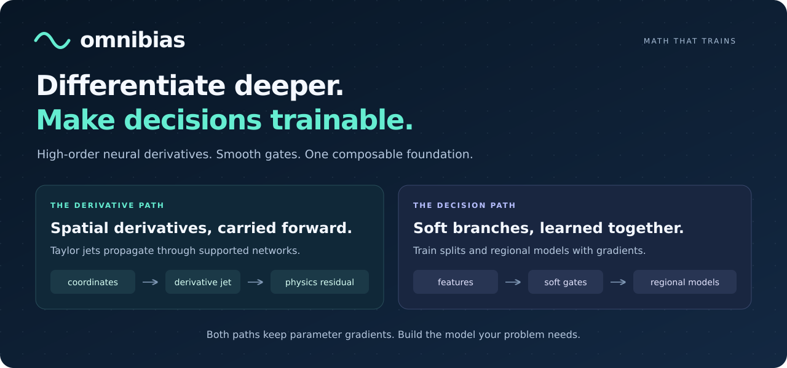
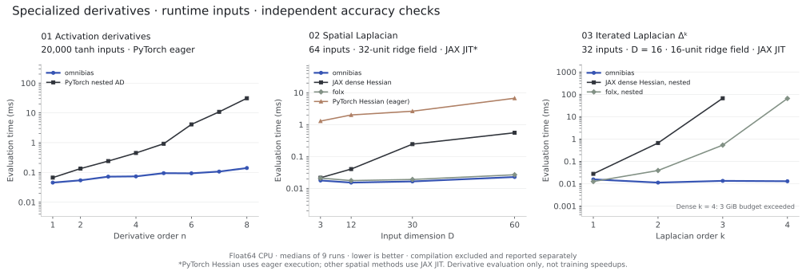

# omnibias

<picture>
  <source media="(max-width: 600px)" srcset="docs/img/omnibias-hero-mobile.svg">
  
</picture>

[](https://github.com/derivon-ai/omnibias/actions/workflows/ci.yml)
[](https://omnibias.ai/)
[](https://pypi.org/project/omnibias-torch/)
[](LICENSING.md)
[](COMMERCIAL-LICENSE.md)

**High-order derivatives without nested spatial autodiff.**

Train physics-informed networks with derivative towers—and extend them with
smooth, trainable decisions.

omnibias turns activation identities into derivative towers, trainable fields
and smooth decisions. It **removes the nested high-order spatial-autodiff
bottleneck for supported models**: derivatives travel forward through the
network, without recursively growing backward graphs. Parameter gradients
remain available for learning. Build high-order physics residuals, regional
models and soft trees on the same mathematical foundation.

**[Start with a PINN →](docs/pinn.md)** ·
**[Choose an API →](docs/derivatives.md)** ·
**[What this unlocks →](docs/capabilities.md)** ·
**[Commercial support →](mailto:info@derivon.ai)**

## Differentiate deeper

Repeated spatial autodiff can make graph construction, memory and evaluation
explode as derivative order rises. That growth can make a
high-order PINN residual impractical before training begins.

omnibias evaluates supported `σ⁽ⁿ⁾(z)` directly, then composes Taylor jets
through the network. Sigmoid and tanh need **one base activation evaluation
plus a derivative polynomial**. Specialized operator contractions avoid
building derivative tensors that the residual never needs. This bypasses the
nested graph bottleneck. High-order numerical instability is checked separately
against independent references: direct formulas can still suffer floating-point
cancellation, and their arithmetic grows with order.

The founding idea is **bias collapse**. A properly weighted, normalized pack
of nearby activations converges to a derivative:

$$
\lim_{\delta\to0}\frac{1}{\delta^n}
\sum_{j=0}^{n}(-1)^{n-j}\binom{n}{j}\sigma(z+j\delta)
=\sigma^{(n)}(z).
$$

The kernels evaluate the analytic limit, avoiding subtraction of nearly equal
samples. Shared polynomial recurrences supply the backends; Taylor composition
supplies the network derivatives. **Forward spatial derivatives. Ordinary
parameter autodiff.**

| Build with | What omnibias provides |
| --- | --- |
| **High-order physics residuals** | Directional jets, mixed partials, specialized Laplacian and repeated-Laplacian paths |
| **Field calculus** | Gradients, divergence, curl, Hessians and reusable field state |
| **Trainable decisions** | Soft partitions, differentiable selection and structured computation |
| **Curvature-aware learning** | Parameter-curvature primitives and optimizers for supported objectives |
| **Scoped numerical guarantees** | Outward-rounded intervals, Taylor models and checker-backed certificates |

PyTorch and JAX provide network jets; Keras 3 provides activation and operator
layers. The [capability map](docs/capabilities.md) connects each mechanism to
its API and evidence.

## Derivative performance, by workload

Activation derivatives, direct Laplacians and general deep-network jets are
different workloads. These specialized paths exploit activation identities
and operator contractions. [Full measurements](docs/performance.md) include
accuracy, compilation, reproduction commands and every baseline.

| Workload | omnibias | Baseline | Speedup |
| --- | ---: | ---: | ---: |
| Activation derivative · `n = 8` | 0.1405 ms | 30.9908 ms · Torch nested autograd | **220×** |
| Laplacian · `D = 60` | 0.0227 ms | 0.5544 ms · JAX dense Hessian | **24.4×** |
| Repeated Laplacian · `Δ³` | 0.0134 ms | 66.4122 ms · JAX dense nested | **4,974×** |
| Repeated Laplacian · `Δ⁴` | 0.0129 ms | 64.8343 ms · folx nested | **5,036×** |



Float64 CPU, nine timed repeats. Activation: 20,000 tanh inputs, Torch eager.
Laplacian: 64 points, 32 hidden units. Repeated Laplacian: 32 points, 16 hidden
units, 16 dimensions. Operator comparisons use JAX JIT with **runtime inputs
and weights**; compilation is recorded separately. All successful methods
pass independent 80-digit accuracy checks at sampled inputs. Dense `Δ⁴` reached
the 3 GiB process budget; no speedup is claimed for that unfinished run.

[Activation data](docs/benchmarks/derivative_order.json) ·
[Laplacian data](docs/benchmarks/laplacian_scaling.json) ·
[Repeated-Laplacian data](docs/benchmarks/polylaplacian_order.json)

The independent deep-MLP comparison remains available in the
[performance guide](docs/performance.md#general-deep-network-jets), including
JAX Taylor-mode AD and cases where it wins.

## High-dimensional physics without a full derivative tensor

The one-layer identity is direct:

$$
\Delta^k f(x) = \sum_h c_h\,\sigma^{(2k)}(w_h\cdot x+\beta_h)\,\lVert w_h\rVert^{2k}.
$$

No dense Hessian or order-`2k` spatial tensor is needed. Deep MLPs use
`deep_field_laplacian` to propagate the Laplacian directly, with **no fixed
input-dimension ceiling** and retained parameter gradients. Both backends
exercise this path at **5,000 dimensions**, beyond the full mixed-jet budget.
For fixed layer widths and depth, work and memory grow linearly with dimension.

In automatic mode, deep repeated Laplacians use exact support enumeration
while it fits the configured budget, then a reported directional estimator. Full
mixed jets still have combinatorial output size. The
[5,000-dimensional training example](docs/derivatives.md#a-deep-laplacian-in-5000-dimensions)
and [operator guarantees](docs/guarantees.md#laplacians-without-the-mixed-jet-dimension-ceiling)
explain which path to choose.

## Install, then differentiate

The published backend distributions are independently installable:

```bash
pip install omnibias-torch
# Alternatives: omnibias-jax or omnibias-keras
```

Published packages can lag this branch. To run both examples against this
exact checkout, install the primitive workspace:

```bash
git clone https://github.com/derivon-ai/omnibias.git
cd omnibias
uv sync --all-packages --group docs
# Run the examples with uv run python.
```

**A fourth spatial derivative, still trainable.** The jet stores Taylor
coefficients; `jet_to_tower` restores ordinary derivatives before the loss.

```python
import torch
from omnibias.torch.jet import jet_to_tower, mlp_jet

weight = torch.tensor([[0.7], [-0.4]], requires_grad=True)
bias = torch.tensor([0.1, 0.2], requires_grad=True)
readout = torch.tensor([[1.0, -0.5]], requires_grad=True)
layers = [(weight, bias, "tanh"), (readout, None, None)]
x = torch.linspace(-1.0, 1.0, 32).reshape(-1, 1)

tower = jet_to_tower(mlp_jet(x, torch.ones_like(x), layers, order=4))
u, du, d2u, d3u, d4u = tower.unbind(0)
loss = (d4u - 24.0).square().mean()
loss.backward()
assert weight.grad is not None
```

The [PINN guide](docs/pinn.md) adds boundary conditions and an optimizer step;
the [derivative guide](docs/derivatives.md) covers mixed partials and JAX.
A derivative demonstration is the starting point for a validated PDE solution.

## Make decisions differentiable

A smooth if/else learns its routing: `g(x) = sigmoid(β(w·x − t))`.
Two branches become `(1 − g)·f₀(x) + g·f₁(x)`, with gradients into thresholds,
split directions and branch models. Multiple splits form nonnegative regional
weights that sum to one. Conditional structure becomes trainable.

**A two-leaf soft tree with trainable regional models:**

```python
import torch
from omnibias.partition.torch import combine, partition_weights_arrays

features = torch.tensor([[-0.8], [0.4], [1.2]])
split = torch.tensor([[1.0]], requires_grad=True)
threshold = torch.tensor([0.0], requires_grad=True)
experts = torch.nn.Linear(1, 2)

memberships = partition_weights_arrays(
    split, threshold, features, beta=4.0, depth=1
)
prediction = combine(memberships, experts(features))
prediction.square().mean().backward()
assert split.grad is not None and experts.weight.grad is not None
```

Use the same mechanism for neural feature encoders, mixtures of regional
models, and soft-tree heads. The external `omnibias-tab` consumer builds
GBM-style Newton boosting and trainable neural/tree compositions on these
primitives; those are distinct training paths, not an automatic conversion
of an existing hard GBM into a differentiable network.

**Temperature hardening** (`β → ∞`) approaches a hard partition away from
ties. It is distinct from bias collapse (`δ → 0`): a smooth branch trains with
gradients; an exact hard jump stays discontinuous. The
[partition API](docs/api/partition.md) covers regional models and hardening.

## Math that trains

Derivative-aware residuals also enable **curvature-aware optimization**.
`omnibias.torch.optim` offers Gauss–Newton, cubic regularization, trust-region
Newton-CG, natural-gradient and KFAC methods. Parameter curvature is computed
on the trainable residual; exact Hessian, Gauss–Newton and factorized
approximations remain distinct choices. The [curvature guide](docs/capabilities.md#curvature-aware-training)
explains their scope and preserves the historical optimizer evidence.

The external **omnibias-pinn** consumer builds four complementary routes on
this foundation:

| Training obstacle | Constructive route |
| --- | --- |
| Time-dependent residuals compete across an interval | Gated causal marching with window handoff |
| Curved boundaries are difficult to enforce by penalties | Distance-based hard boundary ansätze |
| Each physical parameter requires another solve | Conditioned neural operators |
| Gradient descent underfits high frequencies | Multilevel representations and a one-shot least-squares route |

These routes have [historical acceptance evidence](docs/capabilities.md#four-pinn-integration-routes),
with explicit workloads and remaining limits. They complement the derivative
engine; no single derivative formula guarantees that every PDE will train.

## Guarantees with a stated scope

Outward-rounded intervals and Taylor models bound supported quantities on
stated domains. Certificates carry their assumptions; digests protect
integrity, and verification flags require a checker to pass. A sampled
residual alone is not a global solution proof. Read the
[guarantees](docs/guarantees.md) for precision, operator and certificate scope.

## A small foundation, room for your application

Sixteen distributions keep shared algebra, backends and reusable primitives
here. Solvers and products live in separate repositories. Start with a backend;
add fields, partitions or curvature when your model needs them.

<!-- BEGIN GENERATED PACKAGE INVENTORY -->

| Distribution | Version | License |
| --- | --- | --- |
| [omnibias-binary](docs/api/binary.md) | 0.1.0a1 | Apache-2.0 |
| [omnibias-boolean](docs/api/boolean.md) | 0.1.0a1 | Apache-2.0 |
| [omnibias-convex](docs/api/convex.md) | 0.1.0a1 | AGPL-3.0-or-later **or commercial** |
| [omnibias-core](docs/api/core.md) | 0.4.0 | Apache-2.0 |
| [omnibias-curvature](docs/api/curvature.md) | 0.1.0a1 | AGPL-3.0-or-later **or commercial** |
| [omnibias-difference](docs/api/difference.md) | 0.1.0a1 | Apache-2.0 |
| [omnibias-discrete](docs/api/discrete.md) | 0.1.0a1 | AGPL-3.0-or-later **or commercial** |
| [omnibias-fields](docs/api/fields.md) | 0.1.0 | Apache-2.0 |
| [omnibias-graph](docs/api/graph.md) | 0.1.0a1 | AGPL-3.0-or-later **or commercial** |
| [omnibias-jax](docs/api/jax.md) | 0.4.0 | Apache-2.0 |
| [omnibias-keras](docs/api/keras.md) | 0.0.1a1 | Apache-2.0 |
| [omnibias-partition](docs/api/partition.md) | 0.1.0a1 | AGPL-3.0-or-later **or commercial** |
| [omnibias-qcalculus](docs/api/qcalculus.md) | 0.1.0a1 | Apache-2.0 |
| [omnibias-sos](docs/api/sos.md) | 0.1.0a1 | AGPL-3.0-or-later **or commercial** |
| [omnibias-struct](docs/api/struct.md) | 0.1.0a1 | AGPL-3.0-or-later **or commercial** |
| [omnibias-torch](docs/api/torch.md) | 0.4.0 | Apache-2.0 |

<!-- END GENERATED PACKAGE INVENTORY -->

Generated from package metadata; the [package guide](docs/packages.md) includes
maturity and dependencies. Shared coefficients support tested backend parity,
not universal bit identity across devices. Full mixed jets still have
combinatorial size; request the directional derivative or operator you need.

## Open core. A commercial path when you need one.

The derivative and field packages are **Apache-2.0**, including commercial and
closed-source use under its terms. The advanced optimization and decision tier offers
**AGPL-3.0-or-later or a commercial agreement**. Historical Apache grants remain
intact; see the [transition](docs/license-transition.md). Package boundaries and
license metadata are checked in CI; see [Licensing](LICENSING.md) for the exact grants.

## Contact

omnibias is built and maintained by **[Derivon](https://derivon.ai/)**.
See [Governance](GOVERNANCE.md) and [Maintainers](MAINTAINERS.md) for how
project decisions are made.

| Topic | Contact |
| --- | --- |
| Commercial licensing, integration and support | [info@derivon.ai](mailto:info@derivon.ai) |
| Technical questions and partnerships | [info@derivon.ai](mailto:info@derivon.ai) |
| Bug reports and feature requests | [GitHub Issues](https://github.com/derivon-ai/omnibias/issues) |
| Security reports | [Security policy](SECURITY.md) |

Contributions are welcome under the [CLA](CLA.md). Read
[Contributing](CONTRIBUTING.md), the [Code of Conduct](CODE_OF_CONDUCT.md),
and the [agent guide](AGENTS.md) before making a change.

## Citation

```bibtex
@software{omnibias,
  title   = {omnibias: closed-form n-th derivatives of activations},
  author  = {Grigoryants, Vardan},
  year    = {2026},
  version = {0.4.0},
  url     = {https://github.com/derivon-ai/omnibias}
}
```

GitHub's “Cite this repository” button reads [CITATION.cff](CITATION.cff).
