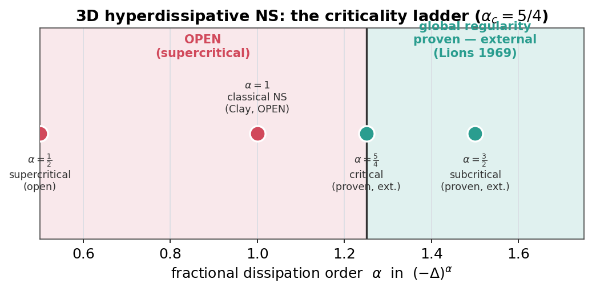

# Navier-Stokes: numerical, certified & fractional tracks

This page ties together three complementary ways omnibias engages the 3D
incompressible Navier-Stokes equation, and is explicit about where each one
stops. It is the narrative companion to the runnable study in
[`examples/certified_fluid_dynamics/`](../../examples/certified_fluid_dynamics/).

!!! warning "Claim boundary (read first)"
    None of this solves — or claims to solve — global regularity for Navier-Stokes.
    Global regularity of the **classical** (`α = 1`) 3D equation is open, and the
    repository is *structurally gated* never to assert it: every artifact below
    hard-wires `unproven_claim = False`, and the honesty gate is shown **blocking** a
    forged claim. Results labelled *proven* (`α ≥ 5/4`, Tao's log-supercritical
    regime) are **external** theorems that omnibias only cites — they are never
    `omnibias_verified`. The exact meaning of these flags lives in
    [Scope & guarantees § 3](../scope-and-guarantees.md#3-the-certified-pde-stacks-navierstokes-ccf).

The three tracks answer three different questions:

| Track | Question | What is delivered | Honest status |
|---|---|---|---|
| **A — validated numerics** | Can we *solve* one instance accurately? | A trained 3D PINN scored against an exact solution | numerical, `< 1%` error |
| **B — certified-evidence bridge** | Can that solution be *independently re-checked and adjudicated*? | Replayable residual certificates + prove/disprove verdict | certified evidence, not a theorem |
| **C — fractional / hyperdissipative** | What is actually *provable*, and where does the openness begin? | Criticality ladder + learnable order + Tao's log-supercritical tier | proven `α ≥ 5/4` (external); `α = 1` open |

---

## Track A — a validated 3D Navier-Stokes PINN

Represent the velocity as `u = curl(A)` with a
[`VectorPotentialField`](pinn-navier-stokes.md), so `div u = 0` holds **by
construction** (closed-form curl — structural, not learned). Train the prebuilt
`NavierStokes(form="primitive_3d")` residual on interior collocation plus an
initial condition, and score it against the exact **decaying Arnold-Beltrami-
Childress** flow (an unsteady `f = 0` solution):

```
U(x)   = (sin z + cos y,  sin x + cos z,  sin y + cos x)
u(x,t) = e^{-ν t} U(x),   p(x,t) = -½ e^{-2 ν t} |U|²
```

Trained on the GPU cluster (H200, float64, 20k steps, cosine LR decay):

| Metric | Value |
|---|---|
| rel-L2 velocity error vs exact ABC on `t ∈ [0,1]` | **0.0097** |
| `max |div u|` | **0.0** (hard cage) |
| RMS momentum residual | 0.069 |

A fixed learning rate *diverged* late in training (rel-L2 = 2.52); cosine decay
fixed it — but incompressibility stayed at machine zero in both runs, because it
is structural. Full write-up: `RESULTS_abc_3d_pinn.md`.

```bash
python -m examples.certified_fluid_dynamics.run_abc_3d_pinn --smoke
```

---

## Track B — turning the field into replayable certificates

A trained field is only as trustworthy as an *independent* re-check. Track B
samples the Track-A field on a periodic grid, takes the **closed-form** time
derivative `u_t`, seals a Navier-Stokes CAP bundle, and adjudicates it through
the [prove/disprove machine](proof-machine.md) with a numpy/FFT **replay twin**.

- **Exact baseline** (`manufactured_abc_flow`): two independent spectral
  implementations agree to `~1e-14`; replay is bit-for-bit.
- **Bridged PINN field**: an *independent* numpy re-check reproduces Track A's
  accuracy — mean 0.9% velocity error, `div u ≤ 9.4e-14`, replay matches on
  every time slice.
- **Honesty gate**: the honest ABC residual conjecture is `PROVED`; a *forged*
  `unproven_claim = True` on the same certificate is **BLOCKED** —
  *"an asserted claim is not supported by the certificate's honesty flags."*
- **Axisymmetric-swirl interval pipeline**: outward-rounded interval bounds are
  certified and replay-checked (`interval_obligation_ready`), while the two
  *continuum* obligations (`radii_polynomial_closure`,
  `operator_theoretic_invertibility`) remain **open** — so no theorem-grade
  upgrade is claimed.

Full write-up: `RESULTS_abc_3d_certified.md`. See also
[Navier-Stokes certified validation](navier-stokes-certified.md) and
[proof-carrying fluid dynamics](proof-carrying-fluid-dynamics.md).

```bash
python -m examples.certified_fluid_dynamics.run_abc_3d_certified --smoke
```

---

## Track C — fractional / hyperdissipative Navier-Stokes

The honest engagement with the open frontier. Replace the dissipation with a
**fractional Laplacian** `(-Δ)^α` (isotropic Fourier symbol `|k|^{2α}`):

$$
\partial_t u + (u\cdot\nabla)u + \nabla p = -\nu\,(-\Delta)^{\alpha} u + f,
\qquad \nabla\cdot u = 0 .
$$

The energy is **critical at `α_c = (n+2)/4 = 5/4` in 3D**, which cleaves the
problem into a proven regime and an open one:

| regime | exponent (3D) | global regularity |
|---|---|---|
| subcritical | `α > 5/4` | **proven** (Lions 1969) — *external* |
| critical | `α = 5/4` | **proven** (Lions 1969) — *external* |
| log-supercritical | just below `5/4` | **proven** under Tao's condition (2009) — *external* |
| supercritical | `1 ≤ α < 5/4` | **open** — `α = 1` is the global-regularity problem |

The same ladder, as an honest regime map — green is the *external* proven zone,
the classical `α = 1` sits squarely in the open region:



### The order sets the dissipation exponent

Two exact unforced solution families make the operator falsifiable for every
`α`: a decaying **shear** `u = (e^{-ν m^{2α} t}\sin(my), 0, 0)` (rate depends on
`α`) and the decaying **ABC** Beltrami field (a `(-Δ)^α` eigenfunction, rate
`ν`). The spectral residual is machine-zero; scoring the *same field with the
wrong exponent* is visibly nonzero. The energy-decay rate `ν m^{2α}` traces a
line of slope `2α` — measured values sit exactly on the analytic prediction:


### The order is learnable and recoverable

This is the honest form of *"the derivative degree is a learnable, possibly
fractional, parameter."* The real, importable primitive is
[`LearnableOrder`](../api/fractional.md), a differentiable exponent living inside
the `|k|^{2α}` multiplier:

```python
import torch
from omnibias.fractional.torch.order import LearnableOrder

order = LearnableOrder(init=0.6, lo=0.1, hi=2.0)   # constrained, differentiable
alpha = order()                                    # a tensor you can backprop through
```

Two recovery experiments both nail the exponent:

- **Operator fit** (`run_fractional_ns.py`, stage 2): fitting `α` so that
  `(-Δ)^α` reproduces a target on a multi-scale signal recovers the order to
  `~1e-14`.
- **Learnable-α PINN** (`run_fractional_pinn.py`): an *inverse-problem* PINN
  trains a spectral neural field **and** the order jointly, from a few noiseless
  snapshots, with the PDE residual evaluated *at the learnable order*. It
  recovers `α ∈ {0.75, 1.0, 1.25, 1.5}` to `< 1%` with field rel-L2 `≤ 0.6%`:


### The genuine research edge: Tao's logarithmically supercritical regime

Just *below* the critical `|k|^{5/2}`, Tao (2009) proved global regularity for a
dissipation weakened by a logarithm, `|k|^{5/2}/g(|k|)^2` with
`g(r) = (\log(e+r^2))^{β}`, **iff** `\int^{\infty} dr/(r\,g(r)^4) = \infty`,
i.e. `4β ≤ 1` for this `g`. omnibias records the exact threshold (and never
claims to have proven it):

| `β` | `∫ dr/(r g⁴)` diverges? | status |
|---|---|---|
| 0.125 | yes | **proven** (Tao 2009) — *external* |
| 0.25 (borderline) | yes | **proven** (Tao 2009) — *external* |
| 0.5 | no | **open** |
| 1.0 | no | **open** |

The divergence condition, computed rather than asserted — the partial integral
`∫₁ᴿ dr/(r g⁴)` keeps climbing (proven-regular side) for `β ≤ ¼` and plateaus
(open side) above it, with the analytic edge at `β_c = ¼`:


**`β` is learnable too.** `run_log_supercritical_pinn.py` makes the log-exponent
`β` a differentiable `LearnableOrder` and recovers it from multi-scale decay data
straddling the `β_c = ¼` edge, with the residual evaluated at the *learnable*
log-supercritical rate `ν |k|^{5/2}/(log(e+k²))^{2β}`. Recovering `β` also
recovers **which side of Tao's threshold** the dynamics lives on:

| `β_true` | `β_recovered` | abs error | Tao side | side recovered? |
|---|---|---|---|---|
| 0.15 | 0.1555 | 5.5e-3 | proven (`4β ≤ 1`) | **yes** |
| 0.25 (borderline) | 0.2586 | 8.6e-3 | proven (edge) | no — knife-edge |
| 0.40 | 0.4042 | 4.2e-3 | open | **yes** |
| 0.60 | 0.6029 | 2.9e-3 | open | **yes** |

`β` is recovered to sub-percent everywhere; the regularity *side* is correct
except exactly on the measure-zero borderline `β = ¼`, where any error flips it —
the honest, expected behaviour, reported not hidden.


Full write-up: `RESULTS_log_supercritical.md`.

```bash
python -m examples.certified_fluid_dynamics.run_log_supercritical_pinn --smoke
```

### A genuinely 3D, α-dependent solve (GPU)

Track A's exact ABC flow lives on the wavenumber shell `|k| = 1`, so its decay
rate is `α`-independent. To make the fractional order *bite* in 3D we solve on an
arbitrary shell. For the ABC generator `U` and integer `K`, the **Beltrami-shell**
field `U_K(x) = U(Kx)` satisfies `curl U_K = K U_K` and `(-Δ)^α U_K = K^{2α} U_K`,
and its advection is a pure pressure gradient, so

```
u(x,t) = e^{-ν K^{2α} t} U_K(x),   p = -½ e^{-2 ν K^{2α} t} |U_K|²
```

solves fractional NS with the **α-dependent** rate `ν K^{2α}` (`K = 1` recovers
the ABC flow). `run_fractional_abc_3d_pinn.py` trains the caged `u = curl(A)` so
that its **FFT** fractional-NS residual (the nonlocal `(-Δ)^α` is exact
multiplication by `|k|^{2α}` on a periodic `N³` grid), its initial condition, and
its trajectory match this solution, with the closed-form `u_t`. On an NVIDIA A100
(`N = 32`, `K = 2`, `α = 1`, float64):

| Metric | Value |
|---|---|
| rel-L2 velocity error vs exact Beltrami shell | **3.0%** mean / 4.9% max |
| `max |div u|` | **2.0e-14** (structural `curl A` cage) |
| RMS fractional-NS residual @ `t = 0` | 0.68 |


Letting `α` be learned jointly here *fails to identify it* (`α → 0.56`, true
`1.0`) even though the field fits to `~5%`: a **single** shell has one wavenumber,
so one dissipation rate cannot pin `α` — identifiability needs the multi-scale
data the mode-space PINN above provides. Reported as an honest limit. Full
write-up: `RESULTS_fractional_abc_3d.md`.

```bash
python -m examples.certified_fluid_dynamics.run_fractional_abc_3d_pinn --smoke --supervise
```

### theorem-readiness gates stay closed

`build_regularity_closure_report` for the classical `α = 1` route reports
`formalizable = False` with `open_obligations = ["all_smooth_finite_energy_data_proof"]`;
the `build_ns_solve_or_falsify_report` roadmap keeps `final_claim_gate.unproven_claim
= False` with 47 open obligations. The route **cannot** be marked closed.

Full write-up: `RESULTS_fractional_ns.md` and `RESULTS_fractional_pinn.md`.

```bash
python -m examples.certified_fluid_dynamics.run_fractional_ns --smoke
python -m examples.certified_fluid_dynamics.run_fractional_pinn --smoke
```

---

## The honest boundary, in one table

| Statement | Status in omnibias |
|---|---|
| A specific 3D NS instance solved to `< 1%` | **yes** — numerical (Track A) |
| That solution independently re-checked & adjudicated | **yes** — certified evidence (Track B) |
| `div u = 0` exactly | **yes** — structural (`u = curl A`) |
| Fractional model exact & order recoverable | **yes** — machine-precision, `< 1%` (Track C) |
| `α ≥ 5/4` global regularity | **cited** external theorem — *not* `omnibias_verified` |
| Tao log-supercritical regularity (`4β ≤ 1`) | **cited** external theorem — *not* `omnibias_verified` |
| Classical `α = 1` global regularity | **open** — `unproven_claim = False`, structurally ungateable |

The value omnibias adds is not a proof of the impossible; it is *closed-form
exactness*, *independent replay*, and *honest bookkeeping* of precisely where the
provable ends and the open problem begins.

---

## Flagship write-up

All three tracks — plus the learnable-β edge and the GPU-scale 3D fractional
solve — are assembled into a self-contained, flagship-style preprint in the
separate [omnibias-papers](https://github.com/derivon-ai/omnibias-papers/tree/main/papers/navier-stokes)
project (`main.tex`, an executed companion notebook, `refs.bib`, and a one-command
`build.sh`). Its figures are the *same* committed computations shown here, and
its scope section restates these honesty invariants verbatim.

See also [References](../references.md) for the Navier-Stokes
problem statement (Fefferman).
