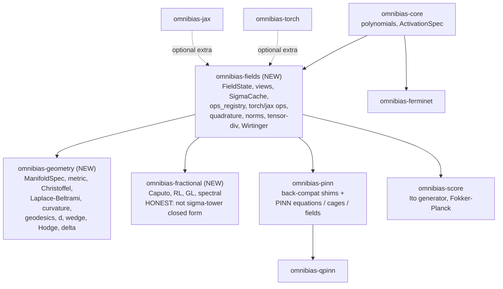

# Calculus & differential-geometry layer — design plan

<!-- docs-test: file-skip reason="design record: the blocks are API sketches from the original proposal, not the shipped surface" -->

> **Status: implemented (Phases 0-8).** This is the original design document,
> kept for the rationale, derivations, and open-question record. Where a
> later decision superseded the initial sketch it is called out inline (see
> §3 and the resolved open questions in §13); the live progress tracker is
> [`PLAN.md`](PLAN.md).

This is the design for completing the calculus and differential-geometry
primitives in omnibias so the library is general enough for *any* type of
scientific-ML research (PINNs, variational Monte Carlo, quantum systems,
second-order optimisation, score/flow models), while preserving every existing
repository invariant.

It is the companion to the per-phase derivations documents that each new
sub-package will ship
([`packages/omnibias-fields/FIELDS_DERIVATIONS.md`](../../packages/omnibias-fields/FIELDS_DERIVATIONS.md),
[`packages/omnibias-geometry/GEOMETRY_DERIVATIONS.md`](../../packages/omnibias-geometry/GEOMETRY_DERIVATIONS.md),
[`packages/omnibias-fractional/FRACTIONAL_DERIVATIONS.md`](../../packages/omnibias-fractional/FRACTIONAL_DERIVATIONS.md)),
mirroring the existing
[`packages/omnibias-qpinn/QPINN_DERIVATIONS.md`](../../packages/omnibias-qpinn/QPINN_DERIVATIONS.md).

---

## 1. Scope and non-goals

### In scope — must-have (general-purpose research completeness)

- **Differential geometry on manifolds** (largest current gap): metric tensor
  \(g_{ij}\), inverse metric \(g^{ij}\), Christoffel symbols \(\Gamma^k_{ij}\),
  covariant derivative \(\nabla\), the **Laplace–Beltrami operator**
  \(\Delta_g f = \tfrac{1}{\sqrt{|g|}}\,\partial_i\!\big(\sqrt{|g|}\,g^{ij}\,\partial_j f\big)\),
  the geodesic equation, and Riemann / Ricci / scalar curvature.
- **Tensor-field divergence** \(\nabla\cdot\sigma\) (divergence of a
  second-order/stress tensor), for solid mechanics / elasticity and the
  conservative form of momentum balance.
- **First-class integration & functional-analysis ops**: a definite integral
  over a domain, inner product \(\langle f, g\rangle\), and L²/Sobolev norms as
  standalone operators (today these are ad hoc via manual quadrature weights in
  the QPINN Galerkin eigensolver only).

### In scope — nice-to-have (round out "any research")

- **Exterior calculus / differential forms**: exterior derivative \(d\), wedge
  \(\wedge\), Hodge star \(\star\), codifferential \(\delta\); verify the de Rham
  identities (\(d^2 = 0\); \(\Delta = d\delta + \delta d\) reducing to
  Laplace–Beltrami on 0-forms).
- **Complex (Wirtinger) calculus**: \(\partial/\partial z\),
  \(\partial/\partial \bar z\), integrated with the existing split-real
  wavefunction convention in `omnibias-qpinn`.
- **Fractional derivatives**: Caputo / Riemann–Liouville
  (+ Grünwald–Letnikov / spectral) for fractional PDEs.
- **Stochastic calculus / generators**: the Itô infinitesimal generator
  \(\mathcal{L} = b\cdot\nabla + \tfrac12\,\mathrm{tr}(\sigma\sigma^\top\nabla^2)\)
  and the Fokker–Planck adjoint, built as a *composition* of existing
  gradient/Hessian/Laplacian/tensor-divergence ops and wired to the reserved
  `omnibias-score` package.

### Non-goals (explicitly out of scope for this effort)

- Adaptive-mesh or sparse-grid (Smolyak) quadrature beyond the fixed
  Gauss–Legendre / Gauss–Hermite / Clenshaw–Curtis / Monte-Carlo rules.
- Automatic atlas construction or numerically-learned charts beyond a single
  user-supplied (analytic or learned) chart with an explicit metric callable.
- Mesh-based / finite-element discretisations. omnibias stays a *closed-form
  forward-pass* library; geometry ops act on collocation points.
- A native-complex `ComponentSpec` (the qpinn split-real encoding is reused;
  native complex is parked as an open question, consistent with qpinn deferring
  it to its own v0.0.2).
- New **keras** field-level ops (rationale in §1 of the layering section and the
  open questions).

---

## 2. Repository invariants (audit checklist)

These are restated from [`AGENTS.md`](../../AGENTS.md) and the task brief so a
reviewer can audit every later phase against them at a glance.

1. **Backend-agnostic core.** `omnibias.core` (and the new pure-Python
   substrate modules) must never import `torch`, `jax`, `tensorflow`, or
   `keras`. Shared math and generic specs live there; closed-form derivative
   coefficients come from
   [`omnibias.core.polynomials`](../../packages/omnibias-core/src/omnibias/core/polynomials.py).
2. **Cross-backend bit-identical by construction.** Every public operator
   produces the same result on torch and jax to `rtol=1e-9, atol=1e-12` or
   tighter (we target `rtol=1e-12, atol=1e-12`, matching the existing PINN
   parity tests), because both backends consume the same core coefficients and
   the same pure-Python schemas.
3. **float64 everywhere in tests**, with documented tolerances.
4. **Closed-form first, autodiff honest.** Where an operator routes through the
   activation derivative tower, it is implemented in closed form (one `sigma`
   evaluation, exact). Where a part genuinely needs autodiff (e.g., the
   geometric part of an arbitrary *learned* chart, or fractional kernels), the
   docstring and docs say so explicitly — never overclaim "closed form".
5. **Follow the existing operator surface.** New field-level operators match the
   structure, naming, and registry mechanism of the PINN ops
   (`packages/omnibias-pinn/src/omnibias/pinn/{jax,torch}/ops/`) and the
   `FieldState` abstraction.
6. **Tooling gates stay green:** `ruff check packages tests`; `mypy --strict`
   for the T1 src trees plus any new strict package; `mkdocs build --strict`;
   numpy-style docstrings on all public API.
7. **Leakage prevention.** No compute-cluster, scheduler, vendor, or local-path
   details in any tracked file. Heavy grid/benchmark scripts live only in the
   separate, private `omnibias_experiments` project. Run a leakage grep before every commit.
8. **Dual license.** AGPL-3.0-or-later + commercial. Every new source file gets
   the SPDX header:

   ```python
   # SPDX-License-Identifier: Apache-2.0
   # Copyright (C) 2026 Derivon
   ```

   (The copyright holder is **Derivon**; the go / no-go sign-off for the public
   release is [`docs/release-readiness.md`](../release-readiness.md).)
9. **Test every behavioral change** with regression tests *and* independent
   validation (§7).

---

## 3. Layering & package layout

The central architectural decision: **lift the backend-agnostic field substrate
out of `omnibias.pinn._core` into a new foundational package
`omnibias-fields`**, then build geometry, fractional calculus, and stochastic
generators on top of it. `omnibias-pinn` keeps its PINN-specific equations,
cages, and field constructors and re-exports the moved symbols through
back-compat shims.

Why a new `omnibias-fields` package and not `omnibias-core`:

- `omnibias-core` is deliberately dependency-free pure math (polynomial
  coefficients + the `ActivationSpec` protocol). The substrate
  (`FieldState`, views, `SigmaCache`, `CoordinateSpec`, `ComponentSpec`,
  `ops_registry`) is also pure Python, but it is a *much larger* surface with a
  different stability tier and its own backend `ops/` trees (which *do* import
  torch / jax under their respective extras). Bolting all of that onto
  `omnibias-core` would blur the "tiny stable math kernel" contract. A dedicated
  base package keeps `omnibias-core` minimal while giving every higher layer a
  single shared substrate.



### New package skeletons

Each new package mirrors the existing per-package `pyproject.toml`
(see [`packages/omnibias-pinn/pyproject.toml`](../../packages/omnibias-pinn/pyproject.toml)):
setuptools build, AGPLv3+ classifier, `Derivon` author metadata,
`omnibias.*` namespace packages, `torch` / `jax` / `all` / `test` / `dev`
optional-dependency extras.

**`omnibias-fields`** (new foundational base):

```
packages/omnibias-fields/
  pyproject.toml          # name = "omnibias-fields"; deps = ["omnibias-core>=0.2.0"]
  LICENSE  README.md  FIELDS_DERIVATIONS.md
  src/omnibias/fields/
    __init__.py
    _core/                # pure Python (no torch/jax)
      state.py  view.py  components.py  coords.py
      field_base.py  sigma_cache.py  ops_registry.py
      quadrature.py       # NEW: QuadratureSpec + rule builders
    torch/
      __init__.py  _ops_dispatch.py
      ops/{basic,vector,high_order,nonlinear,integral,norms,tensor,complex}.py
    jax/
      __init__.py  _ops_dispatch.py
      ops/{basic,vector,high_order,nonlinear,integral,norms,tensor,complex}.py
  tests/{_core,torch,jax,cross_backend}/
```

- `dependencies = ["omnibias-core>=0.2.0"]`
- `[project.optional-dependencies]`: `torch = ["omnibias-torch>=0.2.0", "torch>=2.0"]`,
  `jax = ["omnibias-jax>=0.2.0", "jax>=0.4.30", "jaxlib>=0.4.30"]`,
  `all`, `test`, `dev` (same shape as pinn).

**`omnibias-geometry`** (new, depends on `omnibias-fields`):

```
packages/omnibias-geometry/
  pyproject.toml          # deps = ["omnibias-fields>=0.1.0"]
  LICENSE  README.md  GEOMETRY_DERIVATIONS.md
  src/omnibias/geometry/
    __init__.py
    _core/
      manifold.py         # MetricSpec, ManifoldSpec, ChartSpec
      forms.py            # DifferentialForm schema (Phase 4)
    torch/ops/{metric,connection,laplace_beltrami,curvature,geodesic,exterior}.py
    jax/ops/{metric,connection,laplace_beltrami,curvature,geodesic,exterior}.py
  tests/{_core,torch,jax,cross_backend}/
```

**`omnibias-fractional`** (new, depends on `omnibias-fields`):

```
packages/omnibias-fractional/
  pyproject.toml          # deps = ["omnibias-fields>=0.1.0"]
  LICENSE  README.md  FRACTIONAL_DERIVATIONS.md
  src/omnibias/fractional/
    __init__.py
    _core/kernels.py      # GL weights, RL/Caputo kernels (numpy, backend-free)
    torch/ops/fractional.py
    jax/ops/fractional.py
  tests/{_core,torch,jax,cross_backend}/
```

**`omnibias-score`** (alpha package): ships score / Ito-generator / Fokker-Planck
ops composed from `omnibias-fields` gradient/Hessian/tensor-divergence primitives,
plus the folded `omnibias.score.flow` continuous-normalizing-flow submodule.

### Workspace / mypy / mkdocs enrollment

- **Resolved (open question (d)):** the new field-layer packages
  (`omnibias-fields`, `omnibias-geometry`, `omnibias-fractional`,
  `omnibias-score`) stay at the **extension-package tier** — they are *not*
  added to the `mypy --strict` CI gate or to `[tool.mypy].mypy_path`, matching
  `omnibias-pinn` / `omnibias-qpinn` / `omnibias-curvature`. The strict
  invocation therefore stays scoped to the T1 set:

  ```bash
  uv run mypy --strict \
    packages/omnibias-core/src packages/omnibias-torch/src \
    packages/omnibias-jax/src packages/omnibias-ferminet/src
  ```

  The bulk-moved field ops carry the same torch `no-any-return` findings that
  keep the existing extension packages out of the strict gate; bringing the
  whole field layer under strict typing is a tracked follow-up. Newly
  authored modules are written strict-clean regardless. (The initial sketch enrolled fields/geometry/score in strict
  mypy; this was superseded — see §13(d).)
- All new packages are added to the `exclude` list of the root
  [`pyproject.toml`](../../pyproject.toml) `[tool.uv.workspace]` (they ship their
  own `pyproject.toml` and are installed/tested per-package, exactly like
  `omnibias-pinn` today) and to the `mkdocstrings` `paths` list and `nav` in
  [`mkdocs.yml`](../../mkdocs.yml).
- New `[tool.pytest.ini_options].testpaths` entries are added per package in
  each package's own config; the root `testpaths` continues to list only the
  workspace-installable trees.

---

## 4. Substrate extraction (Phase 1) — exact module-by-module mapping

The substrate is already pure Python (verified: only `numpy` appears, in
`diagnostics.py`; everything else is stdlib + intra-package imports). The lift
is therefore a mechanical move plus shims.

### Modules that MOVE to `omnibias.fields._core` (1:1, names unchanged)

| From (`omnibias.pinn._core`) | To (`omnibias.fields._core`) | Notes |
|---|---|---|
| `state.py` (`FieldState`) | `state.py` | `ops` attribute now points at `omnibias.fields.{torch,jax}._ops_dispatch` |
| `view.py` (`ComponentView`, `VectorView`, `did_you_mean`) | `view.py` | unchanged; new ops surfaced via `ops_registry` |
| `components.py` (`ComponentSpec`) | `components.py` | unchanged |
| `coords.py` (`CoordinateSpec`) | `coords.py` | unchanged |
| `field_base.py` (`FieldBase` protocol) | `field_base.py` | PINN field constructors implement this from its new location |
| `sigma_cache.py` (`SigmaCache`) | `sigma_cache.py` | same `(order, axis)` cache-key semantics preserved |
| `ops_registry.py` | `ops_registry.py` | the `@register` user-extension decorator |

### Modules that STAY in `omnibias.pinn._core`

| Module | Reason |
|---|---|
| `pde.py` (`EquationSpec`, `ResidualPolicy`, …) | PINN/PDE-specific |
| `registry.py` (`register_spec`, `register_factory`) | equation registry, PINN-specific |
| `diagnostics.py` | PINN diagnostics |

### Backend ops that MOVE to `omnibias.fields.{torch,jax}`

| From | To |
|---|---|
| `pinn.{torch,jax}.ops.{basic,vector,high_order,nonlinear}` | `fields.{torch,jax}.ops.*` (1:1) |
| `pinn.{torch,jax}._ops_dispatch` | `fields.{torch,jax}._ops_dispatch` |
| `pinn.{torch,jax}.ops.registry` (re-export of `ops_registry.register`) | `fields.{torch,jax}.ops.registry` |

PINN-specific field constructors
(`OneLayerVectorField`, `SpectralVectorField`, `ChebyshevVectorField`, and the
cage fields) **stay** in `omnibias.pinn.{torch,jax}.fields`; they implement the
`FieldBase` protocol imported from its new `omnibias.fields._core.field_base`
home, and `field(coords)` sets `FieldState.ops = omnibias.fields.<backend>._ops_dispatch`.

### Back-compat shims (keep all existing imports working)

- `omnibias.pinn._core.__init__` re-exports `FieldState`, `ComponentView`,
  `VectorView`, `ComponentSpec`, `CoordinateSpec`, `FieldBase`, `SigmaCache`,
  `ops_registry`, `did_you_mean` from `omnibias.fields._core`, alongside the
  PINN-only `EquationSpec`/`registry`/`diagnostics` that remain local. So
  `from omnibias.pinn._core import FieldState` keeps working.
- `omnibias.pinn.{torch,jax}.ops.__init__` and `.ops.registry` re-export from
  `omnibias.fields.{torch,jax}.ops`. So `state.ops.gradient(...)` and
  `from omnibias.pinn.torch.ops import laplacian` keep working.
- Shims are plain re-exports (no `DeprecationWarning`): pinn still uses these
  internally and `filterwarnings = ["error"]` in
  [`pyproject.toml`](../../pyproject.toml) would otherwise fail the suite.

### Invariants preserved by Phase 1 (and how they're checked)

- **Cross-backend bit-identity**: the existing
  `packages/omnibias-pinn/tests/cross_backend/test_one_layer_parity.py` runs
  unchanged and stays green (it imports through the shimmed surface).
- **`SigmaCache` reuse semantics**: same module, same cache key; a regression
  test asserts a single `sigma` evaluation per `(order, axis)` across a residual
  (mirrors the existing cache test).
- **`mypy --strict`** passes over the new `omnibias-fields/src` tree.
- **Downstream imports**: `omnibias-qpinn` (which imports
  `omnibias.pinn._core` and the pinn ops) and `omnibias-ferminet` continue to
  import and test green with no source edits.
- **Version bumps**: `omnibias-pinn` takes a patch bump (no public API break);
  `omnibias-fields` ships at `0.1.0`. (Open question (c).)

---

## 5. Public API specification — must-haves (full detail)

### 5.1 Quadrature / integration primitive (Phase 2)

Pure-Python schema in `omnibias.fields._core.quadrature`:

```python
@dataclass(frozen=True)
class QuadratureSpec:
    """Tensor-product or Monte-Carlo quadrature rule over a box domain.

    Holds rule metadata only; the backend ``integrate`` op materialises
    nodes/weights as backend tensors at call time (default dtype).
    """
    rule: Literal["gauss_legendre", "gauss_hermite",
                  "clenshaw_curtis", "monte_carlo"]
    dim: int
    points_per_axis: tuple[int, ...]          # len == dim
    bounds: tuple[tuple[float, float], ...]    # len == dim; (lo, hi) per axis
    seed: int | None = None                    # monte_carlo only
    # Optional manifold pullback factor sqrt|g| applied by geometry layer:
    volume_factor: str | None = None           # component name, or None
```

Rule builders (return a `QuadratureSpec` and, lazily, numpy nodes/weights so
both backends stay bit-identical):

```python
def gauss_legendre(bounds, points_per_axis) -> QuadratureSpec: ...
def gauss_hermite(points_per_axis, *, mean=0.0, scale=1.0) -> QuadratureSpec: ...
def clenshaw_curtis(bounds, points_per_axis) -> QuadratureSpec: ...
def monte_carlo(bounds, n, *, seed) -> QuadratureSpec: ...
def tensor_product(*rules_1d) -> QuadratureSpec: ...
```

Backend op `omnibias.fields.{torch,jax}.ops.integral`:

```python
def integrate(state, name, *, rule: QuadratureSpec) -> Tensor:
    r"""Definite integral :math:`\int_\Omega u\,dx` over the box domain.

    Closed form when (a) ``dim == 1`` and the field activation exposes
    ``spec.integral`` (an exact antiderivative) and the rule reduces to a
    band ``[lo, hi]`` -- then the result is ``S(hi) - S(lo)`` with a single
    sigma-tower evaluation. Otherwise a quadrature sum
    :math:`\sum_q w_q\,u(x_q)` (clearly documented as quadrature, not
    closed form).
    """
```

View sugar: `state.u.integrate(rule=...)` via a `ComponentView` method routed
through `ops_registry`.

**Nodes/weights must be produced from a single backend-agnostic source** (numpy
arrays built in `_core.quadrature`, then converted) so torch and jax integrate
bit-identically.

### 5.2 Inner product & norms (Phase 2)

In `omnibias.fields.{torch,jax}.ops.norms`:

```python
def inner_product(state, name_a, name_b, *, rule, weight=None) -> Tensor:
    r"""Real weighted inner product :math:`\langle a, b\rangle_w
    = \int_\Omega w\,a\,b\,dx` via ``integrate``."""

def l2_norm(state, name, *, rule) -> Tensor:
    r""":math:`\lVert u\rVert_{L^2} = \sqrt{\langle u, u\rangle}`."""

def sobolev_norm(state, name, *, rule, k=1, weights=None) -> Tensor:
    r""":math:`\lVert u\rVert_{H^k}^2
    = \sum_{|\alpha|\le k} c_\alpha \int_\Omega (\partial^\alpha u)^2\,dx`,
    using the closed-form derivative ops for each :math:`\partial^\alpha u`."""
```

The complex inner product variant ships with Phase 5 (Wirtinger), reusing the
same `integrate` machinery on `|psi|^2 = psi_R^2 + psi_I^2`.

### 5.3 Tensor-field divergence (Phase 2)

In `omnibias.fields.{torch,jax}.ops.tensor`:

```python
def tensor_divergence(state, sigma_names) -> Tensor:
    r"""Row-wise divergence of a 2-tensor field.

    ``sigma_names`` is a ``(d, d)`` nested tuple of component names laying
    out :math:`\sigma_{ij}`. Returns the vector
    :math:`(\nabla\cdot\sigma)_i = \partial_j \sigma_{ij}` of shape
    ``(B, d)``, computed from the closed-form first derivatives of each
    component. Cartesian (flat) divergence; the covariant version with
    Christoffel correction terms lives in ``omnibias-geometry`` (Phase 3).
    """
```

View sugar: `state.sigma.div_tensor(layout=...)`.

### 5.4 Differential geometry (Phase 3)

Pure-Python schemas in `omnibias.geometry._core.manifold`:

```python
@dataclass(frozen=True)
class MetricSpec:
    r"""Riemannian (or pseudo-Riemannian) metric on a coordinate chart.

    Parameters
    ----------
    g
        Callable ``coords -> g_ij`` returning the metric of shape
        ``(B, d, d)`` in the backend tensor type. For an *analytic* metric
        this is exact; for a *learned* chart it may route through autodiff
        of the embedding (labelled non-closed-form in the docstring).
    inv_g, sqrt_det_g
        Optional analytic inverse / volume element. If ``None`` they are
        computed from ``g`` (closed-form linear algebra; no autodiff).
    signature
        e.g. ``(1, 1, 1)`` Riemannian or ``(1, -1, -1, -1)`` Lorentzian.
    """
    g: Callable[[TensorT], TensorT]
    inv_g: Callable[[TensorT], TensorT] | None = None
    sqrt_det_g: Callable[[TensorT], TensorT] | None = None
    signature: tuple[int, ...] = ()

@dataclass(frozen=True)
class ManifoldSpec:
    name: str
    dim: int
    coords: CoordinateSpec
    metric: MetricSpec
    atlas: Sequence["ChartSpec"] | None = None   # multi-chart; deferred
```

Backend ops in `omnibias.geometry.{torch,jax}.ops` (each takes a `FieldState`
and a `ManifoldSpec`; closed-form when the metric is analytic, else autodiff
fallback labelled in the docstring):

| Op | Signature | Math |
|---|---|---|
| `metric` | `(state, manifold) -> (B,d,d)` | \(g_{ij}\) |
| `inverse_metric` | `(state, manifold) -> (B,d,d)` | \(g^{ij}\) |
| `sqrt_det_metric` | `(state, manifold) -> (B,)` | \(\sqrt{|g|}\) |
| `christoffel` | `(state, manifold) -> (B,d,d,d)` | \(\Gamma^k_{ij} = \tfrac12 g^{kl}(\partial_i g_{lj} + \partial_j g_{li} - \partial_l g_{ij})\) |
| `covariant_derivative` | `(state, name, manifold, *, kind)` | \(\nabla\) of scalar / vector / one-form / tensor |
| `laplace_beltrami` | `(state, name, manifold) -> (B,)` | \(\Delta_g f = \tfrac{1}{\sqrt{|g|}}\partial_i(\sqrt{|g|}\,g^{ij}\partial_j f)\) |
| `geodesic_rhs` | `(state, manifold) -> (B,d)` | \(\ddot x^k = -\Gamma^k_{ij}\dot x^i \dot x^j\) RHS |
| `riemann_tensor` | `(state, manifold) -> (B,d,d,d,d)` | \(R^\rho{}_{\sigma\mu\nu}\) |
| `ricci_tensor` | `(state, manifold) -> (B,d,d)` | \(R_{\mu\nu} = R^\rho{}_{\mu\rho\nu}\) |
| `scalar_curvature` | `(state, manifold) -> (B,)` | \(R = g^{\mu\nu}R_{\mu\nu}\) |

`covariant_derivative` `kind` is
`Literal["scalar", "vector", "one_form", "tensor"]` and applies the appropriate
\(\pm\Gamma\) correction:
\(\nabla_i V^k = \partial_i V^k + \Gamma^k_{ij}V^j\),
\(\nabla_i \omega_k = \partial_i \omega_k - \Gamma^j_{ik}\omega_j\).

View sugar via a thin `ManifoldFieldState` wrapper that pairs a `FieldState`
with a `ManifoldSpec` and exposes `mstate.u.laplace_beltrami`, `mstate.christoffel`,
etc. (Recommended over mutating `CoordinateSpec`; see open question (b).)

---

## 6. Public API sketches — nice-to-haves

These are intentionally lighter: signatures, the governing math, and the open
questions to resolve in each phase's own prelude design note before coding.

### 6.1 Exterior calculus / differential forms (Phase 4)

`omnibias.geometry._core.forms.DifferentialForm` wraps a `FieldState` component
layout tagged with a form degree `k`. Ops in
`omnibias.geometry.{torch,jax}.ops.exterior`:

```python
def exterior_derivative(form) -> DifferentialForm        # d: Ω^k -> Ω^{k+1}
def wedge(a, b) -> DifferentialForm                       # ∧
def hodge_star(form, manifold) -> DifferentialForm        # ★ (needs metric)
def codifferential(form, manifold) -> DifferentialForm    # δ = ±★d★
```

Math: \(d\) is the antisymmetrised gradient on component indices;
\(\star\) uses \(\sqrt{|g|}\) and the Levi-Civita symbol; \(\delta\) is the
metric adjoint. **Canonical regression tests**: \(d^2 = 0\) (to tolerance);
\(\Delta = d\delta + \delta d\) on 0-forms equals `laplace_beltrami`.

Open questions: component-layout convention for `k`-forms over `FieldState`;
whether to store forms as flat antisymmetric component tuples or a dense
\((B, \binom{d}{k})\) tensor.

### 6.2 Complex / Wirtinger calculus (Phase 5)

Reuse the qpinn split-real convention
(\(\psi = \psi_R + i\psi_I\); see
[`QPINN_DERIVATIONS.md`](../../packages/omnibias-qpinn/QPINN_DERIVATIONS.md)).
In `omnibias.fields.{torch,jax}.ops.complex`:

```python
def dz(state, re_name, im_name, *, axis) -> tuple[Tensor, Tensor]:
    r""":math:`\partial_z = \tfrac12(\partial_x - i\,\partial_y)` returned
    as a (real, imag) pair."""
def dzbar(state, re_name, im_name, *, axis) -> tuple[Tensor, Tensor]:
    r""":math:`\partial_{\bar z} = \tfrac12(\partial_x + i\,\partial_y)`."""
```

Math/validation: for holomorphic \(f(z) = z^2\), \(\partial_{\bar z}f = 0\)
(Cauchy–Riemann) is the closed-form regression test, built from the existing
closed-form first derivatives of \(\psi_R, \psi_I\).

Open question: when (if ever) to migrate to a native-complex `ComponentSpec`
(qpinn already defers this to its own v0.0.2).

### 6.3 Fractional calculus (Phase 6) — honestly NOT closed form

`omnibias-fractional` is flagged research-heavy and **non-local**: a fractional
derivative depends on the whole history/domain, so it is *not* a sigma-tower
closed form. Backend-free kernels in `_core.kernels`:

```python
def gl_weights(alpha, n) -> np.ndarray            # Grünwald–Letnikov binomials
def rl_kernel(alpha, grid) -> np.ndarray          # Riemann–Liouville
# Caputo via RL of the (integer) derivative; spectral via FFT on periodic grids
```

Ops `caputo`, `riemann_liouville`, `grunwald_letnikov`, `spectral_fractional`.

Math/validation: \(D^\alpha x^p = \frac{\Gamma(p+1)}{\Gamma(p+1-\alpha)}x^{p-\alpha}\);
\(D^\alpha e^{\lambda x}\) (Mittag-Leffler / exponential reference). **No
bit-parity claim**: torch↔jax agreement is to `rtol=1e-9` and the primary tests
are FFT-roundtrip and grid-refinement convergence, with the discretisation
error budget documented.

### 6.4 Stochastic generators (Phase 7) — composition only

In `omnibias-score` (`_core.generator` + backend ops), composing existing
`omnibias-fields` primitives — **no new low-level kernels**:

```python
def ito_generator(state, name, *, drift, diffusion) -> Tensor:
    r""":math:`\mathcal L f = b\cdot\nabla f
    + \tfrac12\,\mathrm{tr}(\sigma\sigma^\top \nabla^2 f)`."""
def fokker_planck(state, name, *, drift, diffusion) -> Tensor:
    r"""Adjoint :math:`\mathcal L^* p
    = -\nabla\cdot(b\,p) + \tfrac12\,\partial_i\partial_j[(\sigma\sigma^\top)_{ij} p]`."""
```

Validation: the Ornstein–Uhlenbeck process \(dX = -\theta X\,dt + \sigma\,dW\)
has stationary density \(\mathcal N(0, \sigma^2/(2\theta))\); both
\(\mathcal L^* p_\infty = 0\) and \(\mathcal L\) acting on test functions match
the analytic generator.

---

## 7. Validation strategy (applied to every primitive)

Each operator is validated at least three independent ways where possible, plus
cross-backend parity and a pinned regression — mirroring the QPINN RotatingNLS
precedent.

1. **Analytic / manufactured solution** with a known closed form. Catalogue:
   - Sphere \(S^2\) of radius \(R\): scalar curvature \(2/R^2\), Gaussian
     curvature \(1/R^2\), Ricci \(= (n-1)g/R^2\).
   - Flat Euclidean metric: `laplace_beltrami` equals the existing
     `state.u.lap` (direct parity to the closed-form Laplacian).
   - Holomorphic \(f(z)=z^2\): \(\partial_{\bar z} f = 0\).
   - Fractional: \(D^\alpha x^p = \Gamma(p+1)/\Gamma(p+1-\alpha)\,x^{p-\alpha}\).
   - OU process: stationary \(\mathcal N(0, \sigma^2/(2\theta))\).
   - Quadrature: \(\int_0^1 x^k\,dx = 1/(k+1)\); Gauss–Hermite of polynomials.
2. **Symbolic** via `sympy` for small cases — especially the metric →
   Christoffel → Riemann → Ricci → scalar pipeline on \(S^2\), the torus, and a
   conformally-flat 2-metric.
3. **Autodiff reference** for the components that have one:
   `jax.hessian`/`jacfwd`/`jacrev` and `torch.autograd` for Christoffel
   (\(\partial g\)), covariant derivative, Laplace–Beltrami, and the Itô
   generator's Hessian trace.
4. **Cross-backend bit-parity** torch vs jax at `rtol=1e-12, atol=1e-12`
   (tighter than the `1e-9/1e-12` floor), reusing the
   `tests/cross_backend/` pattern. **Honest exception**: fractional ops relax to
   `rtol=1e-9` (finite discretisation), explained inline in the test.
5. **Pinned regression** capturing the library output to
   `rtol=1e-12, atol=1e-14` (the RotatingNLS pattern from QPINN), so future
   refactors cannot silently drift.
6. **float64 everywhere** in tests; tolerances documented next to each assertion.

---

## 8. Tooling gates (run at the end of every phase)

```bash
uv run ruff check packages tests
uv run mypy --strict <T1 src trees>     # new field-layer packages are
                                        # extension-tier; see §3 / §13(d)
mkdocs build --strict
python -m pytest packages/omnibias-fields/tests -q       # + geometry/fractional/score
# Cross-backend parity + pinned regression suites green
```

Plus a **leakage grep** before every commit (read-only; fails the gate on any
hit). The pattern set lives only in the separate, private `omnibias_experiments` harness (so the
sensitive tokens themselves never appear in a tracked file) and matches, over
`packages tests docs`:

- scheduler / submission command names,
- the GPU-queue / vendor module identifiers,
- the dev machine's hostname,
- absolute local filesystem path prefixes.

The gate passes only when that grep returns nothing. There is also an **SPDX
presence** check: every new `.py` carries the two-line dual-license header from
§2.8.

---

## 9. Heavy-compute policy

No heavy training / large benchmarks run on the dev machine (it auto-kills heavy
jobs). All such scripts live only in the separate, private `omnibias_experiments`
project and reuse its submission harness (`_lib.sh`, `README.md`).
Only **vendor-neutral** headline numbers (e.g. "GPU job, 1 device, 20 GB") are
transcribed into [`docs/benchmarks.md`](../benchmarks.md). Heavy validation
(a PINN on a curved manifold; larger-\(d\) VMC with the new Laplace–Beltrami /
generator ops) runs on the GPU grid, never locally.

---

## 10. Per-package derivations docs

Authored alongside each phase, all following the
[`QPINN_DERIVATIONS.md`](../../packages/omnibias-qpinn/QPINN_DERIVATIONS.md)
shape (conventions section, then one section per primitive with the math,
assumptions, numerical notes, and references):

- [`packages/omnibias-fields/FIELDS_DERIVATIONS.md`](../../packages/omnibias-fields/FIELDS_DERIVATIONS.md)
  — quadrature rules, inner products / Sobolev norms, tensor divergence,
  Wirtinger.
- [`packages/omnibias-geometry/GEOMETRY_DERIVATIONS.md`](../../packages/omnibias-geometry/GEOMETRY_DERIVATIONS.md)
  — metric → connection → curvature pipeline, Laplace–Beltrami, geodesics,
  exterior calculus + de Rham identities.
- [`packages/omnibias-fractional/FRACTIONAL_DERIVATIONS.md`](../../packages/omnibias-fractional/FRACTIONAL_DERIVATIONS.md)
  — GL/RL/Caputo/spectral definitions, the honesty/error-budget section.

---

## 11. Cookbook + notebook plan

One CPU-runnable, output-stripped notebook per flagship primitive (matched by a
`docs/cookbook/*.md` page added to the [`mkdocs.yml`](../../mkdocs.yml) nav,
mirroring the existing eight notebooks under [`notebooks/`](../../notebooks/)):

- `notebooks/fields_quadrature_norms.ipynb` — integrate / inner-product / Sobolev
  norm of a closed-form field.
- `notebooks/geometry_sphere_laplace_beltrami.ipynb` — \(S^2\) metric →
  Laplace–Beltrami of a spherical harmonic; curvature check \(R = 2/R^2\).
- `notebooks/geometry_pinn_curved_manifold.ipynb` — a small PINN residual using
  `laplace_beltrami` (CPU-sized; the heavy run goes to the grid).
- `notebooks/fractional_diffusion.ipynb` — fractional derivative of \(x^p\) vs
  the analytic Gamma-ratio.
- `notebooks/score_ou_generator.ipynb` — OU generator + Fokker–Planck stationary
  density.

---

## 12. AI-agent context updates (final phase)

- [`AGENTS.md`](../../AGENTS.md): new "Foundational substrate (`omnibias-fields`)"
  and "Manifold ops (`omnibias-geometry`)" sections; update the repository-layout
  block, the strict-mypy command, and the "Where to look" list.
- `.cursor/rules/`: a new rule file pointing agents at the substrate, geometry,
  and fractional packages and the closed-form/honest-autodiff distinction.
- [`llms.txt`](../../llms.txt) and [`docs/llms.txt`](../llms.txt): add the new
  package summaries.
- Per-package `README.md`s with a "Building on top of this" section (public API
  surface, invariants, extension points via `ops_registry`, a minimal runnable
  example).
- A `CHANGELOG.md` entry under `[Unreleased]` for each phase.

---

## 13. Open questions for human review

a. **`QuadratureSpec` representation** — immutable `@dataclass(frozen=True)`
   (recommended, matches `ActivationSpec`/`CoordinateSpec` style) vs `TypedDict`.

b. **Manifold attachment** — a `ManifoldFieldState` wrapper (recommended, keeps
   `CoordinateSpec` unchanged and makes the metric explicit at the call site) vs
   adding an optional `metric` field to `CoordinateSpec` (more implicit, risks
   touching the PINN hot path).

c. **Version bumps for the extraction** — `omnibias-fields` ships `0.1.0`;
   `omnibias-pinn` takes a patch bump (`0.1.0` → `0.1.1`) since the public import
   surface is preserved by shims. Confirm no minor bump is desired.

d. **Strict-mypy tier for the new field-layer packages** — *Resolved:* all four
   (`omnibias-fields`, `omnibias-geometry`, `omnibias-fractional`,
   `omnibias-score`) stay at the **extension-package tier**, i.e. NOT on the
   `mypy --strict` CI gate or `[tool.mypy].mypy_path`, matching
   `omnibias-pinn` / `omnibias-qpinn` / `omnibias-curvature`. The bulk-copied
   field ops carry the same torch `no-any-return` findings that keep those
   packages out of the strict gate today; bringing the whole field layer under
   strict typing is a tracked follow-up. Newly authored
   modules are written to be strict-clean regardless.

e. **Field-level keras parity** — defer indefinitely (recommended: keras users
   already get bit-identical *activation-level* math via `OperatorBlock`; the
   field/ops DSL is torch+jax only, matching `omnibias-pinn`) vs schedule it.

f. **`ChartSpec` / multi-chart atlases** — ship single-chart only in Phase 3 and
   defer true atlases (transition maps) to a later phase?
