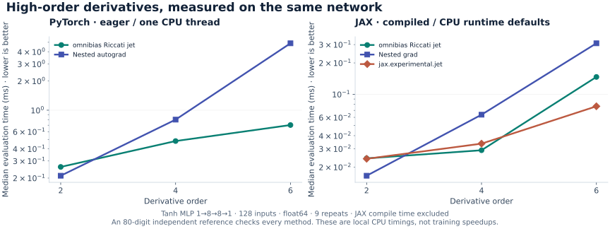

# Performance by workload

Activation derivatives, one-layer operator contractions and deep-network jets
are different computational problems. Compare timings within a workload, with
matching models, shapes, dtypes and execution policies. None of these timings
is an end-to-end PDE-training speedup.

## Direct activation derivatives

20,000 tanh inputs, float64, PyTorch eager with one CPU thread. Both methods
return the requested derivative; the final nested-autograd result does not
retain an additional training graph. Nine timed repeats follow two warmups.

| Order | Closed form | Nested autograd | Speedup |
| --- | ---: | ---: | ---: |
| 1 | 0.0455 ms | 0.0669 ms | 1.5× |
| 2 | 0.0543 ms | 0.1345 ms | 2.5× |
| 3 | 0.0720 ms | 0.2405 ms | 3.3× |
| 4 | 0.0736 ms | 0.4496 ms | 6.1× |
| 5 | 0.0944 ms | 0.9184 ms | 9.7× |
| 6 | 0.0933 ms | 4.0961 ms | 43.9× |
| 7 | 0.1068 ms | 10.8289 ms | 101.4× |
| 8 | 0.1405 ms | 30.9908 ms | 220.5× |

[Raw activation measurements](benchmarks/derivative_order.json) include an
independent 80-digit reference at 33 points, finite-difference errors and
cross-backend differences. A roughly flat small-order timing curve is not an
asymptotic `O(1)` claim: polynomial evaluation still grows with order.

## One-layer Laplacian

`f(x) = sum_h c_h tanh(w_h.x + beta_h)`, 64 points and 32 hidden units.
JAX methods are compiled; `torch.func.hessian` runs eagerly with one thread.
The last column is a cross-framework execution comparison, not an isolated
algorithmic speedup. All input arrays and parameters are runtime arguments.

| Dimension | omnibias JIT | folx JIT | JAX Hessian JIT | Torch Hessian eager |
| --- | ---: | ---: | ---: | ---: |
| 3 | 0.0177 ms | 0.0210 ms | 0.0215 ms | 1.2872 ms |
| 12 | 0.0152 ms | 0.0176 ms | 0.0403 ms | 2.0020 ms |
| 30 | 0.0165 ms | 0.0190 ms | 0.2433 ms | 2.6206 ms |
| 60 | 0.0227 ms | 0.0267 ms | 0.5544 ms | 6.6897 ms |

[Raw Laplacian measurements](benchmarks/laplacian_scaling.json) record compile
cost, first execution, all steady-state samples and independent accuracy.

## Repeated one-layer Laplacian

32 points, 16 hidden units, 16 dimensions. Each JAX method runs in a fresh
subprocess with a 120-second wall budget and 3 GiB RSS budget, including
imports, compilation and accuracy validation. Successful cells report only
steady-state execution; a budget termination has no fabricated timing.

| Operator | omnibias | folx nested | Dense JAX nested |
| --- | ---: | ---: | ---: |
| `Δ^1` | 0.0156 ms | 0.0125 ms | 0.0276 ms |
| `Δ^2` | 0.0112 ms | 0.0389 ms | 0.6615 ms |
| `Δ^3` | 0.0134 ms | 0.5318 ms | 66.4122 ms |
| `Δ^4` | 0.0129 ms | 64.8343 ms | memory_budget (3 GiB) |

At `k = 1`, folx is faster than omnibias in this run. The large gains appear
at higher repeated-Laplacian orders.

[Raw repeated-Laplacian measurements](benchmarks/polylaplacian_order.json)
include resource observations, compilation costs and independent 80-digit
accuracy checks. A memory-budget result is a bounded experiment, not a proof
that the baseline cannot run on a larger machine.


## Why the older figures differ

The original operator benchmarks JIT-compiled zero-argument functions that
captured coordinates and weights as constants. Replaying the old `D = 60`
Laplacian on the recorded JAX version produces optimized HLO with zero runtime
parameters and a constant-result copy. It does not evaluate a changing field
at runtime. The new four-argument version retains the dot products and tanh.
The [compiler audit](benchmarks/laplacian_scaling.json) records both forms.

The former approximately 0.004 ms plateau therefore cannot establish
constant-cost operator evaluation. The refreshed results pass inputs and
parameters at runtime, and separate compilation from execution. The activation
benchmark also stops retaining a graph after the final requested nested
derivative, matching the derivative-only task. These are benchmark protocol
corrections; the mathematical kernels were not changed.

The general deep-MLP benchmark below is a different workload again: it
propagates complete directional jets through multiple nonlinear layers.
It complements the direct operators rather than replacing their measurements.

Reproduce from a development checkout:

```bash
uv run --all-packages python benchmarks/derivative_order.py
uv run --all-packages --with folx python benchmarks/laplacian_scaling.py
uv run --all-packages --with folx python benchmarks/polylaplacian_order.py
```

Outputs go to `artifacts/`, or `$OMNIBIAS_SCRATCH`. See each JSON configuration
for versions, seeds, dtypes, shapes and source hashes. Dirty working trees
record a base commit plus hashes of the actual measured files.

## Precision is measured separately from speed

Exact derivative identities remove recursive spatial autodiff; they do not
remove floating-point conditioning. The shared integer coefficients are exact,
but evaluating their polynomials can lose significant digits through
cancellation. That behavior is present in the kernels retained from the
pre-separation checkpoint.

The [bounded precision probe](benchmarks/precision_sweep.json) compares both
closed-form backends and JAX Taylor-mode AD against an independent 80-digit
reference. At `tanh`, `z = 3`, order 16, the closed-form relative error is
`7.09e-7`, versus `2.60e-13` for JAX Taylor mode. At `z = 0.1`, the same
closed-form derivative is within one float64 ULP. These are pointwise examples,
not exhaustive error bounds. Neither universal bit identity nor universal
high-order failure of another framework follows from the activation formula.

Reproduce the four-point/order cases with
`uv run --all-packages python benchmarks/precision_sweep.py`. Workload timings and pointwise
accuracy answer different questions; choose an algorithm that satisfies both
your cost and error requirements.

## General deep-network jets



This run measures **input-derivative evaluation**, not end-to-end training:
a `1 → 8 → 8 → 1` tanh MLP, 128 points, float64, CPU, fixed weights and seed,
nine timed repeats. JAX timings synchronize results and exclude compilation;
PyTorch runs eagerly with one thread. Compare methods within each panel:
framework execution and thread policies differ.

| Order | Torch nested AD | Torch omnibias | JAX nested AD | JAX Taylor AD | JAX omnibias |
| --- | ---: | ---: | ---: | ---: | ---: |
| 2 | **0.211 ms** | 0.261 ms | **0.016 ms** | 0.024 ms | 0.024 ms |
| 4 | 0.799 ms | **0.481 ms** | 0.064 ms | 0.034 ms | **0.029 ms** |
| 6 | 4.885 ms | **0.703 ms** | 0.309 ms | **0.077 ms** | 0.147 ms |

At order six, omnibias was **6.9× faster than nested PyTorch autograd** in this
run. At order two, nested autodiff won in both backends.
JAX's existing Taylor-mode `jet` also beat omnibias at order six. Taylor-mode AD is an
important alternative, and the comparison includes it rather than treating
nested autodiff as the only baseline.

The [measurement artifact](benchmarks/readme_derivatives.json) records
every result, separate compilation and first-call times, sample timings,
source hashes, working-tree status, versions and independent **80-digit mpmath**
accuracy checks. A dirty working tree labels its recorded revision as the base
commit; source hashes identify the measured files.
Rerun the bounded experiment on your hardware:

```bash
uv run --all-packages python benchmarks/readme_derivatives.py
```

Results go to `artifacts/`, or `$OMNIBIAS_SCRATCH` when set. The
[benchmark guide](https://github.com/derivon-ai/omnibias/tree/main/benchmarks) covers other derivative workloads.
Speed depends on architecture, order, batch size, dtype and execution mode.
