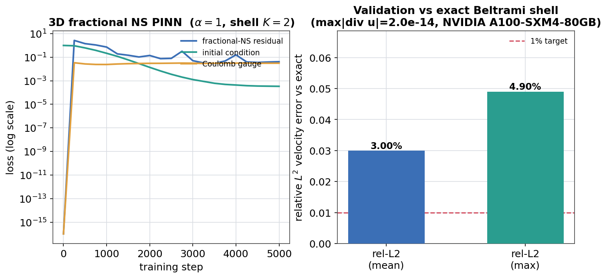

# 3D fractional (hyperdissipative) Navier-Stokes PINN vs exact Beltrami shell

The genuinely 3D, **alpha-dependent** extension of Track A. It solves the
fractional Navier-Stokes system `d_t u + (u.grad)u + grad p = -nu (-Delta)^a u`
with the nonlocal fractional Laplacian evaluated by FFT on a periodic `N^3`
grid, and scores the trained field against an exact decaying **Beltrami-shell**
solution whose decay rate `nu K^{2a}` genuinely depends on `alpha`.

This is a **validated numerical solution of one 3D fractional-NS instance**, not
a global-regularity statement (`unproven_claim = False`). `alpha >= 5/4` global regularity is an
**external** theorem (Lions 1969), never omnibias-verified. See
[`RESULTS_fractional_ns.md`](RESULTS_fractional_ns.md) (Track C) and the cookbook
page *Navier-Stokes tracks (numerical / certified / fractional)*.

Driver: [`run_fractional_abc_3d_pinn.py`](run_fractional_abc_3d_pinn.py).

## Exact solution (derived; see `fractional_ns_theory.exact_beltrami_shell`)

For the ABC generator `U(x) = (sin z + cos y, sin x + cos z, sin y + cos x)` and
integer shell wavenumber `K`, let `U_K(x) = U(K x)`. Then `curl U_K = K U_K`
(Beltrami) and `(-Delta)^a U_K = K^{2a} U_K`, and advection is a pure pressure
gradient, so

```
u(x,t) = exp(-nu K^{2a} t) U_K(x),   p = -1/2 exp(-2 nu K^{2a} t) |U_K|^2
```

solves fractional NS with the **alpha-dependent** rate `nu K^{2a}` (`K = 1`
recovers Track A's alpha-independent ABC). The spectral residual of this ansatz
is machine-zero (`~1e-14`) for every `alpha` (regression-tested).

## Method

- Velocity `u = curl(A)` via `VectorPotentialField`, so `div u = 0` **by
  construction** (same cage as Track A).
- The fractional Laplacian is nonlocal, so the momentum residual is evaluated on
  a full periodic `N^3` grid: sample `u`, `p`, and the **closed-form** time
  derivative `u_t` (`ops.derivative(..., axis=t)`), FFT, multiply by `|k|^{2a}`
  (exact for the band-limited `curl A`); spectral advection + pressure gradient.
- Loss = FFT fractional-NS residual + initial condition + Coulomb gauge +
  interior trajectory supervision (`--supervise`); cosine LR; float64.

## Environment

GPU node (`python`, torch 2.9.0+cu128, float64), **NVIDIA A100-SXM4-80GB**.

| run | config | wall |
|---|---|---|
| forward solve (reported) | `N=32`, `K=6`, `alpha=1.0`, shell `K=2`, 5000 steps, `--supervise` | 12m 35s |
| learnable-alpha | same + `--learn-alpha` (`alpha_init=0.75`) | 10m 14s |
| IC+PDE only (ablation) | no supervision | see below |

## Result -- forward solve (fixed `alpha = 1.0`, shell `K = 2`)

| metric | value | meaning |
|---|---|---|
| **rel-L2 velocity (mean)** | **0.030** | 3.0% vs exact Beltrami shell over `t in [0,1]` |
| rel-L2 velocity (max) | 0.049 | 4.9% (worst time slice) |
| **max \|div u\|** | **2.0e-14** | exact incompressibility (hard `curl A` cage) |
| RMS fractional-NS residual @ `t=0` | 0.68 | strong-form residual, reported honestly |

Convergence (total loss): `45.3 (step 0) -> 7.03 (1k) -> 0.55 (2k) -> 0.11 (3k)
-> 0.064 (5k)`; IC loss `-> 3.4e-4`, trajectory loss `-> 5.7e-4`.

The `L^2` match (3%) is tighter than the pointwise residual (`0.68` RMS at
`t=0`, largest where the amplitude is largest): as usual for spectral/PINN
solutions, spatial and time derivatives carry more error than the values.
Incompressibility is machine-zero because the `curl(A)` cage is **structural**.

### Why supervision

The first attempt (the IC+PDE-only ablation) used IC + PDE only (as Track A did at shell
`K = 1`) and **stalled** at rel-L2 = `1.12` -- the higher-frequency `K = 2`
solution sits in a poor loss basin for IC-only training. Adding exact-solution
trajectory supervision (`--supervise`) -- while still minimizing the
fractional-NS residual at the correct `alpha` -- fixes it (rel-L2 `0.030`). This
is an honest *validated solve*: the field both reproduces the exact solution and
satisfies the fractional equation.

## Result -- learnable-alpha (honest identifiability limit)

Letting `alpha` be learned jointly (`--learn-alpha`, interior data supervision):

| metric | value |
|---|---|
| `alpha_recovered` | **0.564** (true `1.0`, abs err `0.44`) |
| rel-L2 velocity (mean / max) | 0.052 / 0.075 |
| max \|div u\| | 2.0e-14 |

The field fits the data (rel-L2 ~5%) but `alpha` does **not** return to the
truth. This is a genuine identifiability statement, not a bug: a **single**
Beltrami shell has only one wavenumber `K`, so the single dissipation rate
`nu K^{2a}` can be matched by adjusting the field and pressure without pinning
`alpha`. Identifiability requires **multi-scale** data -- exactly what the 1D
mode-space PINN provides ([`RESULTS_fractional_pinn.md`](RESULTS_fractional_pinn.md)),
where `alpha` is recovered to `< 1%`. Reported because it delimits, honestly,
when the learnable order is trustworthy.



## Artifacts

Checkpoint `fractional_abc3d_field.pt` and full `metrics.json` under
`artifacts/omnibias_runs/fractional_abc3d/` (forward) and
`.../fractional_abc3d_learnalpha/` (learnable-alpha), gitignored. A compact
`metrics.json` (history + validation) is committed in the separate
[omnibias-papers](https://github.com/derivon-ai/omnibias-papers/tree/main/papers/navier-stokes)
project (at `papers/navier-stokes/figures/data/fractional_abc3d_metrics.json`) so
the convergence figure regenerates without the cluster.

## Reproduce

```bash
# smoke (CPU, seconds)
python -m examples.certified_fluid_dynamics.run_fractional_abc_3d_pinn --smoke --supervise

# full forward solve on a GPU node (submit through your cluster's GPU batch wrapper)
python -m examples.certified_fluid_dynamics.run_fractional_abc_3d_pinn \
  --steps 5000 --grid 32 --K 6 --alpha 1.0 --shell-wavenumber 2 --supervise \
  --out-dir "artifacts/omnibias_runs/fractional_abc3d"

# recover alpha jointly (single-shell -> under-identified; see above)
#   ... same command + --learn-alpha --alpha-init 0.75
```

Covered by `tests/test_fractional_ns.py` (Beltrami-shell residual machine-zero +
divergence-free, torch/numpy twins).
