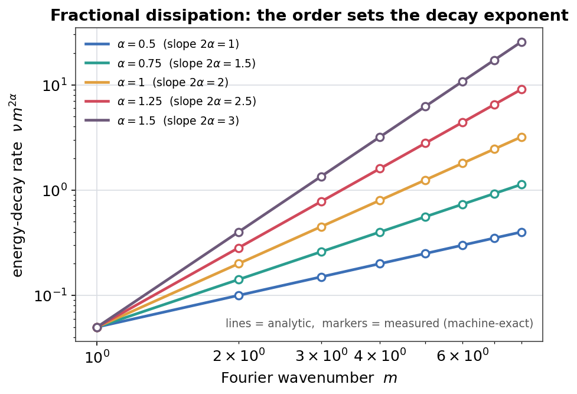

# Track C results: fractional / hyperdissipative Navier-Stokes (the honest open frontier)

This is the **honest** engagement with the global-regularity problem. Global regularity of
the **classical** 3D incompressible Navier-Stokes equation (`alpha = 1`) is
open, and omnibias is structurally gated never to claim it. Every artifact here
carries `unproven_claim = False`, and the honest gates are shown to stay closed.

> **What this is not.** It is *not* a proof (or a disproof) of the global-regularity problem,
> and no honesty gate was removed or bypassed. `alpha >= 5/4` global regularity
> is cited as an **external** theorem, **not** verified by omnibias.

Driver: [`run_fractional_ns.py`](run_fractional_ns.py). Companion to Tracks
A/B ([`RESULTS_abc_3d_pinn.md`](RESULTS_abc_3d_pinn.md),
[`RESULTS_abc_3d_certified.md`](RESULTS_abc_3d_certified.md)).

## The equation and its critical exponent

Hyperdissipative incompressible Navier-Stokes on the periodic torus:

```
d_t u + (u.grad)u + grad p = -nu (-Delta)^alpha u + f,   div u = 0
```

Scaling `u_lambda(x,t) = lambda^{2a-1} u(lambda x, lambda^{2a} t)` makes the
energy critical at `2a - 1 = n/2`, i.e. **`alpha_c = (n+2)/4 = 5/4` in 3D**:

| regime | exponent (3D) | global regularity |
|---|---|---|
| subcritical | `alpha > 5/4` | **proven** (Lions 1969) -- *external* |
| critical | `alpha = 5/4` | **proven** (Lions 1969) -- *external* |
| log-supercritical | just below `5/4` | **proven** under Tao's condition (2009) -- *external* (stage 6) |
| supercritical | `1 <= alpha < 5/4` | **open** (`alpha = 1` is the global-regularity problem) |



## Environment

CPU, `python` (torch 2.9.0, float64). Full run **~6.6 s**
(`n = 32`, `alpha in {0.5, 0.75, 1.0, 1.25, 1.5}`, `beta in {0.125, 0.25, 0.5, 1.0}`,
`nu = 0.05`, shear `m = 2`).

## Stage 1 -- the fractional model is exact across alpha

Two exact solution families (unforced): a decaying **shear**
`u = (e^{-nu m^{2a} t} sin(m y), 0, 0)` whose rate depends on `alpha`, and the
decaying **ABC** Beltrami field (a `(-Delta)^a` eigenfunction, rate `nu`,
alpha-independent). The generic spectral residual is machine-zero, and scoring
the *same field with the wrong exponent* is visibly nonzero -- the operator
genuinely depends on `alpha`.

| alpha | shear residual sup | predicted decay rate `nu m^{2a}` | wrong-`alpha` residual sup |
|---|---|---|---|
| 0.50 | 1.9e-16 | 0.100 | 0.041 |
| 0.75 | 7.5e-16 | 0.141 | 0.059 |
| 1.00 | 2.6e-15 | 0.200 | 0.083 |
| 1.25 | 9.5e-15 | 0.283 | 0.117 |
| 1.50 | 3.5e-14 | 0.400 | 0.166 |

Measured energy-decay rates match the analytic `nu m^{2a}` to machine precision;
ABC residual and divergence are `<= ~1e-14` for every `alpha`.

## Stage 2 -- the fractional order is learnable and recoverable

The honest form of *"the derivative degree is a learnable, possibly fractional
parameter"*: a differentiable `LearnableOrder` in the `|k|^{2a}` multiplier,
fit by Adam to reproduce `(-Delta)^{a_true}` acting on a multi-scale signal.

| `alpha_true` | `alpha_recovered` | abs error | final loss |
|---|---|---|---|
| 0.75 | 0.750000000000003 | 2.8e-15 | 1.5e-28 |
| 1.00 | 1.000000000000004 | 4.2e-15 | 4.0e-27 |
| 1.25 | 1.249999999999987 | 1.3e-14 | 3.8e-26 |
| 1.50 | 1.499999999999997 | 3.3e-15 | 1.2e-25 |

The order is recovered to ~1e-14 -- system identification of a fractional model,
not a statement about NS regularity. A full *inverse-problem PINN* that trains a
neural field and the order **jointly** from sparse snapshots lives in the
companion driver ([`RESULTS_fractional_pinn.md`](RESULTS_fractional_pinn.md)).

## Stage 3-4 -- criticality ladder + conditional continuation criteria

Regime labels (honest): `alpha in {0.5, 0.75, 1.0}` -> `supercritical / open`
(`alpha = 1` flagged `is_classical_open_problem = True`); `alpha in {1.25, 1.5}`
-> `proven_global_regularity_external` with `omnibias_verified = False` and the
Lions/Tao citation.

Conditional Beale-Kato-Majda / energy diagnostics on each trajectory (a *true,
per-trajectory* statement -- finite BKM integral + non-increasing energy imply
that trajectory stays smooth on `[0, T]`; this is **not** an all-data claim):

| alpha | `int ||omega||_inf dt` | finite | `E(0) -> E(T)` | energy non-increasing |
|---|---|---|---|---|
| 0.50 | 1.903 | yes | 8192 -> 6707 | yes |
| 0.75 | 1.865 | yes | 8192 -> 6174 | yes |
| 1.00 | 1.813 | yes | 8192 -> 5491 | yes |
| 1.25 | 1.742 | yes | 8192 -> 4653 | yes |
| 1.50 | 1.648 | yes | 8192 -> 3681 | yes |

Stronger dissipation (larger `alpha`) drains energy faster, as expected.

## Stage 5 -- theorem-readiness gates stay closed

- **Classical (`alpha = 1`) regularity route** via `build_regularity_closure_report`:
  `formalizable = False`, `open_obligations = ["all_smooth_finite_energy_data_proof"]`,
  `unproven_claim = False`. The route *cannot* be marked closed -- the all-data proof
  obligation is hard-wired open.
- **Solve-or-falsify roadmap** (`build_ns_solve_or_falsify_report` on a finite
  interval candidate): `unproven_claim = False`, `final_claim_gate.unproven_claim = False`,
  **47** open obligations remaining.

```
classical route formalizable : False
roadmap final regularity gate       : False
```

## Stage 6 -- Tao's logarithmically supercritical dissipation (the research edge)

Just *below* the critical `|k|^{5/2}`, Tao (2009) proved global regularity for a
dissipation weakened by a logarithm, `|k|^{5/2} / g(|k|)^2` with
`g(r) = (log(e + r^2))^{beta}`, **iff** `int^inf dr / (r g(r)^4) = inf`, which for
this `g` means `4 beta <= 1`. The operator and the divergence test are
implemented in `fractional_ns_theory.py`; omnibias records the exact threshold
and never claims to have proven the theorem (`omnibias_verified = False`).

| `beta` | `int dr/(r g^4)` to `r_max = 1e8` | diverges? | status |
|---|---|---|---|
| 0.125 | 5.405 | yes | **proven** (Tao 2009) -- *external* |
| 0.25 (borderline) | 2.028 | yes | **proven** (Tao 2009) -- *external* |
| 0.50 | 0.581 | no | **open** |
| 1.00 | 0.160 | no | **open** |

The analytic condition `4 beta <= 1` is the ground truth; the finite partial
integral (to `r_max`) is corroborating evidence -- on the divergent side it grows
like `log log r` (slowly, without bound), on the convergent side it plateaus.
This is the genuine frontier: strictly weaker than critical hyperdissipation, yet
still provably regular -- and it stops just short of the classical `alpha = 1`.

## Conclusion

Track C reaches the **provably regular** hyperdissipative regime (`alpha >= 5/4`,
external theorem), pushes to Tao's logarithmically supercritical edge just below
`5/4` (stage 6), certifies the fractional model numerically across the whole
`alpha` sweep, recovers the fractional order from data, and honestly places the
classical `alpha = 1` case where it belongs: **the open global-regularity problem**. It does
not, and structurally cannot, close it. The three Navier-Stokes tracks are tied
together in the cookbook page *Navier-Stokes tracks (numerical / certified /
fractional)*.

## Artifacts

`artifacts/omnibias_runs/fractional_ns/` (gitignored): `fractional_ns_summary.json`,
`regularity_closure_alpha1.json`, `solve_or_falsify_roadmap.json`.

## Reproduce

```bash
python -m examples.certified_fluid_dynamics.run_fractional_ns --smoke
python -m examples.certified_fluid_dynamics.run_fractional_ns \
  --out-dir "artifacts/omnibias_runs/fractional_ns"

# regenerate the deterministic figures into docs/img/
python examples/certified_fluid_dynamics/make_figures.py
```

The shared operators, exact solutions, criticality ladder, and Tao diagnostic
live in the importable `fractional_ns_theory.py`, covered by
`tests/test_fractional_ns.py`.
