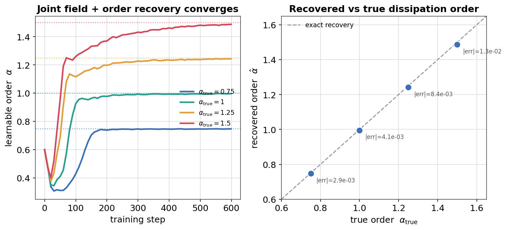

# Learnable-alpha PINN: recovering the fractional order jointly with the field

The honest, concrete realisation of *"the derivative order is a learnable,
possibly fractional, parameter"* -- as a **parameter-identification PINN**, not
an NS regularity claim. `unproven_claim` never appears here.

Driver: [`run_fractional_pinn.py`](run_fractional_pinn.py). Companion to
[`RESULTS_fractional_ns.md`](RESULTS_fractional_ns.md) (Track C) and the cookbook
page *Navier-Stokes tracks (numerical / certified / fractional)*.

## Problem

The unforced fractional shear `U(y,t)` (the x-velocity of a divergence-free
shear, whose nonlinearity vanishes) obeys the linear fractional heat equation

```
d_t U + nu (-Delta)^alpha U = 0,
```

so each Fourier mode decays at its own rate `nu k^{2 alpha}`. We synthesise data
from a *known* `alpha_true` at a handful of time snapshots, then train

- a **spectral neural field** `U_theta(y,t) = sum_k g_k(t) sin(k y)`, with the
  mode amplitudes `g_k(t)` produced by a small MLP in `t` (exact `d_t` by
  autograd), and
- a differentiable `LearnableOrder` exponent (`omnibias.fractional.torch.order`),

minimising a **data loss** at the snapshots plus the **PDE residual evaluated at
the learnable order**, `sum_k (g_k'(t) + nu k^{2 alpha} g_k(t)) sin(k y)`. The
joint optimum recovers both the field and `alpha_true`. Data at several distinct
times is what breaks the degeneracy and pins the exponent.

## Environment

CPU, `python` (torch 2.9.0, float64), single-threaded.
Full sweep (4 orders x 1000 Adam steps) in **~35 s**.

## Result

Joint recovery of the order and the field, from 6 snapshots, `modes = 4`,
`hidden = 64`, `depth = 3`, `nu = 0.05`, `T = 1`, `lr = 3e-3` (order LR `x20`):

| `alpha_true` | `alpha_recovered` | abs error | field rel-L2 |
|---|---|---|---|
| 0.75 | 0.7498 | 2.4e-4 | 1.4e-4 |
| 1.00 | 0.9929 | 7.1e-3 | 6.0e-3 |
| 1.25 | 1.2470 | 3.0e-3 | 3.0e-3 |
| 1.50 | 1.4952 | 4.8e-3 | 1.5e-3 |

Every order is recovered to `< 1%` with sub-percent field error.



The figure (generated by `make_figures.py` with 600 steps for a legible
convergence curve) shows the learnable order climbing from its initialisation to
each true value (left) and the recovered-vs-true parity with per-point error
(right).

## Notes

- **Speed.** On a many-core node the tiny second-order-autograd PINN was ~24x
  slower under default thread oversubscription; pinning `torch.set_num_threads(1)`
  (and giving the scalar order its own faster LR) is what makes the sweep finish
  in seconds. Both are exposed as flags (`--threads`, `--alpha-lr-mult`).
- **Honesty.** This is system identification of a fractional model. It says
  nothing about Navier-Stokes regularity; `unproven_claim = False` throughout.

## Reproduce

```bash
# smoke (CPU, ~10 s): single order, 200 steps
python -m examples.certified_fluid_dynamics.run_fractional_pinn --smoke

# full sweep
python -m examples.certified_fluid_dynamics.run_fractional_pinn \
  --out-dir "artifacts/omnibias_runs/fractional_pinn"

# regenerate the figure into docs/img/
python examples/certified_fluid_dynamics/make_figures.py
```

Covered by `tests/test_fractional_ns.py::test_learnable_pinn_recovers_order_and_field`.
