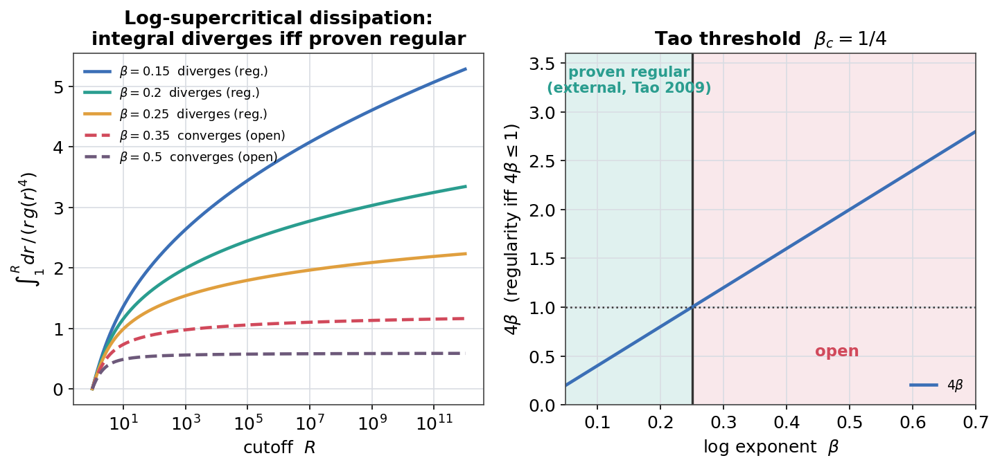
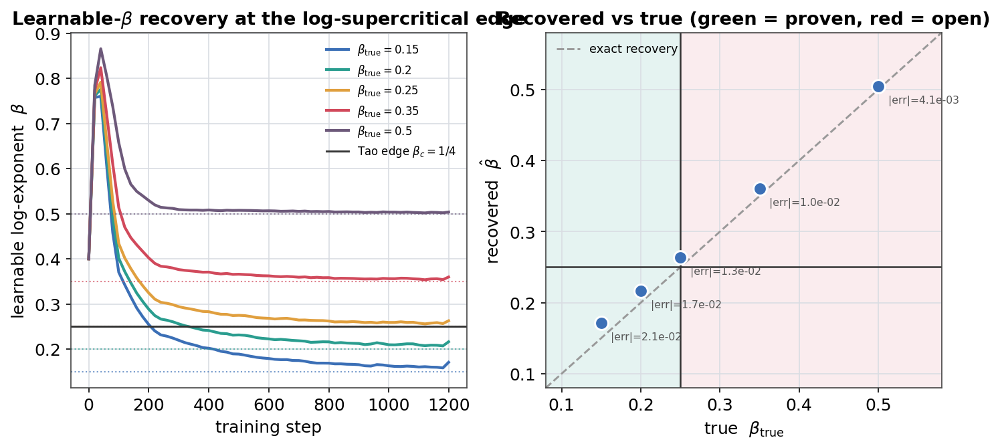

# Learnable-beta PINN at Tao's logarithmically supercritical edge

The research-frontier companion to the learnable-alpha PINN
([`RESULTS_fractional_pinn.md`](RESULTS_fractional_pinn.md)). Instead of the
*power* `alpha`, the learnable parameter is Tao's **log-exponent** `beta`, one
logarithm below critical hyperdissipation -- the genuine edge of what is provably
regular in 3D.

`unproven_claim` never appears. Tao's theorem is **external**, only cited and tested
(`omnibias_verified = False`).

Driver: [`run_log_supercritical_pinn.py`](run_log_supercritical_pinn.py).

## Problem

Tao (2009) weakened critical hyperdissipation `|k|^{5/2}` to
`|k|^{5/2} / g(|k|)^2` with `g(r) = (log(e + r^2))^{beta}` and proved 3D global
regularity **iff** `int^inf dr/(r g(r)^4) = inf`, i.e. `4 beta <= 1` -- borderline
`beta_c = 1/4`. Each Fourier mode `k` then dissipates at rate
`nu |k|^{5/2} / (log(e + k^2))^{2 beta}`.

We synthesise multi-scale decay data from a known `beta_true`, train a spectral
neural field `U(y,t) = sum_k g_k(t) sin(k y)` jointly with a differentiable
`LearnableOrder` (bounding `beta`), and minimise a data loss plus the PDE
residual evaluated at the **learnable** log-supercritical rate. Recovering `beta`
also recovers *which side of Tao's threshold* the dynamics lives on.

## Environment

CPU, `python` (torch 2.9.0, float64), single-threaded.
Full sweep (4 values x 1500 Adam steps) in **~73 s**.

## Result

`modes = 6`, `hidden = 64`, `depth = 3`, `nu = 0.05`, `T = 1`, `lr = 3e-3`
(order LR `x20`), 8 snapshots:

| `beta_true` | `beta_recovered` | abs error | Tao side | side recovered? |
|---|---|---|---|---|
| 0.15 | 0.1555 | 5.5e-3 | proven (`4b<=1`) | **yes** |
| 0.25 (borderline) | 0.2586 | 8.6e-3 | proven (edge) | no -- knife-edge |
| 0.40 | 0.4042 | 4.2e-3 | open | **yes** |
| 0.60 | 0.6029 | 2.9e-3 | open | **yes** |

`beta` is recovered to sub-percent in every case. The **regularity side** (which
side of Tao's `beta_c = 1/4` threshold) is recovered correctly for every value
*except exactly at the borderline* `beta = 0.25`, where the true value sits on the
edge (`4 beta = 1`) and any recovery error flips the side. This is the honest,
expected behaviour of a measure-zero knife-edge -- reported, not hidden.




## Notes

- **Why beta is harder than alpha.** `beta` enters only through the slowly
  varying `log` factor, so its per-mode sensitivity is weaker than `alpha`'s
  power law; it is still identifiable from multi-scale data, just with a larger
  (though still sub-percent) error.
- **Honesty.** System identification of a linear dissipation model. It says
  nothing about Navier-Stokes regularity, and Tao's theorem is external.

## Reproduce

```bash
# smoke (CPU, ~5 s): borderline beta = 0.25, 400 steps
python -m examples.certified_fluid_dynamics.run_log_supercritical_pinn --smoke

# full sweep straddling the 0.25 edge
python -m examples.certified_fluid_dynamics.run_log_supercritical_pinn \
  --out-dir "artifacts/omnibias_runs/log_supercritical"

# regenerate the figures into docs/img/
python examples/certified_fluid_dynamics/make_figures.py
```

Covered by `tests/test_fractional_ns.py::test_learnable_beta_pinn_recovers_beta_and_side`
and `::test_tao_symbol_torch_matches_numpy`.
