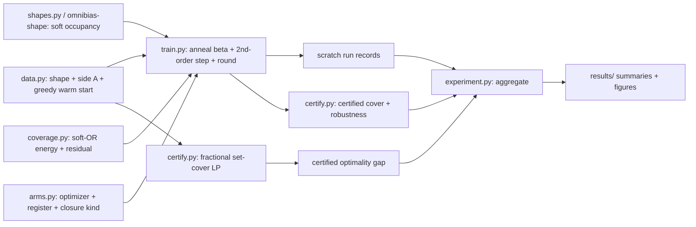

# Min-Square-Cover: Certified Geometric Covering with omnibias

## Goal

Turn the classic **minimum fixed-size-square cover** problem into a smooth
**geometric-optimization** pipeline on omnibias, and turn it into a *differentiated*
scientific artifact the discrete-optimization literature (greedy / ILP solvers) does
not produce: an **exact-curvature** geometric solver plus a **certified cover** and a
**certified optimality gap**.

The problem (from the reference question): given a 0/1 image `I` of shape `M x N` and
an integer side `A`, place the fewest axis-aligned `A x A` squares, pixel-aligned and
edge-parallel, whose union contains every 1-pixel. The exact optimum is NP-hard
(geometric set cover); the reference asker explicitly wants "a good enough, almost
feasible solution in limited time," which is exactly the niche of a smooth relaxation
plus a soundness certificate.

The core idea is that omnibias's real primitive is not "derivatives of neural nets"
but **exact closed-form high-order derivatives of smooth surrogates of discrete or
geometric objects**. A square is a product of sigmoid steps; "covered" is a soft-OR;
"number of squares" is a cardinality gate. Once the discrete cover is written that way,
the gradient *and Hessian* of the coverage energy are available in closed form (the
Riccati sigmoid tower), and omnibias's second-order optimizers can navigate an energy
landscape that first-order Adam/SGD stall on.

Hypotheses to falsify:

- H1 (quality): the relax -> anneal -> round pipeline matches or beats the greedy
  sliding-window baseline square count on benchmark shapes.
- H2 (optimizer axis): the exact-curvature optimizers (`CubicNewton`,
  `TrustRegionNewtonCG`, `CubicGaussNewton`) escape the coverage energy's plateaus and
  find fewer-square covers than Adam/SGD at an equal step budget.
- H3 (annealing): the `beta` soft-to-hard homotopy (`BetaAnnealScheduler`) yields a
  lower final hard-cover count than any fixed `beta`.
- H4 (certified gap): the `omnibias-convex` fractional set-cover LP produces a
  certified lower bound `L`, so the returned cover of size `K` carries a *proven*
  optimality gap `K / ceil(L)`.
- H5 (certified cover): `omnibias-verify` certifies that every 1-cell is covered by the
  rounded integer solution, and certifies a position-jitter robustness margin (the
  cover survives a `+/- delta` perturbation of every square center).
- H6 (closed-form curvature): the exact coverage Hessian (see `HESSIAN.md`) agrees
  bit-closely with autodiff / finite differences, and makes each second-order step
  exact and cheap rather than a matrix-free approximation.

## Where it lives

New example package `examples/min_square_cover/`, mirroring the structure of
[examples/binary_vs_ste/](../binary_vs_ste): dataclass specs with a registry dict plus a
`get_*` lookup and a sorted `__all__`, SPDX headers on every `.py`, an argparse CLI, an
offline `--synthetic` smoke mode, and small committed summaries / figures under
`results/`. Larger artifacts go to a scratch directory; only summaries and figures are
committed.

```
examples/min_square_cover/
  __init__.py
  data.py         # image specs; synthetic shapes; optional real-image loader; greedy baseline
  shapes.py       # thin wrapper over omnibias-shape occupancy (local fallback until the pkg lands)
  coverage.py     # soft-OR / LSE union + coverage energy + residual (scalar & vector closures)
  arms.py         # the optimizer arms: (optimizer, register, closure kind) + registry
  train.py        # solve one arm: build energy, anneal beta, step, round, record RunResult
  experiment.py   # run_sweep over (shape, arm, seed, register); write JSON/CSV; summarize
  certify.py      # LP lower bound (omnibias-convex) + certified cover / robustness (omnibias-verify)
  run_demo.py     # argparse CLI; --synthetic offline smoke
  tests/          # offline, CPU, fast smoke tests mirroring examples/binary_vs_ste/tests
  results/        # committed summary.csv|json + figures/*.png
  PLAN.md         # this design doc
  API.md          # the omnibias-shape package API spec (deliverable b)
  HESSIAN.md      # the closed-form coverage-Hessian derivation (deliverable c)
```

The occupancy / coverage math is specified as a reusable package `omnibias-shape` in
[API.md](API.md); the example imports it (with a local `shapes.py` fallback so the
example runs before the package is scaffolded). The exact curvature the second-order
arms rely on is derived in [HESSIAN.md](HESSIAN.md).

## Formulation

Fix an upper bound `K` on the square count (initialised from the greedy baseline).
Each square `k` carries a continuous center `c_k = (x_k, y_k)` and an existence gate
`alpha_k = sigmoid(a_k) in [0, 1]`. Parameters `theta = {(x_k, y_k, a_k)}`.

- Soft square occupancy (the omnibias core primitive). A 1-D "inside the interval"
  indicator is a difference of two sigmoids; an axis-aligned square is the product of
  two of them:

  `box(t; c, A) = sigmoid(beta (t - c + A/2)) - sigmoid(beta (t - c - A/2))`
  `m_k(i, j)   = box(i; x_k, A) * box(j; y_k, A)`.

  Because `m_k` is built purely from sigmoids, every center-derivative is a closed-form
  polynomial in `sigmoid` via the Riccati tower
  ([sigmoid_polynomial_coeffs](../../packages/omnibias-core/src/omnibias/core/polynomials.py),
  [riccati_sigmoid_derivative](../../packages/omnibias-binary/src/omnibias/binary/torch/ops/quantize.py)).

- Soft coverage (soft-OR union): `C(i, j) = 1 - prod_k (1 - alpha_k m_k(i, j))`, or the
  log-sum-exp smooth-max variant reusing
  [logsumexp_hessian](../../packages/omnibias-hopfield/src/omnibias/hopfield/torch/ops/hopfield.py).

- Energy: `E(theta) = sum_{I(i,j)=1} loss(1 - C(i, j)) + lambda * sum_k alpha_k`, with an
  optional tightness term on background pixels (the problem allows covering background,
  so it is off by default). The `loss` is a smooth hinge (`softplus`) or a squared hinge
  (unlocking the Gauss-Newton residual closure). The `lambda` term is the `L0` count
  surrogate that drives unneeded gates to zero.

- Homotopy: anneal `beta` upward so boxes go from smooth (well-conditioned, wide
  gradients) to hard (exact), the soft-to-hard curriculum shipped as
  [BetaAnnealScheduler](../../packages/omnibias-binary/src/omnibias/binary/schedule.py).

Why second order matters here: the coverage energy has large flat plateaus (a square
sitting over pure background, or deep inside an already-covered region, has near-zero
gradient) and sharp ridges at edges. First-order methods stall on the plateaus;
cubic-regularised / trust-region Newton use negative-curvature directions to escape the
saddles. Annealing `beta` controls the plateau width, so the two levers compose.

## Two registers and the optimizer-to-closure mapping

Every configuration is run in two registers, so the differentiable and certified paths
both light up (mirroring the two-register discipline of the MNIST-1D double-descent
study):

- Continuous-energy register (primary heuristic): soft occupancy + soft-OR + `beta`
  anneal + second-order optimize, then round to the pixel grid.
- LP-relaxation register (certified lower bound + warm start): fractional set cover
  `min 1^T x s.t. C x >= 1, 0 <= x <= 1` over pixel-aligned candidate squares, solved
  and differentiated by `omnibias-convex`.

Per [packages/omnibias-torch/src/omnibias/torch/optim.py](../../packages/omnibias-torch/src/omnibias/torch/optim.py),
`arms.py` declares each optimizer's closure kind so `train.py` wires it correctly:

- Scalar-loss closure (`closure() -> scalar`, graph intact, no `.backward()`):
  `CubicNewton` (L1747), `TrustRegionNewtonCG` (L2534), `JetLBFGSOptimizer`,
  `JetSubspaceTensor`, `DiagonalCurvature(curvature="hutchinson")`. Objective is
  `coverage_energy` with the `softplus` hinge.
- Residual-vector closure (`closure() -> (N,)`): `CubicGaussNewton` (L1839),
  `DiagonalCurvature(curvature="gauss_newton")`, and the functional `GaussNewton`
  (L584) via `functional_residual_fn`. Objective is `coverage_residual` (the per-1-pixel
  under-coverage residual `sqrt(w) (1 - C)`), unlocking the Gauss-Newton family.
- Baselines `adam`, `sgd`: standard `.step()` with explicit `backward()` on the scalar
  energy, the first-order controls H2 is measured against.

Second-order arms default to **full-batch** over the 1-pixel set (the images are tiny,
so the coverage energy and its exact Hessian are cheap and well defined). The exact
closed-form Hessian path (`coverage_energy_hessian`, from `HESSIAN.md`) is cross-checked
against the matrix-free double-backward HVP that the drop-in optimizers use.

## Instrumentation

`certify.py` and `train.py` record a per-run JSON/NPZ (large arrays to scratch, small
summaries committed):

- config: shape id, `M`, `N`, `A`, `K` init, register, arm, seed, `lambda`, `beta`
  schedule.
- per-iteration: energy, coverage fraction of 1-pixels, number of active gates
  (`alpha_k > 0.5`), gradient norm.
- final: rounded hard square count `K_final`; the greedy baseline count.
- certified: LP lower bound `L` and gap `K_final / ceil(L)`; certificate verdict (every
  1-cell covered) and the position-jitter robustness margin `delta`.
- exact-vs-autodiff curvature check: max relative error between
  `coverage_energy_hessian` and `torch.func.hessian` at the solution.
- wall clock, and optimizer iteration / HVP counts.

## Compute and data

- The interactive development path is CPU only; dev and CI run the `--synthetic` shapes.
  Larger sweeps fan out to a GPU job on a GPU cluster (vendor-neutral; the actual
  submission wrapper lives in the separate, private `omnibias_experiments` project,
  never in this example).
- `data.py`: an offline deterministic shape generator (blobs, rings, L-shapes, and the
  reference `25 x 25`, `A = 15` non-convex-but-connected shape) with a fixed seed, plus
  an optional real-image loader gated behind a flag (lazy `skimage` import, mirroring the
  lazy `torchvision` import in
  [examples/binary_vs_ste/data.py](../binary_vs_ste/data.py)). The greedy sliding-window
  cover (max-overlap window, remove, repeat, with the connected-component guard) is
  vendored as the baseline and as candidate initialization.
- Default grid: shapes `{blob, ring, L, reference25}`, sides `A in {5, 8, 15}`, seeds
  `{0..7}`, both registers. Dense-Hessian second-order arms and the dense-metric LP /
  certified paths are capped to small images (the reference `25 x 25` scale and below);
  larger images use the matrix-free optimizers and matrix-free certified diagnostics.



## Phases

- P1 - Harness + reproduce + instrument: build the package skeleton and the offline
  smoke test; implement soft occupancy + soft-OR coverage energy; reproduce the greedy
  baseline and overlay the continuous solution. Gate: the continuous solution covers all
  1-pixels after annealing and rounding on the reference shape, and its count is `<=` the
  greedy count.
- P2 - Optimizer-axis sweep: run all arms x both registers x shapes x sides x seeds;
  produce per-optimizer cover-count curves and the register comparison (H2, H3).
  Cross-check the closed-form Hessian vs the matrix-free HVP (H6).
- P3 - Certified gap + certified cover: build the fractional set-cover LP lower bound and
  report the certified optimality gap (H4); certify the rounded cover and its
  position-jitter robustness margin with `omnibias-verify` (H5).
- P4 - Shape and curvature variants: square vs disk vs convex polytope occupancy
  (min-of-half-plane sigmoids); the exact closed-form-Hessian second-order path vs the
  matrix-free path near the hard-`beta` regime.

## Artifacts, tests, gates

- Committed: `results/summary.csv|json`, `results/figures/*.png` (cover-count vs optimizer
  and register; energy and coverage-fraction trajectories under annealing; certified-gap
  bars; certified-cover overlays; square vs disk vs polytope), and a short findings
  writeup. Optional docs / `llms.txt` / `CHANGELOG` entries only if we decide to surface
  it publicly.
- `tests/` (offline, CPU, fast, mirroring
  [examples/binary_vs_ste/tests/](../binary_vs_ste/tests)): synthetic tiny shapes; assert
  soft occupancy is `in [0, 1]` and hardens to the exact box as `beta -> inf`; assert each
  optimizer arm takes a valid step in its register; assert `coverage_energy_hessian`
  matches `torch.func.hessian` at tiny `K`; assert the sweep harness runs end-to-end and
  writes records; assert the greedy baseline and the certified-cover check agree on a
  hand-checkable shape.
- Gates: `ruff check`, and the tests via the workspace interpreter
  (`python -m pytest examples/min_square_cover/tests -q`). Examples are extension-tier
  (not on the strict mypy gate), but new modules are written strict-clean.

## Honest caveats (scope explicitly)

- The exact ILP optimum is out of scope by design: this is a relaxation-plus-certificate
  framework, not an exact combinatorial solver, consistent with the `omnibias-graph` audit
  that forbids `vertex_cover` / `ilp_solve`. The defensible thesis is the certified
  heuristic with a proven optimality gap, not "beats a dedicated ILP solver."
- "Closed-form curvature" is exact for the sigmoid-built coverage energy; if a `relu`-style
  hard occupancy were substituted its second derivative would be trivial a.e. (expected,
  not a bug).
- Dense-Hessian second-order arms, the dense LP, and the certified enclosures are
  small-image only; the wide tail uses matrix-free optimizers and matrix-free certified
  diagnostics.
- The certified robustness margin is a *local* box claim (a per-square position tolerance),
  stated honestly in the sealed certificate scope, not a global guarantee.
