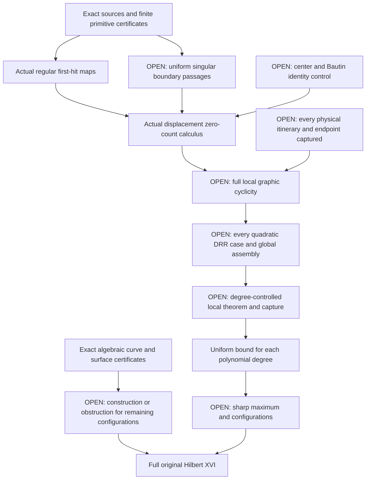

# Hilbert XVI: implemented evidence and open proof program

Checked against primary literature and repository sources on **2026-09-13**.
The machine-readable companion is [hilbert16-literature.json](hilbert16-literature.json).
Publication status, theorem premises, preprint claims, and repository evidence
are recorded separately. No mathematical novelty or external acceptance of
the repository's written arguments is asserted.

## The full target and the current boundary

Hilbert's original problem includes the arrangement of real algebraic curves
and surfaces, and the number and placement of limit cycles of planar
polynomial differential equations. A degree-dependent cycle bound alone
does not settle the configuration questions or the algebraic part.
[Original problem 16](https://people.reed.edu/~davidp/341/resources/hilbert.pdf).

The dynamical distinctions are essential: finiteness for each fixed field,
finite cyclicity in a parameter neighborhood, a bound uniform over all fields
of a fixed degree, an effective bound, and a sharp maximum with possible
configurations are different conclusions. Compactifying a normalized
coefficient space supplies a finite-subcover argument only after every
boundary point has a proved local bound and every cycle has been captured.

The repository's [strict quadratic passage arguments](HILBERT16.md) and
[varying-detuning result](HILBERT16-VARYING-DETUNING.md) are internally audited
written arguments. They concern selected, admitted itineraries on strict
parameter sets. The varying-detuning result bounds three distinct admitted
small-height cycles; the separate strict first-root saddle itinerary has
bound two. These statements do not cover every nearby cycle or every
degenerating parameter direction.

**Full cyclicity of the repository's I_2^1 and I_4^1 targets, uniform finiteness
for all quadratic fields, the arbitrary-degree uniform problem, and the full
algebraic classifications remain open program obligations.** The literature
search did not establish a complete current list of all unresolved DRR cases.
The new primitives below do not solve a uniform singular-passage stage.

## What is now implemented

| Module and entry points | Earned conclusion | Boundary of the claim |
| --- | --- | --- |
| `omnibias.core.verified.asymptotic_jet`: `power_compensator`, `signed_root_primitive`, `fixed_product_jet`, `verify_fixed_product_derivative` | Outward enclosures through the power-compensator diagonal and signed root parameter zero; exact weighted polynomial derivatives along the fixed-product scale path. | Finite analytic primitives, not membership or remainder closure for actual Dulac maps. Negative root parameters require the whole integration path to avoid poles. |
| `omnibias.dynamics.return_maps`: `PolynomialFlow`, `PolynomialEvent`, `certify_stopped_event`, `verify_stopped_event` | Exact polynomial sources generate interval flow, first and mixed second variational equations, transverse first eligible events, earlier-event exclusion, and event-time-corrected derivatives. Positive polynomial guards distinguish section branches. | Finite time and regular events; ambiguous guards, grazing, competing stops, or failed enclosures remain unresolved. |
| `omnibias.dynamics.cyclicity`: `certify_polynomial_cyclicity`, `certify_exponential_cyclicity`, `certify_planar_return_cyclicity` and their replay functions | Exact polynomial identity fibers and Sturm/Rolle/degree bounds; terminating zero counts for supplied real confluent exponential polynomials; actual regular planar return-displacement bounds from generated event derivatives. | A finite model is not silently substituted for an unknown physical displacement. The actual-return adapter covers cycles closing at its certified first eligible hit. |
| `omnibias.dynamics.hilbert16`: `CyclicityLeaf`, `CyclicitySplit`, `certify_polynomial_cover`, `verify_polynomial_cover` | Every exact rational split and source-bound polynomial leaf is replayed. Height splits sum bounds; parameter splits take their maximum. | A finite polynomial-box cover is not a cover of physical cycles, singular charts, or infinity. |
| `omnibias.geometry.algebraic`: `HomogeneousPlaneCurve`, `find_smoothness_witness`, `certify_curve`, `replay_curve_certificate` | Exact Bezout identities exclude complex singularities on all projective charts; whole-edge Bernstein signs certify oval barriers and their nesting. Attaining Harnack's bound completes the real scheme in the supported setting. | A failed bounded witness search is inconclusive. Nonmaximal barrier counts do not determine the complete locus, rigid isotopy, or complex orientations. |
| `omnibias.geometry.algebraic_surfaces`: `separable_quartic_polynomial`, `certify_separable_quartic_surface`, `replay_separable_quartic_surface` | Actual coefficients identify the supported rational quartic family, complex smoothness, and a complete real locus of eight disjoint spheres bounding disjoint balls. | This family-specific certificate is not a quartic or arbitrary-degree surface classification. |

The regular-return consumer has a nontrivial positive example. Put
`a=(1-x^2-y^2)/10` and use the polynomial field
`x'=y+a*x, y'=-x+a*y`, the initial section `(0,h)`, and target `x=0, y>0`.
On `h in [0.99999,1.00001]`, a finite validated run encloses the actual
displacement derivative in approximately `[-0.7673,-0.6663]`, earning an
upper bound of one for cycles closing at this first eligible return. The
unit circle is the familiar invariant cycle of this field. This is not
a quadratic-field or global-cycle bound. The [return-map companion](HILBERT16-RETURN-MAPS.md)
and [cyclicity calculus](HILBERT16-CYCLICITY-CALCULUS.md) give the exact interfaces
and written analytic implications.

The smooth octic baseline is

\[
[(X^2-Z^2)(X^2-9Z^2)]^2+
[(Y^2-Z^2)(Y^2-9Z^2)]^2-Z^8/16.
\]

It has **16 certified separated oval barriers**, with Harnack upper bound
22; the checker reports an incomplete real scheme. It does not realize the
open 22-oval target in [HILBERT16-ALGEBRAIC-TARGET.md](HILBERT16-ALGEBRAIC-TARGET.md).
The new surface baseline is

\[
\sum_{i=1}^{3}(X_i^2-W^2)^2-\epsilon W^4,
\qquad 0<\epsilon<1.
\]

Its affine critical levels are exactly 0, 1, 2, 3, and its spatial partials
exclude singularities at infinity. In each orthant, `u_i=x_i^2-1` identifies
one sphere and its ball. This proves completeness for that specific surface
family, unlike the octic's lower component count.

Two trust corrections accompany these additions. The legacy Poincare
`crossed` flag means opposite endpoint signs were detected; it proves neither
transversality, uniqueness, nor absence of earlier crossings. Its behavior is
preserved and its terminology corrected. Separately,
`omnibias.difference.singularity.convergence_radius_from_geometric_tail`
returns only `[1/q,+infinity]` from an independently established upper tail
`|a_k|<=M*q^k`. The legacy `certified_singularity_annulus` delegates to this
sound lower-radius inference. A finite prefix cannot prove a finite upper
radius or existence of a singularity; zero declared tail gives a polynomial.

## Literature that changes the next proof step

The [Huzak–Kristiansen paper, published in 2026](https://doi.org/10.1088/1361-6544/ae9443)
uses the same five-parameter family as the repository. Its entry–exit theorem
requires a strict nonvanishing drift in one weighted chart. It identifies
I_2^1 and I_4^1 as the relevant saddle-node-at-infinity cases and cites their
cyclicity treatment as work in progress. Higher even multiplicities can
produce a dominating central integral, so a fixed outer entry–exit relation
need not survive without an additional balance condition.

[Marin–Villadelprat's 2024 Dulac coefficient theorem](https://doi.org/10.1016/j.jde.2024.05.037)
provides uniform hyperbolic expansions and compensators; its selected
coefficient continuation results do not include every coefficient or the
saddle-node limit. [Binyamini's Log-Noetherian preprint](https://arxiv.org/html/2405.16963v1)
gives effective bounds once an actual function has a representation with
controlled format. Joint representation of singular return families with
uniform chain, coefficient, analytic-domain, and norm bounds is a new
obligation, not a consequence already supplied by that theorem.

[Mardesic et al., 2026](https://doi.org/10.1007/s00574-026-00521-7) provide
differential-ideal Noetherianity and Melnikov-length control for fixed
Hamiltonian/orbit data. This is not a degree-uniform bound on first nonzero
Melnikov order, nor a transfer theorem to arbitrary singular return maps.
The [multisummability and o-minimal structures of Rolin–Servi–Speissegger](https://doi.org/10.4153/S0008414X23000111)
offer another possible representation setting, with the same family-membership
gate. The May 2026 [IAS report](https://www.ias.edu/math/events/special-year-research-seminar-49)
describes further work toward a gap repair as a first step, not a finished
general theorem.

[Yeung's published critique](https://doi.org/10.1007/s12346-025-01220-2)
identifies failure of a function-class closure assertion in one Ilyashenko
proof framework. A proposed calculus must survive that counterexample to
closure. It is not an infinite-cycle counterexample, a refutation of
Ecalle's separate argument, or a refutation of fixed-field finiteness.
[Palma-Marquez–Yeung's 2025 theorem](https://doi.org/10.1088/1361-6544/add703)
proves nonoscillation for a specified Stokes-controlled composition class;
the unrestricted induction and parametric cyclicity remain separate.

[Gasull–Santana, Proc. AMS 153 (2025)](https://doi.org/10.1090/proc/17116)
prove that if `H(n)` is finite then `H(n+1) >= H(n)+1`, and that a finite
maximum is realized by structurally stable hyperbolic cycles. This is not a
chart, a remainder, or `H(2)<infty`.
[arXiv:2602.22558](https://arxiv.org/abs/2602.22558) gives generic Bautin-size
bounds on a residual set. That is G2-adjacent; G2 stays closed.
[Maletto, arXiv:2606.21449](https://arxiv.org/abs/2606.21449) classifies
arrangements of three lines and a cubic by combinatorial types `(n, W, T)`.
That is Hilbert XVI Part A. The repository replays the published §1.1
quartic type; it does not absorb `sep = exp(-1/epsilon^2)` or
`L = 1/n`, and it is not a limit-cycle theorem.

## Dated DRR case ledger

The original reduction is stated in terms of 121 graphics. Later refinements
and additions require an audited case registry before any assertion that
exactly a specified number remain unresolved. Subscripts and superscripts
must be retained: I_2^1 is different from I_12^1.

| Cases | Verified source status |
| --- | --- |
| I_2^1, I_4^1 | The 2026 Huzak–Kristiansen source gives entry–exit tools and names a cyclicity paper as work in progress. Full treatment remains an open target here. |
| I_12^1, I_13^1 | Full finite cyclicity in [Rousseau–Shan–Zhu, 2016](https://arxiv.org/pdf/1502.00689), for nilpotent saddle cases. |
| I_14^1 | Full finite cyclicity in [Roussarie–Rousseau, 2015](https://arxiv.org/pdf/1506.07104). |
| I_6b^1, H_13^3, DI_2b | That 2015 theorem treats the boundary blown-up limit periodic set only; no later full resolution was verified in this review. |
| H_14^3 | **Full local finite cyclicity is claimed by Haibo Lu's [arXiv:2607.13785v3, 26 August 2026](https://arxiv.org/html/2607.13785v3)**. It claims a fixed two-sided collar and a full twelve-dimensional quadratic coefficient neighborhood. This is a preprint claim, not an independently established theorem in this dossier. |
| DF_1a, DF_2a | Full finite cyclicity in [Huzak, 2018](https://doi.org/10.3934/cpaa.2018063). |
| DF_1b, DF_2b, DH_1, DH_2 | Explicitly open in that 2018 paper. This is the latest published status located here, not a certified exhaustive statement of 2026 openness. |

Lu's H_14^3 manuscript offers reusable candidate interfaces: stopped
itineraries, common-domain matched curvature, and finite-face gluing with
open local bounds. Its center ideal, incidence analysis, and coalescing/root
identities are specific to its field. They cannot be transferred to I_2^1 or
I_4^1 without proof. Lu's other [entry–exit/grazing preprint, v4](https://arxiv.org/html/2607.27464v4)
concerns a piecewise-smooth circuit; quadratic grazing is contact order, not
a global quadratic polynomial field.

## Dependency graph and decision-complete research gates



The [coalescing-capture companion](HILBERT16-COALESCING-CAPTURE.md)
records a χ-atlas and a restricted shrinking-rectangle first-derivative
bound. The [saddle-node](HILBERT16-SADDLE-NODE.md),
[shrinking-root](HILBERT16-SHRINKING-ROOT.md), and
[two-blow-up](HILBERT16-TWO-BLOWUP.md) follow-ups fail on the same named
sequences: a fold-versus-separation scale tension at
`sep = exp(-1/epsilon^2)`, rewritten as an exploding W-ratio on chart WS
and then as a scale dichotomy in [the next-atlas note](HILBERT16-NEXT-ATLAS.md),
and an outgoing saddle colliding with the centre along `L = 1/n` (SR2
rematch fails on the selected itinerary). The
[chart-cell ledger](HILBERT16-CHART-CELLS.md) records those labels; a
complete list is not G1. Logarithmic charts LI/WL are not a third scale.
The super-small sequence remains admitted. **G1 does not pass.** C2
remainders used by the joined Rolle chain remain absent. G4 is not
opened. The next analytic target remains a **coalescing-root and
central-capture theorem for the actual quadratic passage**, not another
primitive evaluation. A
counterexample to a naive extension is already exact. For
`X'=-epsilon*s*X, Y'=r*Y`, entry `X=1, Y=exp(-kappa/epsilon)` and exit `Y=1`
give `X_exit=exp(-(s/r)*kappa)`. No fixed positive decay exponent can bound
its kappa sensitivity uniformly as `s/r` tends to zero. Choosing `s/r<gamma`
makes the ratio to `C*exp(-gamma*kappa)` diverge. This obstructs that proof
extension, not finite cyclicity. The scale `chi=(s/r)*kappa` must be resolved
and matched to central, endpoint, and shrinking-section charts.

| Research gate | Required acceptance evidence | Falsification or unresolved condition |
| --- | --- | --- |
| G1: actual confluent passage | A finite weighted chart description spanning no-root, double-root, and first-root limits; complete physical first-hit domains; uniform variational remainder bounds in all derivatives used downstream; endpoint matching. | **Open / failed.** The χ-atlas, saddle-node blow-up, shrinking-root rematch, two-blow-up pair, and next-atlas log charts all fail on `sep = exp(-1/epsilon^2)` (scale dichotomy; sequence admitted) or `L = 1/n` with `r1 -> 0`. Primitive bounds, a discovery hit, or a named `lim` path alone do not pass G1. |
| G2: identity-aware displacement calculus | Exact center/Bautin generators for actual maps; vanishing equivalent to identity; a proved class closed under the specific composition, differentiation, and division operations, with finite termination. | Frozen leading coefficients, unproved remainder membership, or the known closure counterexample break the chain. |
| G3: bounded-format representation | Actual jointly parameterized return and admission predicates represented with uniformly controlled format, including norms, analytic extensions, branches, and Stokes data where needed. | An unbounded chain/format or unhandled degeneration prevents invoking an effective o-minimal zero theorem. An alternative quasianalytic route must prove its own uniform hypotheses. |
| G4: complete graphic capture | Every degenerating sequence of nearby cycles has a subsequence in a chart with an open original-parameter neighborhood carrying a uniform count. Identity fibers and all incident sides are included. | A finite list of labels or a compact parameter sphere without local count neighborhoods is insufficient. |
| G5: algebraic realization or obstruction | An explicit complex-nonsingular polynomial with complete topology, or a general obstruction covering all realizations of the proposed scheme. For patchworking, verify regularity and the theorem's hypotheses. | Search exhaustion in a bounded class, a failed sign layout, real-only smoothness, a single Maletto `(n, W, T)` replay, or a nonmaximal component lower bound does not decide the scheme. |
| G6: full generality | An audited quadratic case inventory and assembly, then a degree-controlled resolution/capture theorem; separate sharp/configuration conclusions and arbitrary-degree algebraic classifications. | A solved local case, a finite-degree example, or empirical scaling is not the general theorem. |

Acceptance for each new theorem is a complete analytic proof, independent
adversarial review, and targeted Lean verification of suitable exact and
zero-count obligations. Full analytic formalization is not an imposed
prerequisite. Experiments guide the proof and test counterexamples; they do
not replace quantified continuum estimates.

## Formal scope and reproduction

`Hilbert16Scale.lean` contains eight Mathlib theorem declarations: the actual
confluent divided-difference limit, exponential scale derivatives, product
invariance, the curved-path second derivative, its cancellation test, and the
signed-root pole margin. `Hilbert16ChiScale.lean` contains seven declarations
for the linear matching coordinate, its χ and kappa derivatives, the
reciprocal-separation threshold, the sensitivity ratio, and the
frozen-exponent obstruction. `Hilbert16SaddleNode.lean` contains six
exact identities: the double-root quadratic, the wall at the equilibrium,
vanishing-separation linear exit, vanishing χ, the `sigma * kappa`
factorization on a χ-locus, and the shrinking-root product.
`Hilbert16TwoBlowup.lean` contains four exact W-coordinate identities:
height reconstruction, the outgoing W-ratio, the log-W velocity, and the
two-scale product. They do not prove a physical C2 remainder.
`Hilbert16ScaleDichotomy.lean` contains nine exact identities: blow-up
height and height ratio, fold-scale `epsilon^4`, the affine leading
event exponent and its first derivative and second difference, the
joint-axis sum and exclusion, and the logarithmic inner coordinate on
the kill sequence. They do not prove a physical C2 remainder.
`Hilbert16ReturnMap.lean` contains eight declarations
for exponential weighting, event-time algebra, first/second derivative
zero-count implications, signed enclosure exclusion, and identity zeros.
Their derivative and event chain-rule hypotheses remain explicit. They do
not prove the Python evaluator, physical return existence, or global capture.
All nine Hilbert modules are imported by the analytic umbrella. The full Mathlib project build
passed on the review date, and the program benchmark passed its ten finite
checks and nine formal-module checks with per-theorem axiom audits. Those
successful checks retain the explicit premises and limited conclusions above.

From the repository root, use the prepared environment without resynchronizing:

```bash
uv run --no-sync python -m benchmarks.hilbert16_program --lean
uv run --no-sync python -m pytest packages/omnibias-dynamics/tests -q
uv run --no-sync python -m pytest packages/omnibias-core/tests/verified/test_asymptotic_jet.py -q
uv run --no-sync python -m pytest packages/omnibias-geometry/tests/test_algebraic_curve_certificates.py packages/omnibias-geometry/tests/test_algebraic_surface_certificates.py -q
```

The [program benchmark](../../benchmarks/hilbert16_program.py) records actual
checks and source hashes in `artifacts/hilbert16/program.json` by default;
`OMNIBIAS_SCRATCH` changes the artifact root and `--output` selects a file.
Its output is a
reproducibility record of scoped computations, not a global proof. Run
`lake build OmnibiasAnalytic` inside `formal/omnibias-analytic` for the analytic
umbrella. Build and benchmark outcomes belong in their generated records;
source-file existence or test counts do not establish a theorem beyond the
premises documented above.
