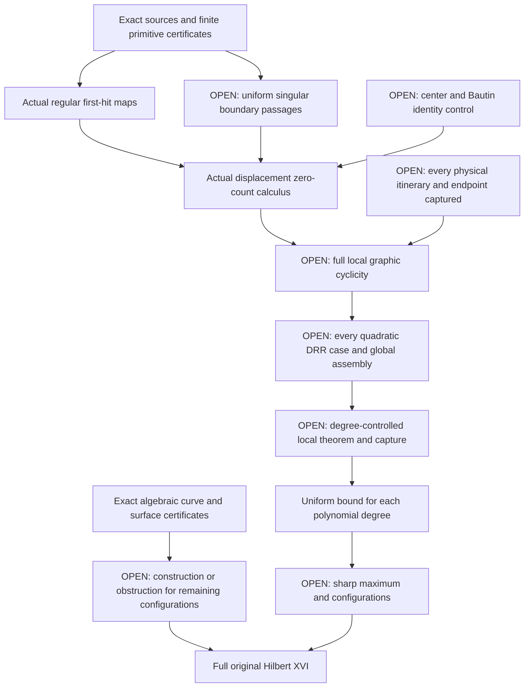

# Hilbert XVI: implemented evidence and open proof program

Checked against primary literature and repository sources on **2026-09-13**.
The machine-readable companion is [hilbert16-literature.json](hilbert16-literature.json).
Publication status, theorem premises, preprint claims, and repository evidence
are recorded separately. No mathematical novelty or external acceptance of
the repository's written arguments is asserted.

## The full target and the current boundary

Hilbert's original problem includes the arrangement of real algebraic curves
and surfaces, and the number and placement of limit cycles of planar
polynomial differential equations. A degree-dependent cycle bound alone
does not settle the configuration questions or the algebraic part.
[Original problem 16](https://people.reed.edu/~davidp/341/resources/hilbert.pdf).

The dynamical distinctions are essential: finiteness for each fixed field,
finite cyclicity in a parameter neighborhood, a bound uniform over all fields
of a fixed degree, an effective bound, and a sharp maximum with possible
configurations are different conclusions. Compactifying a normalized
coefficient space supplies a finite-subcover argument only after every
boundary point has a proved local bound and every cycle has been captured.

The repository's [strict quadratic passage arguments](HILBERT16.md) and
[varying-detuning result](HILBERT16-VARYING-DETUNING.md) are internally audited
written arguments. They concern selected, admitted itineraries on strict
parameter sets. The varying-detuning result bounds three distinct admitted
small-height cycles; the separate strict first-root saddle itinerary has
bound two. These statements do not cover every nearby cycle or every
degenerating parameter direction.

**Full cyclicity of the repository's I_2^1 and I_4^1 targets, uniform finiteness
for all quadratic fields, the arbitrary-degree uniform problem, and the full
algebraic classifications remain open program obligations.** The literature
search did not establish a complete current list of all unresolved DRR cases.
The new primitives below do not solve a uniform singular-passage stage.

## What is now implemented

| Module and entry points | Earned conclusion | Boundary of the claim |
| --- | --- | --- |
| `omnibias.core.verified.asymptotic_jet`: `power_compensator`, `signed_root_primitive`, `fixed_product_jet`, `verify_fixed_product_derivative` | Outward enclosures through the power-compensator diagonal and signed root parameter zero; exact weighted polynomial derivatives along the fixed-product scale path. | Finite analytic primitives, not membership or remainder closure for actual Dulac maps. Negative root parameters require the whole integration path to avoid poles. |
| `omnibias.dynamics.return_maps`: `PolynomialFlow`, `PolynomialEvent`, `certify_stopped_event`, `verify_stopped_event` | Exact polynomial sources generate interval flow, first and mixed second variational equations, transverse first eligible events, earlier-event exclusion, and event-time-corrected derivatives. Positive polynomial guards distinguish section branches. | Finite time and regular events; ambiguous guards, grazing, competing stops, or failed enclosures remain unresolved. |
| `omnibias.dynamics.cyclicity`: `certify_polynomial_cyclicity`, `certify_exponential_cyclicity`, `certify_planar_return_cyclicity` and their replay functions | Exact polynomial identity fibers and Sturm/Rolle/degree bounds; terminating zero counts for supplied real confluent exponential polynomials; actual regular planar return-displacement bounds from generated event derivatives. | A finite model is not silently substituted for an unknown physical displacement. The actual-return adapter covers cycles closing at its certified first eligible hit. |
| `omnibias.dynamics.hilbert16`: `CyclicityLeaf`, `CyclicitySplit`, `certify_polynomial_cover`, `verify_polynomial_cover` | Every exact rational split and source-bound polynomial leaf is replayed. Height splits sum bounds; parameter splits take their maximum. | A finite polynomial-box cover is not a cover of physical cycles, singular charts, or infinity. |
| `omnibias.dynamics.compactify`, `.dulac`, `.graphic` | Exact-Q Poincare charts and invariant equator; rational/resonant finite Dulac-model bounds after `x=exp(-kappa)`; interval-ratio coefficient-sign covers; explicit open-case refusal. | The expansion and remainder are declared inputs. No physical return-map membership, uniform remainder, complete itinerary, graphic cyclicity, or DRR-case closure is inferred. See [HILBERT16-DULAC-CYCLICITY.md](HILBERT16-DULAC-CYCLICITY.md). |
| `omnibias.holonomic.picard_fuchs`, `omnibias.dynamics.abelian`, `.abelian_return_transfer` | Exact-Q Picard--Fuchs syzygies, validated instance and coefficient-box Abelian zero counts, and an exact conditional epsilon threshold preserving a supplied first-order count under supplied remainder margins. | Regular Hamiltonian ovals only. No reduction, physical remainder, or singular endpoint capture is supplied for open DRR `I_2^1`/`I_4^1`; not DRR closure or Hilbert XVI. See [HILBERT16-ABELIAN-COUNT.md](HILBERT16-ABELIAN-COUNT.md) and [HILBERT16-ABELIAN-DRR-TRANSFER.md](HILBERT16-ABELIAN-DRR-TRANSFER.md). |
| `omnibias.holonomic._core.groebner`: `buchberger`, `reduced_groebner_basis`, `ideal_member`, `radical_member` | Exact-`Q` Buchberger with both pair-skipping criteria; a reduced basis; ideal/radical membership with a replayable cofactor witness; a `GroebnerBudget` that refuses loudly. | Doubly exponential worst case; a budget refusal is an engineering limit, not a mathematical obstruction. |
| `omnibias.dynamics.focal`, `.bautin`, `.saddle_normal_form`, `.membership` | Exact homological-equation Poincare-Lyapunov focal values and their Bautin ideal (Bautin's classical quadratic family replays at basis length 3 against an independent `sympy` oracle); exact Poincare-Dulac resonant normal forms at rational-eigenvalue saddles with a mechanically **derived** (not hand-declared) first-order `x^r log x` corner map; sound collar-membership agreement between a declared and a derived return model, with a genuine unique-limit-cycle proof when the enclosure allows it. | Only the first nonzero focal value is gauge-invariant; `bautin_ideal_stabilization_proved` is always false; the corner map is first-order only (not exponentiated, cross-checked against a hand-solvable Bernoulli case); collar membership is sound only away from the corner (`corner_window_external` always true) and never claims `physical_return_membership_proved`. See [HILBERT16-FOCAL-BAUTIN.md](HILBERT16-FOCAL-BAUTIN.md). |
| `omnibias.dynamics.bautin_stabilization_barrier` | H5 derives the quadratic focal prefix through degree ten and certifies `V4 in (V1,V2,V3)` with exact-Q cofactors; a formal next coefficient outside that ideal proves that a finite jet alone cannot establish the infinite tail. | The adversarial continuation is not asserted realizable by a quadratic field. An all-orders recurrence/termination theorem and the physical singular return map remain absent, so `bautin_ideal_stabilization_proved` and G2 stay false. See [HILBERT16-BAUTIN-STABILIZATION-BARRIER.md](HILBERT16-BAUTIN-STABILIZATION-BARRIER.md). |
| `omnibias.dynamics.songling_lower_bound` | H6 transcribes the exact Songling quadratic source and the published four-cycle section data, then proves the current binary64 interval backend loses the sign of the `8*epsilon` coefficient after dominant cancellation. | Galias--Tucker already gave a rigorous 2048-bit proof of exactly four cycles in 2022, so this would not be the first certificate-backed `H(2)>=4`; omnibias does not replay the four returns. See [HILBERT16-SONGLING-LOWER-BOUND.md](HILBERT16-SONGLING-LOWER-BOUND.md). |
| `omnibias.dynamics.entry_exit_leading` | Exact slow-line partial fractions and the tracked `sep^2 * (h_1/(epsilon^3 mu sep^2))^(C epsilon)` product; the kill-sequence logarithm is strictly negative for small `epsilon`. | First-derivative algebra only. Not a C2 remainder, first-hit completeness, `sep = 0`, chart O, G1, or Hilbert XVI. See [HILBERT16-ENTRY-EXIT-LEADING.md](HILBERT16-ENTRY-EXIT-LEADING.md). |
| `omnibias.dynamics.stage_b` | Kill-line Stage-B Picard inclusion `|Delta x|<1/3` on `lambda1=-2`, `sep in (0, 1]`, `eps in [0, 1/16]`; tracked exponent stays positive. | Not Stage A/C, C2, first-hit, G1, or Hilbert XVI. See [HILBERT16-STAGE-B.md](HILBERT16-STAGE-B.md). |
| `omnibias.dynamics.stage_a` | Kill-line Stage-A wall identities `B_-(a)=theta(1+theta)sep^2` and `B_-'(bnd)=-sep(1-2 theta)` at `theta=1/8`; Interval `a>1/4` and leading `Psi_pre` factor `<1/4` on `sep in [0, 1]`. | Not `dx_e/dkappa`, `chi`, Stage C, first-hit, G1, or Hilbert XVI. See [HILBERT16-STAGE-A.md](HILBERT16-STAGE-A.md). |
| `omnibias.dynamics.chi_b` | Kill-line `chi_b` identities `(1+theta)/theta=9`, decay `c=1/16`, worst-case `(K+1)/r1=8`; Interval `sep*S_pre<3` and `chi_b<9` on `sep in [1/2^16, 1]`. | Not `dx_e/dkappa`, Stage C, first-hit, G1, or Hilbert XVI. See [HILBERT16-CHI-B.md](HILBERT16-CHI-B.md). |
| `omnibias.dynamics.dx_e_leading` | Kill-line `dx_e` leading identities: prefactor `3/8`, slope half `3/8`, net floor `3/16`; Interval prefactor `<1/2` and threshold net exponent `>1/8` after the `y0` log remainder. | Not the uniform-in-`chi` bound, Stage C, first-hit, G1, or Hilbert XVI. See [HILBERT16-DX-E-LEADING.md](HILBERT16-DX-E-LEADING.md). |
| `omnibias.dynamics.dx_e_unif` | Kill-line uniform-in-`chi` `dx_e` identities: extra coefficient `3/32`, written `c=1/16` weaker by `1/32`, lift `27/32`; Interval `C<2` and extra `>1/16` on the `chi_b` compact. | Not Stage C, first-hit, `dx_e` off the kill line, G1, or Hilbert XVI. See [HILBERT16-DX-E-UNIF.md](HILBERT16-DX-E-UNIF.md). |
| `omnibias.dynamics.stage_c` | Kill-line Stage-C `a_min` identities: written `1/2`, integrating factor `4`, declared floor `1/4`; Interval `end_lo>1/4` and `1/x<8` on the Stage-B end box. | Not an outgoing orbit, first-hit, C2, G1, or Hilbert XVI. See [HILBERT16-STAGE-C.md](HILBERT16-STAGE-C.md). |
| `omnibias.dynamics.stage_c_exit` | Kill-line Stage-C exit identities: `T_e/eps^2 = 1/8` at `x=1/2`, `eps y0 = 1/256`, gap room `31/256`; Interval `T_e/eps^2 in (1/16, 1)` and `T_e > h_e`. | Not an outgoing orbit, first-hit, C2, G1, or Hilbert XVI. See [HILBERT16-STAGE-C-EXIT.md](HILBERT16-STAGE-C-EXIT.md). |
| `omnibias.dynamics.stage_c_th` | Kill-line Stage-C `T_h` identities: midpoint product `-sep^2/4`, worst `3/4`, room `1/4`; Interval `T_h>1/2` at `y_1=1`. | Not an outgoing orbit, first-hit, C2, G1, or Hilbert XVI. See [HILBERT16-STAGE-C-TH.md](HILBERT16-STAGE-C-TH.md). |
| `omnibias.dynamics.stage_c_gap` | Kill-line Stage-C start-gap identities: wall `1/8-1/16=1/16`, `h_1` cube `1/4096`, exact wall `T-h=1/4096`; Interval `(T_e-h_1)/eps^2>1/32` at `y_1=1`. | Not an outgoing orbit, first-hit, C2, G1, or Hilbert XVI. See [HILBERT16-STAGE-C-GAP.md](HILBERT16-STAGE-C-GAP.md). |
| `omnibias.dynamics.stage_c_env` | Kill-line Stage-C C=0 envelope identities: wall `T_e/eps^2=1/8` below 1, declared `c=1/32`, `c+room=1`; Interval `(1/32)(eps^2+h)<=T(h)<=eps^2+h`. | Not a C≠0 orbit, first-hit, C2, G1, or Hilbert XVI. See [HILBERT16-STAGE-C-ENV.md](HILBERT16-STAGE-C-ENV.md). |
| `omnibias.dynamics.stage_c_if` | Kill-line Stage-C C=2 integrating-factor identities: `2*3=6`, `2*6=12`, edge `12(1/4-1/16)=9/4`; Interval exponent `<=3` and `(h/h_1)^{C eps}<32`. | Not `T(h)<=C(eps^2+h)` after the remaining integral, first-hit, C2, G1, or Hilbert XVI. See [HILBERT16-STAGE-C-IF.md](HILBERT16-STAGE-C-IF.md). |
| `omnibias.dynamics.stage_c_int` | Kill-line Stage-C C=2 T(h)-integral identities: `C eps=1/8`, `1-alpha=7/8`, slope `16/7`; Interval `T(h)<=64(eps^2+h)`. | Not first-hit, C2, G1, or Hilbert XVI. See [HILBERT16-STAGE-C-INT.md](HILBERT16-STAGE-C-INT.md). |
| `omnibias.dynamics.stage_c_lo` | Kill-line Stage-C C=2 lower-envelope identities: `1/2-1/32=15/32`, `1+1/16=17/16`, wrapping `15/512`; Interval `T(h)>=(1/32)(eps^2+h)`. | Not first-hit, C2, G1, or Hilbert XVI. See [HILBERT16-STAGE-C-LO.md](HILBERT16-STAGE-C-LO.md). |
| `omnibias.dynamics.stage_c_k` | Kill-line Stage-C C=2 tight-ratio identities: `6*(1/16)=3/8`, `3*2=6`, `6-16/7=26/7`; Interval `T(h)<=6(eps^2+h)` from the edge factor. | Not `T-h=O(eps)`, first-hit, C2, G1, or Hilbert XVI. See [HILBERT16-STAGE-C-K.md](HILBERT16-STAGE-C-K.md). |
| `omnibias.dynamics.stage_c_boot` | Kill-line Stage-C C=2 T-h bootstrap identities: `1+6=7`, `2*6+3=15`, `2*7*3=42`; Interval `T-h<1` at the compact edge. | Not `O(eps)`, first-hit, C2, G1, or Hilbert XVI. See [HILBERT16-STAGE-C-BOOT.md](HILBERT16-STAGE-C-BOOT.md). |
| `omnibias.dynamics.stage_c_rect` | Kill-line Stage-C continuation-rectangle identities: `1+1=2`, `2*2=4`, `(1/16)*(1/4)=1/64`; Interval left wall `<3`, right wall `>0`. | Not first-hit of the large section, C2, G1, or Hilbert XVI. See [HILBERT16-STAGE-C-RECT.md](HILBERT16-STAGE-C-RECT.md). |
| `omnibias.dynamics.stage_c_hit` | Kill-line Stage-C comparison first-hit identities: `1/(1/64)=64`, `64*3=192`, `1-1/4096=4095/4096`; Interval time `<1024` to `h=1`. | Not Lohner, signed-label section, chart O, C2, G1, or Hilbert XVI. See [HILBERT16-STAGE-C-HIT.md](HILBERT16-STAGE-C-HIT.md). |
| `omnibias.dynamics.stage_c_sec` | Kill-line Stage-C `E_out` comparison first-hit identities: `1/4-1/12=1/6`, `(1/2)/2=1/4`, `1/64+1/256=5/256`; Interval `E_out>0` at start, `dE/dh<0`, `h_hit<1/8`. | Not Lohner, chart O, C2, G1, or Hilbert XVI. See [HILBERT16-STAGE-C-SEC.md](HILBERT16-STAGE-C-SEC.md). |
| `omnibias.dynamics.stage_c_oneshot` | Kill-line Stage-C Lohner first-hit identities: `(1/4)/(1/16)=4`, `120*(1/20)=6`, `80*(1/20)=4`; unique transverse first-hit of matching-chart `x=4` from `(x,y)=(1/4,1)` on `sep in {0, 3/5, 1}` at `eps=1/16`. | Not every `eps`, chart O, C2, G1, or Hilbert XVI. See [HILBERT16-STAGE-C-ONESHOT.md](HILBERT16-STAGE-C-ONESHOT.md). |
| `omnibias.dynamics.stage_c_oneshot_eps` | Kill-line Stage-C shrinking-eps Lohner identities: `(1/4)/(1/20)=5`, `(1/4)/(1/25)=25/4`, `160*(1/20)=8`; unique transverse first-hit of `x=n/4` at `n in {16, 20, 25}`. | Not every `eps`, chart O, C2, G1, or Hilbert XVI. See [HILBERT16-STAGE-C-ONESHOT-EPS.md](HILBERT16-STAGE-C-ONESHOT-EPS.md). |
| `omnibias.dynamics.stage_c_eps_span` | Kill-line Stage-C parametric-eps Lohner identities: `23/400+1/200=1/16`, `4*(1/800)=1/200`, `800*(1/16)=50`; unique transverse first-hit of `4 eps x=1` on four `1/800` slabs covering `[23/400, 1/16]`. | Not every `eps`, chart O, C2, G1, or Hilbert XVI. See [HILBERT16-STAGE-C-EPS-SPAN.md](HILBERT16-STAGE-C-EPS-SPAN.md). |
| `omnibias.dynamics.stage_c_origin` | Kill-line matching-chart Lohner identities: `1-2/2=0`, `1-(3/2)/2=1/4`, `1-(7/4)/2=1/8`; unique transverse first-hit of `x=4` from `(x,y)=(1/4,1)` on `sep in {3/2, 7/4, 2}` (`r1 in {1/4, 1/8, 0}`). | Not every `r1`, complete first-hit on chart O, C2, G1, or Hilbert XVI. See [HILBERT16-STAGE-C-ORIGIN.md](HILBERT16-STAGE-C-ORIGIN.md). |
| `omnibias.dynamics.stage_c_origin_span` | Kill-line parametric-sep matching-chart Lohner identities: `3/2+1/2=2`, `8*(1/16)=1/2`, `16*(1/2)=8`; unique transverse first-hit of `x=4` on eight `1/16` slabs covering `[3/2, 2]`. | Not every `r1`, complete first-hit on chart O, C2, G1, or Hilbert XVI. See [HILBERT16-STAGE-C-ORIGIN-SPAN.md](HILBERT16-STAGE-C-ORIGIN-SPAN.md). |
| `omnibias.dynamics.stage_c_origin_iface` | Kill-line nearer-interface matching-chart Lohner identities: `7/4+1/4=2`, `8*(1/32)=1/4`, `32*(1/4)=8`; unique transverse first-hit of `x=4` from `(x,y)=(1/8,1)` on eight `1/32` slabs covering `[7/4, 2]`. | Not every `r1`, complete first-hit on chart O, C2, G1, or Hilbert XVI. See [HILBERT16-STAGE-C-ORIGIN-IFACE.md](HILBERT16-STAGE-C-ORIGIN-IFACE.md). |
| `omnibias.dynamics.stage_c_origin_near` | Kill-line nearer-interface matching-chart Lohner identities: `15/8+1/8=2`, `8*(1/64)=1/8`, `64*(1/8)=8`; unique transverse first-hit of `x=4` from `(x,y)=(1/16,1)` on eight `1/64` slabs covering `[15/8, 2]`. | Not every `r1`, complete first-hit on chart O, C2, G1, or Hilbert XVI. See [HILBERT16-STAGE-C-ORIGIN-NEAR.md](HILBERT16-STAGE-C-ORIGIN-NEAR.md). |
| `omnibias.dynamics.stage_c_origin_x32` | Kill-line nearer-interface matching-chart Lohner identities: `31/16+1/16=2`, `8*(1/128)=1/16`, `128*(1/16)=8`; unique transverse first-hit of `x=4` from `(x,y)=(1/32,1)` on eight `1/128` slabs covering `[31/16, 2]`. | Not every `r1`, complete first-hit on chart O, C2, G1, or Hilbert XVI. See [HILBERT16-STAGE-C-ORIGIN-X32.md](HILBERT16-STAGE-C-ORIGIN-X32.md). |
| `omnibias.dynamics.stage_c_compare` | Kill-line comparison identities: `2*1-1^2=1`, `(1/4)/(1/32)=8`, `310*(1/40)=31/4`; phase-wise Interval speed bound from `(x,y)=(1/4,1)` reaches `x=8` for every `r1` in `[0,1]` and every `eps` in `[1/32, 1/16]`. Freezing `y` at `1` stalls. | Not every `eps`, a Lohner tube, the shrinking interface, complete first-hit on chart O, C2, G1, or Hilbert XVI. See [HILBERT16-STAGE-C-COMPARE.md](HILBERT16-STAGE-C-COMPARE.md). |
| `omnibias.dynamics.stage_c_uniform` | Kill-line neck identities: `1/4+7/4=2`, `70*(1/40)=7/4`, `2*(4-1/4)/(1/16)=120`; `dy/dx` keeps `dx/dσ >= eps/2` from `(x,y)=(1/4,1)` for every `r1` in `[0,1]` and every `eps` in `(0, 1/16]`, so `x=(1/4)/eps` is hit. Holding `y` at `1` stalls. | Not a Lohner tube, `eps>1/16`, the shrinking interface, complete first-hit on chart O, C2, G1, or Hilbert XVI. See [HILBERT16-STAGE-C-UNIFORM.md](HILBERT16-STAGE-C-UNIFORM.md). |
| `omnibias.dynamics.stage_c_interface` | Kill-line entrance identities: `1+(1/2)*(1/2-2)=1/4`, `60*(1/40)=3/2`, `5*(1/4)/(1/16)^2=320`; `dx/dσ >= eps/5` from every start in `(0, 1/2]`, every `r1` in `[0,1]`, every `eps` in `(0, 1/16]`. An interface in that interval is included. Holding `y` at `1` stalls. | Not a Lohner tube, the height-section flag, `eps>1/16`, complete first-hit on chart O, C2, G1, or Hilbert XVI. See [HILBERT16-STAGE-C-INTERFACE.md](HILBERT16-STAGE-C-INTERFACE.md). |
| `omnibias.dynamics.sep_spre` | Kill-line identities: `2^48 * 2^{-48}=1`, `4/(1/2)=8`, `(3/16)(4-11/5)=27/80`; `sep * S_pre < 11/5` and `chi_b <= 8` for every `sep` in `(0, 1]`. The `dx_e` log remainder keeps the net exponent above `1/8`. Feeding `S=4` stalls. | Not `dx_e` off the kill line, uniform-in-chi, Stage C, first-hit, G1, or Hilbert XVI. See [HILBERT16-SEP-SPRE.md](HILBERT16-SEP-SPRE.md). |
| `omnibias.dynamics.dx_e_off` | Identities `1-5/8=3/8`, `1/(1/2)=2`, `11/5+2=21/5`; `h(sep/r1)<11/5` on `u in (0, 2]`. For `lambda1` in `[-4, -2]` and `sep` in `(0, 1]`, the net exponent stays above `1/8`, `chi_b <= 21/5`, and `C < 2`. Comparing `h` with `1` stalls. | Not `lambda1 < -4`, `lambda1` in `(-2, 0)`, Stage C, first-hit, G1, or Hilbert XVI. See [HILBERT16-DX-E-OFF.md](HILBERT16-DX-E-OFF.md). |
| `omnibias.dynamics.dx_e_ray` | Identities `2*1=2`, `(3/8)/2=3/16`, `11/5+2=21/5`. For every `rstar >= 1` and every `sep` in `(0, 1]`, `X <= 2 rstar` keeps the net exponent above `1/8`, `chi_b <= 21/5`, and `C < 2`. Dropping the `rstar` surplus stalls. | Not `lambda1` in `(-2, 0)`, Stage C, first-hit, G1, or Hilbert XVI. See [HILBERT16-DX-E-RAY.md](HILBERT16-DX-E-RAY.md). |
| `omnibias.dynamics.dx_e_near` | Identities `3/4-5/8=1/8`, `1/(1/4)=4`, `11/5+3=26/5`. For every `lambda1` in `[-3/2, -2)` and every `sep` in `(0, 1]`, `h(u)<11/5` on `u<=4`, the net exponent stays above `1/8`, `chi_b<=26/5`, and `C<2`. Dropping the `rstar` surplus stalls. | Not `lambda1` in `(-3/2, 0)`, Stage C, first-hit, G1, or Hilbert XVI. See [HILBERT16-DX-E-NEAR.md](HILBERT16-DX-E-NEAR.md). |
| `omnibias.dynamics.dx_e_open` | Identities `1-(5/8)*(8/5)=0`, `11/5+5=36/5`, `3/16-1/20=11/80`. For every `lambda1` in `(-3/2, 0)` and every `sep` in `(0, min(1, (8/5) rstar))`, the `eps` cap keeps the net exponent above `1/8` and `C < (1/5)/a`. Holding `eps=1/16` at `sep=1/4096` stalls. | Not Stage C, first-hit, G1, or Hilbert XVI. See [HILBERT16-DX-E-OPEN.md](HILBERT16-DX-E-OPEN.md). |
| `omnibias.dynamics.weighted_section` | Exact scalar hit-time identities show finite `q tau_q` and `q^2 tau_qq` but ordinary derivatives growing as `q^-1` and `q^-2` for `q=sep^2`; the chart-O interface speed vanishes with `r1`. | Negative assessment: the intrinsic `eta`-section is transverse only for fixed `sep>0`; it does not match `D` to `C` or `O`, prove physical C2, G1, or Hilbert XVI. See [HILBERT16-WEIGHTED-SECTION.md](HILBERT16-WEIGHTED-SECTION.md). |
| `omnibias.dynamics.quasihomogeneous_dichotomy` | Exact kill-sequence logarithms classify every rational monomial weight: bounded event factor requires `b>1`, or `b=1, a>=0`, while a bounded-above frozen-section W-ratio requires `b<=0`. | Proves a frozen-section one-scale no-go, but not the proposed atlas impossibility: `h=eps^3 sep^2` is an exact scalar counterexample. Not physical C2, G1, or Hilbert XVI. See [HILBERT16-QUASIHOMOGENEOUS-DICHOTOMY.md](HILBERT16-QUASIHOMOGENEOUS-DICHOTOMY.md). |
| `omnibias.dynamics.ln_format_barrier` | Every finite direct `tau`/log-W truncation has a certified two-function LN chain with fixed degree and coefficients; on the corrected kill sequence its outer radius and chain sup norm grow linearly. | Refutes a uniform bound for the direct representation only. An exact positive zero-preserving normalization remains open; not actual-return LN membership, G3, or Hilbert XVI. See [HILBERT16-LN-FORMAT-BARRIER.md](HILBERT16-LN-FORMAT-BARRIER.md). |
| `omnibias.dynamics.fold_leading` | Exact `sep = 0` I-map `dx/dkappa = delta^2/(r-delta)` and leading C2 of `log(dx/dkappa)`; Gronwall `sigma kappa` is not the leading derivative. | Not a physical remainder versus `B_eps`, first-hit completeness, chart O, G1, or Hilbert XVI. See [HILBERT16-FOLD-LEADING.md](HILBERT16-FOLD-LEADING.md). |
| `omnibias.dynamics.shrinking_root_leading` | Exact two-root I-map `dx/dkappa = (x-r1)(x-r2)/x` and the `r1 -> 0` remainder. | Not outgoing first-hit of the large first-root section, G1, or Hilbert XVI. See [HILBERT16-SHRINKING-ROOT.md](HILBERT16-SHRINKING-ROOT.md) §7. |
| `omnibias.dynamics.canonical_zeta` | Algebraic `r=-1` slow-line `zeta` on `lambda=0`, the implicit-`k` sample at nonzero `lambda1`, and a Cauchy majorant for `Z` at `(0,0)` on `lambda=0`. | Not physical C2, first-hit, G1, or Hilbert XVI. Fold compact is `fold_zeta`. See [HILBERT16-CANONICAL-ZETA.md](HILBERT16-CANONICAL-ZETA.md). |
| `omnibias.dynamics.fold_zeta` | Disc identities on `L=r^2`, `lambda1=-2 r`, and a Picard-plus-Cauchy majorant for `Z` on `r in [1.4, 1.6]`. | Not physical C2, first-hit, G1, or Hilbert XVI. See [HILBERT16-FOLD-ZETA.md](HILBERT16-FOLD-ZETA.md). |
| `omnibias.dynamics.physical_c2` | Frozen-Z first-log-derivative and C2 remainder identities versus the lifted fold. | Not `Z_x`, `sep>0`, a uniform-in-`eps` majorant, G1, or Hilbert XVI. See [HILBERT16-PHYSICAL-C2.md](HILBERT16-PHYSICAL-C2.md). |
| `omnibias.dynamics.z_x_gap` | Unfrozen-Z first-log-derivative gap identities including `Z_x` versus the lifted fold. | Not a bound on `Z_x`, `sep>0`, a uniform-in-`eps` majorant, G1, or Hilbert XVI. See [HILBERT16-Z-X-GAP.md](HILBERT16-Z-X-GAP.md). |
| `omnibias.dynamics.z_v_bound` | Holomorphic `Z_v` identities and an Interval enclosure `|Z_v|<1/4` on the cancelled-N kill compact, excluding 0. | Not fold `Z_x`, `sep>0`, first-hit, G1, or Hilbert XVI. See [HILBERT16-Z-V-BOUND.md](HILBERT16-Z-V-BOUND.md). |
| `omnibias.dynamics.z_slow_v` | Slow-line `Z_V=-Z_v/ell` identities, `|Z_V|<1/4` on the kill compact, and holomorphic `|Z_v|<1/4` on the fold wall `r in [1.4, 1.6]`. | Not fold I-map `Z_x`, `sep>0`, first-hit, G1, or Hilbert XVI. See [HILBERT16-Z-SLOW-V.md](HILBERT16-Z-SLOW-V.md). |
| `omnibias.dynamics.fold_z_x` | Matching-chart `Z_x=Z_v eps/ell` identities and `|Z_x|<1/100` on the fold I-map compact `r in [1.4, 1.6]`, `eps in [0, 0.02]`. | Not `sep>0`, first-hit, G1, or Hilbert XVI. See [HILBERT16-FOLD-Z-X.md](HILBERT16-FOLD-Z-X.md). |
| `omnibias.dynamics.outgoing_corridor` | Cleared two-root I-map from `r1(1+theta)` to a compact `x_*`; `r1 log r1` majorized by `2 sqrt(r1)-2 r1`. | Not height-section first-hit, uniform `a_min`, G1, or Hilbert XVI. See [HILBERT16-OUTGOING-CORRIDOR.md](HILBERT16-OUTGOING-CORRIDOR.md). |
| `omnibias.dynamics.post_corridor` | After the x-corridor, `T_*=Theta(eps^2)` and `(h/h_e)^{C eps}->1` independently of `r1`; leading `T_h > 1/2` at a fixed `y0`. | Not height-section first-hit, sealed `T-h=O(eps)`, G1, or Hilbert XVI. See [HILBERT16-POST-CORRIDOR.md](HILBERT16-POST-CORRIDOR.md). |
| `omnibias.dynamics.height_envelope` | `C=0` comparison conserves `T-h = T_e-h_e`; `|q|/(eps(eps^2+T))` at matching is independent of `eps` and bounded as `r1->0`. | Not height-section first-hit, actual-field `T-h=O(eps)`, G1, or Hilbert XVI. See [HILBERT16-HEIGHT-ENVELOPE.md](HILBERT16-HEIGHT-ENVELOPE.md). |
| `omnibias.dynamics.q_ratio_c2` | On `lambda1=-2` the leading `|q|` ratio is `<2` for every `x`, uniformly in `r1->0`. | Not `k=1+O(eps)`, `zeta` remainder, first-hit, G1, or Hilbert XVI. See [HILBERT16-Q-RATIO-C2.md](HILBERT16-Q-RATIO-C2.md). |
| `omnibias.dynamics.k_zeta_remainder` | On `C=0`, `A=1` the normal `k` is `1+O(nu)` with exact `O(nu^2)` remainder; cubic correction past two-root leading is `eps^4 x^3/3`. | Not a `Z` bound, `T-h` along the orbit, first-hit, G1, or Hilbert XVI. See [HILBERT16-K-ZETA-REMAINDER.md](HILBERT16-K-ZETA-REMAINDER.md). |
| `omnibias.dynamics.kill_zeta` | Cauchy majorant for `Z` on `lambda1=-2`, `L in [0, 1]`, including the kill limit `L=0`. | Rectangular and not small enough for `C=2+delta`, first-hit, G1, or Hilbert XVI. See [HILBERT16-KILL-ZETA.md](HILBERT16-KILL-ZETA.md). |
| `omnibias.dynamics.cancelled_n` | Cancelled-N holomorphic `Z` on `lambda1=-2`, `L in [0, 1]`; `2 eps |V| |Z| < 1` on a declared real slow-line compact. | Not `T-h` along the orbit, first-hit, G1, or Hilbert XVI. See [HILBERT16-CANCELLED-N.md](HILBERT16-CANCELLED-N.md). |
| `omnibias.dynamics.height_mix` | `C!=0` `ell`/`V` mixing; `|g_h|=O(nu^2)` on a declared compact with `ell>0`. | Not `T-h` along the orbit, first-hit, G1, or Hilbert XVI. See [HILBERT16-HEIGHT-MIX.md](HILBERT16-HEIGHT-MIX.md). |
| `omnibias.dynamics.orbit_th` | Actual-versus-comparison `T_h` gap equals `k-1` at flux touching; `|k-1|<=3 nu` on the `C=0` box. | Not an integrated `T-h` orbit, first-hit, G1, or Hilbert XVI. See [HILBERT16-ORBIT-TH.md](HILBERT16-ORBIT-TH.md). |
| `omnibias.dynamics.th_integral` | Comparison-bootstrap integral of `(T-h)_h` after `T<=K(eps^2+h)`; majorant `< 9 eps` on a declared compact. | Not a Lohner-validated `(V,h)` orbit, first-hit, G1, or Hilbert XVI. See [HILBERT16-TH-INTEGRAL.md](HILBERT16-TH-INTEGRAL.md). |
| `omnibias.dynamics.vh_orbit` | QR-Lohner prefix of the cubic `(V,h)` field plus certified first-hit of `V=-1/4`. | Not GRAZING `E_sigma`, uniform `r1->0`, G1, or Hilbert XVI. Matching-chart `E_out` is [HILBERT16-E-OUT-SECTION.md](HILBERT16-E-OUT-SECTION.md). See [HILBERT16-VH-ORBIT.md](HILBERT16-VH-ORBIT.md). |
| `omnibias.dynamics.e_out_section` | Matching-chart `E_out=V+rho+nu rho h+C nu^2 rho h^2` is the image of `x=rho/nu` under `V=-eps x`; certified first-hit on `L in {9/25, 1/16, 0}` including the kill limit; GRAZING `E_sigma=V-1+...` excluded. | Not uniform `eps->0`, G1, or Hilbert XVI. See [HILBERT16-E-OUT-SECTION.md](HILBERT16-E-OUT-SECTION.md). |
| `omnibias.dynamics.e_out_eps` | Matching-chart `E_out` first-hit on the finite shrinking pack `eps=1/n` for `n in {16, 20, 25}` at `L=0` inside `T=n^2/8`. | Not a uniform-in-`eps` theorem, GRAZING `E_sigma`, G1, or Hilbert XVI. See [HILBERT16-E-OUT-EPS.md](HILBERT16-E-OUT-EPS.md). |
| `omnibias.dynamics.e_out_speed` | Kill-line comparison `F=f+4 eps^3 g` is increasing with `-Vdot >= 3 eps^3`; hitting time of `V=-rho` is at most `(rho-eps)/(3 eps^3)` for every `eps in (0, 1/16]`. | `O(1/eps^3)` comparison majorant, not Lohner for every `eps`, GRAZING `E_sigma`, G1, or Hilbert XVI. See [HILBERT16-E-OUT-SPEED.md](HILBERT16-E-OUT-SPEED.md). |
| `omnibias.dynamics.e_sigma_speed` | Incoming reverse cubic has `F(0)=-4 eps^3(1+eps)` and `phi(0)<0` on `eps in (0, 1/16]`; time to cross `Delta V=1` is at most `1/(4 eps^3(1+eps))`. | `O(1/eps^3)` comparison majorant, not certified `E_sigma` first-hit, G1, or Hilbert XVI. See [HILBERT16-E-SIGMA-SPEED.md](HILBERT16-E-SIGMA-SPEED.md). |
| `omnibias.dynamics.e_sigma_in` | Incoming reverse cubic from GRAZING start `V=0`, `h=4 eps^3` has unique transverse first-hit of `V=1/4` on `L in {9/25, 1/16, 0}`. | Not certified `E_sigma` from `V=0`, G1, or Hilbert XVI. See [HILBERT16-E-SIGMA-IN.md](HILBERT16-E-SIGMA-IN.md). |
| `omnibias.dynamics.e_sigma_hit` | Declared incoming point `(V,h)=(3/4,1/4)` has unique transverse first-hit of GRAZING `E_sigma` on `L in {9/25, 1/16, 0}`. | Not the GRAZING band from `V=0`, G1, or Hilbert XVI. See [HILBERT16-E-SIGMA-HIT.md](HILBERT16-E-SIGMA-HIT.md). |
| `omnibias.dynamics.e_sigma_from0` | Comparison tube from GRAZING `V=0` isolates a unique increasing `E_sigma` zero on `L in {9/25, 1/16, 0}` at `eps=1/16`. | Not a Lohner event from `V=0`, G1, or Hilbert XVI. See [HILBERT16-E-SIGMA-FROM0.md](HILBERT16-E-SIGMA-FROM0.md). |
| `omnibias.dynamics.e_sigma_unif` | Cancelled height majorant on `eps in [0, 1/8]` keeps `E_sigma>0` on eight Interval slabs. | Not a Lohner event for every `eps`, G1, or Hilbert XVI. See [HILBERT16-E-SIGMA-UNIF.md](HILBERT16-E-SIGMA-UNIF.md). |
| `omnibias.dynamics.e_sigma_wall` | Orbit-aligned `(V,h)=(1/4,1/40)` inside the certified `V=1/4` wall box has unique transverse GRAZING `E_sigma`. | Not a single Lohner run from `V=0`, G1, or Hilbert XVI. See [HILBERT16-E-SIGMA-WALL.md](HILBERT16-E-SIGMA-WALL.md). |
| `omnibias.dynamics.e_sigma_box` | Twelve `h`-slabs covering `[1/50, 4/125]` at `V=1/4` certify GRAZING `E_sigma` at `L=0`; a declared sub-box of every L-pack wall box. | Not the whole wall `h`-interval, not a single Lohner run from `V=0`, G1, or Hilbert XVI. See [HILBERT16-E-SIGMA-BOX.md](HILBERT16-E-SIGMA-BOX.md). |
| `omnibias.dynamics.e_sigma_span` | Twenty-one `h`-slabs covering `[19/1000, 1/25]` at `V=1/4` certify GRAZING `E_sigma` at `L=0`; a declared span containing the whole `L=0` wall box. | Not the `L in {9/25, 1/16}` walls, not a single Lohner run from `V=0`, G1, or Hilbert XVI. See [HILBERT16-E-SIGMA-SPAN.md](HILBERT16-E-SIGMA-SPAN.md). |
| `omnibias.dynamics.e_sigma_pack` | Eighteen `h`-slabs covering `[17/1000, 7/200]` at `V=1/4` certify GRAZING `E_sigma` on `L in {9/25, 1/16}`; a declared span containing both remaining wall boxes. | Not a single Lohner run from `V=0`, G1, or Hilbert XVI. See [HILBERT16-E-SIGMA-PACK.md](HILBERT16-E-SIGMA-PACK.md). |
| `omnibias.dynamics.e_sigma_eps` | Aligned `(V,h)=(1/4,1/40)` certifies GRAZING `E_sigma` at `eps=1/n` for `n in {16, 20, 25}` on `L=0`; each GRAZING-from-`V=0` `V=1/4` box contains that point. | Not a wall-span cover at every `n`, not a single Lohner run from `V=0`, G1, or Hilbert XVI. See [HILBERT16-E-SIGMA-EPS.md](HILBERT16-E-SIGMA-EPS.md). |
| `omnibias.dynamics.e_sigma_oneshot` | A single `certify_stopped_event` from GRAZING `V=0`, `h=4 eps^3` hits GRAZING `E_sigma` on `L in {9/25, 1/16, 0}` at `eps=1/16`. | Not uniform in `eps`, not `Z_x` C2, G1, or Hilbert XVI. See [HILBERT16-E-SIGMA-ONESHOT.md](HILBERT16-E-SIGMA-ONESHOT.md). |
| `omnibias.dynamics.e_sigma_oneshot_eps` | A single `certify_stopped_event` from GRAZING `V=0` hits GRAZING `E_sigma` at `eps=1/n` for `n in {16, 20, 25}` on `L=0`. | Not uniform in `eps`, not `Z_x` C2, G1, or Hilbert XVI. See [HILBERT16-E-SIGMA-ONESHOT-EPS.md](HILBERT16-E-SIGMA-ONESHOT-EPS.md). |
| `omnibias.dynamics.e_sigma_eps_span` | Three `eps`-slabs covering `[1/25, 1/16]` from aligned `(V,h)=(1/4,1/40)` certify GRAZING `E_sigma` at `L=0`; the last slab certifies on `L in {9/25, 1/16}`. | Not every `eps`, not Lohner from `V=0` on that compact, not `Z_x` C2, G1, or Hilbert XVI. See [HILBERT16-E-SIGMA-EPS-SPAN.md](HILBERT16-E-SIGMA-EPS-SPAN.md). |
| `omnibias.dynamics.e_sigma_eps_lo` | Six `eps`-slabs covering `[1/64, 1/16]` from aligned `(V,h)=(1/4,1/40)` certify GRAZING `E_sigma` at `L=0`; the last slab certifies on `L in {9/25, 1/16}`. | Not every `eps`, not Lohner from `V=0` on that compact, not `Z_x` C2, G1, or Hilbert XVI. See [HILBERT16-E-SIGMA-EPS-LO.md](HILBERT16-E-SIGMA-EPS-LO.md). |
| `omnibias.dynamics.hilbert16_ledger` | A per-gate, per-DRR-case, per-Part-A `H16Obligation` ledger whose parent flags (`full_hilbert16_solved`, `hilbert16_part_a_solved`, `hilbert16_part_b_quadratic_solved`) are derived from the entries and cannot be forged from a stored payload. | `full_hilbert16_solved` is false on every ledger this module ships; `DISCHARGED_LOCAL_SCOPE` entries (this plan's genuine local wins) never count toward a parent flag. See [HILBERT16-LEDGER.md](HILBERT16-LEDGER.md). |
| `omnibias.geometry.algebraic`: `HomogeneousPlaneCurve`, `find_smoothness_witness`, `certify_curve`, `replay_curve_certificate` | Exact Bezout identities exclude complex singularities on all projective charts; whole-edge Bernstein signs certify oval barriers and their nesting. Attaining Harnack's bound completes the real scheme in the supported setting. | A failed bounded witness search is inconclusive. Nonmaximal barrier counts do not determine the complete locus, rigid isotopy, or complex orientations. |
| `omnibias.geometry.part_a_obstruction` | H7 validates the exact 22-annulus polygonal wide/deep layout, records the 45-variable SOS Gram growth, and confirms the Positivstellensatz engine on a toy empty basic closed set. | No finite basic-closed encoding or complete symmetry reduction covers all realizations of either open `(19,3)` scheme; a fixed-layout miss is not a global obstruction. See [HILBERT16-PART-A-POLYGON-SOS.md](HILBERT16-PART-A-POLYGON-SOS.md). |
| `omnibias.geometry.algebraic_surfaces`: `separable_quartic_polynomial`, `certify_separable_quartic_surface`, `replay_separable_quartic_surface` | Actual coefficients identify the supported rational quartic family, complex smoothness, and a complete real locus of eight disjoint spheres bounding disjoint balls. | This family-specific certificate is not a quartic or arbitrary-degree surface classification. |

The regular-return consumer has a nontrivial positive example. Put
`a=(1-x^2-y^2)/10` and use the polynomial field
`x'=y+a*x, y'=-x+a*y`, the initial section `(0,h)`, and target `x=0, y>0`.
On `h in [0.99999,1.00001]`, a finite validated run encloses the actual
displacement derivative in approximately `[-0.7673,-0.6663]`, earning an
upper bound of one for cycles closing at this first eligible return. The
unit circle is the familiar invariant cycle of this field. This is not
a quadratic-field or global-cycle bound. The [return-map companion](HILBERT16-RETURN-MAPS.md)
and [cyclicity calculus](HILBERT16-CYCLICITY-CALCULUS.md) give the exact interfaces
and written analytic implications.

The smooth octic baseline is

\[
[(X^2-Z^2)(X^2-9Z^2)]^2+
[(Y^2-Z^2)(Y^2-9Z^2)]^2-Z^8/16.
\]

It has **16 certified separated unnested oval barriers** from a `4\times4` grid
of polygonal annuli (a sum-of-two-squares construction with no nesting
mechanism), with Harnack upper bound 22; the checker reports an incomplete real
scheme. This baseline demonstrates the direct coefficient verifier; it is not a
stalled patchwork attempt at the open 22-oval target in
[HILBERT16-ALGEBRAIC-TARGET.md](HILBERT16-ALGEBRAIC-TARGET.md).
The new surface baseline is

\[
\sum_{i=1}^{3}(X_i^2-W^2)^2-\epsilon W^4,
\qquad 0<\epsilon<1.
\]

Its affine critical levels are exactly 0, 1, 2, 3, and its spatial partials
exclude singularities at infinity. In each orthant, `u_i=x_i^2-1` identifies
one sphere and its ball. This proves completeness for that specific surface
family, unlike the octic's lower component count.

Two trust corrections accompany these additions. The legacy Poincare
`crossed` flag means opposite endpoint signs were detected; it proves neither
transversality, uniqueness, nor absence of earlier crossings. Its behavior is
preserved and its terminology corrected. Separately,
`omnibias.difference.singularity.convergence_radius_from_geometric_tail`
returns only `[1/q,+infinity]` from an independently established upper tail
`|a_k|<=M*q^k`. The legacy `certified_singularity_annulus` delegates to this
sound lower-radius inference. A finite prefix cannot prove a finite upper
radius or existence of a singularity; zero declared tail gives a polynomial.

## Literature that changes the next proof step

The [Huzak–Kristiansen paper, published in 2026](https://doi.org/10.1088/1361-6544/ae9443)
uses the same five-parameter family as the repository. Its entry–exit theorem
requires a strict nonvanishing drift in one weighted chart. It identifies
I_2^1 and I_4^1 as the relevant saddle-node-at-infinity cases and cites their
cyclicity treatment as work in progress. Higher even multiplicities can
produce a dominating central integral, so a fixed outer entry–exit relation
need not survive without an additional balance condition.

[Marin–Villadelprat's 2024 Dulac coefficient theorem](https://doi.org/10.1016/j.jde.2024.05.037)
provides uniform hyperbolic expansions and compensators; its selected
coefficient continuation results do not include every coefficient or the
saddle-node limit. [Binyamini's Log-Noetherian preprint](https://arxiv.org/html/2405.16963v1)
gives effective bounds once an actual function has a representation with
controlled format. Joint representation of singular return families with
uniform chain, coefficient, analytic-domain, and norm bounds is a new
obligation, not a consequence already supplied by that theorem.

[Mardesic et al., 2026](https://doi.org/10.1007/s00574-026-00521-7) provide
differential-ideal Noetherianity and Melnikov-length control for fixed
Hamiltonian/orbit data. This is not a degree-uniform bound on first nonzero
Melnikov order, nor a transfer theorem to arbitrary singular return maps.
The [multisummability and o-minimal structures of Rolin–Servi–Speissegger](https://doi.org/10.4153/S0008414X23000111)
offer another possible representation setting, with the same family-membership
gate. The May 2026 [IAS report](https://www.ias.edu/math/events/special-year-research-seminar-49)
describes further work toward a gap repair as a first step, not a finished
general theorem.

[Yeung's published critique](https://doi.org/10.1007/s12346-025-01220-2)
identifies failure of a function-class closure assertion in one Ilyashenko
proof framework. A proposed calculus must survive that counterexample to
closure. It is not an infinite-cycle counterexample, a refutation of
Ecalle's separate argument, or a refutation of fixed-field finiteness.
[Palma-Marquez–Yeung's 2025 theorem](https://doi.org/10.1088/1361-6544/add703)
proves nonoscillation for a specified Stokes-controlled composition class;
the unrestricted induction and parametric cyclicity remain separate.

[Gasull–Santana, Proc. AMS 153 (2025)](https://doi.org/10.1090/proc/17116)
prove that if `H(n)` is finite then `H(n+1) >= H(n)+1`, and that a finite
maximum is realized by structurally stable hyperbolic cycles. This is not a
chart, a remainder, or `H(2)<infty`.
[arXiv:2602.22558](https://arxiv.org/abs/2602.22558) gives generic Bautin-size
bounds on a residual set. That is G2-adjacent; G2 stays closed.
[Maletto, arXiv:2606.21449](https://arxiv.org/abs/2606.21449) classifies
arrangements of three lines and a cubic by combinatorial types `(n, W, T)`.
That is Hilbert XVI Part A. The repository replays the published §1.1
quartic type; it does not absorb `sep = exp(-1/epsilon^2)` or
`L = 1/n`, and it is not a limit-cycle theorem.

## Dated DRR case ledger

The original reduction is stated in terms of 121 graphics. Later refinements
and additions require an audited case registry before any assertion that
exactly a specified number remain unresolved. Subscripts and superscripts
must be retained: I_2^1 is different from I_12^1.

| Cases | Verified source status |
| --- | --- |
| I_2^1, I_4^1 | The 2026 Huzak–Kristiansen source gives entry–exit tools and names a cyclicity paper as work in progress. Full treatment remains an open target here. |
| I_12^1, I_13^1 | Full finite cyclicity in [Rousseau–Shan–Zhu, 2016](https://arxiv.org/pdf/1502.00689), for nilpotent saddle cases. |
| I_14^1 | Full finite cyclicity in [Roussarie–Rousseau, 2015](https://arxiv.org/pdf/1506.07104). |
| I_6b^1, H_13^3, DI_2b | That 2015 theorem treats the boundary blown-up limit periodic set only; no later full resolution was verified in this review. |
| H_14^3 | **Full local finite cyclicity is claimed by Haibo Lu's [arXiv:2607.13785v3, 26 August 2026](https://arxiv.org/html/2607.13785v3)**. It claims a fixed two-sided collar and a full twelve-dimensional quadratic coefficient neighborhood. This is a preprint claim, not an independently established theorem in this dossier. |
| DF_1a, DF_2a | Full finite cyclicity in [Huzak, 2018](https://doi.org/10.3934/cpaa.2018063). |
| DF_1b, DF_2b, DH_1, DH_2 | Explicitly open in that 2018 paper. This is the latest published status located here, not a certified exhaustive statement of 2026 openness. |

Lu's H_14^3 manuscript offers reusable candidate interfaces: stopped
itineraries, common-domain matched curvature, and finite-face gluing with
open local bounds. Its center ideal, incidence analysis, and coalescing/root
identities are specific to its field. They cannot be transferred to I_2^1 or
I_4^1 without proof. Lu's other [entry–exit/grazing preprint, v4](https://arxiv.org/html/2607.27464v4)
concerns a piecewise-smooth circuit; quadratic grazing is contact order, not
a global quadratic polynomial field.

## Dependency graph and decision-complete research gates



The [coalescing-capture companion](HILBERT16-COALESCING-CAPTURE.md)
records a χ-atlas and a restricted shrinking-rectangle first-derivative
bound. The [saddle-node](HILBERT16-SADDLE-NODE.md),
[shrinking-root](HILBERT16-SHRINKING-ROOT.md), and
[two-blow-up](HILBERT16-TWO-BLOWUP.md) follow-ups fail on the same named
sequences: a fold-versus-separation scale tension at
`sep = exp(-1/epsilon^2)`, rewritten as an exploding W-ratio on chart WS
and then as a scale dichotomy in [the next-atlas note](HILBERT16-NEXT-ATLAS.md),
and an outgoing saddle colliding with the centre along `L = 1/n` (SR2
rematch fails on the selected itinerary). The
[chart-cell ledger](HILBERT16-CHART-CELLS.md) records those labels; a
complete list is not G1. Logarithmic charts LI/WL are not a third scale.
The super-small sequence remains admitted. **G1 does not pass.** C2
remainders used by the joined Rolle chain remain absent. G4 is not
opened.  The subsequent
[LN/exp cell test](HILBERT16-LN-PASSAGE.md) proves the log-chart Cauchy
bound and monomial logarithmic-derivative identity, but it does not turn the
physical passage into a bounded-format LN map.  It also corrects the
super-small path to
`lambda1=-3, L=(9-sep^2)/4`: the formerly printed `L=1` tuple violated
`sep^2=lambda1^2-4L`.  On the corrected path the matching W-ratio still has
`log(W_max/W_e)=2/epsilon+o(1)`.  On `L=1/n, lambda1=-2`, the proposed
cell radius `r1-theta*sep` is eventually negative; a positive relative
replacement still loses the absolute physical transversality margin.
The GL1–GL7 full replay through `n=2000` passes as a negative assessment:
both finite rational obligations are accepted by the minimal Lean kernel,
while `physical_phi_member`, `physical_uniform_c2`,
`physical_first_hit_complete`, and `g1_passed` remain false.

The next analytic target remains a **coalescing-root and
central-capture theorem for the actual quadratic passage**, not another
primitive evaluation. A
counterexample to a naive extension is already exact. For
`X'=-epsilon*s*X, Y'=r*Y`, entry `X=1, Y=exp(-kappa/epsilon)` and exit `Y=1`
give `X_exit=exp(-(s/r)*kappa)`. No fixed positive decay exponent can bound
its kappa sensitivity uniformly as `s/r` tends to zero. Choosing `s/r<gamma`
makes the ratio to `C*exp(-gamma*kappa)` diverge. This obstructs that proof
extension, not finite cyclicity. The scale `chi=(s/r)*kappa` must be resolved
and matched to central, endpoint, and shrinking-section charts.

| Research gate | Required acceptance evidence | Falsification or unresolved condition |
| --- | --- | --- |
| G1: actual confluent passage | A finite weighted chart description spanning no-root, double-root, and first-root limits; complete physical first-hit domains; uniform variational remainder bounds in all derivatives used downstream; endpoint matching. | **Open / failed.** The tracked `sep^2` × outgoing-factor product absorbs the super-small W-ratio as a first-derivative identity ([HILBERT16-ENTRY-EXIT-LEADING.md](HILBERT16-ENTRY-EXIT-LEADING.md)). The fold I-map replaces Gronwall `sigma kappa` at `sep = 0` ([HILBERT16-FOLD-LEADING.md](HILBERT16-FOLD-LEADING.md)). Chart O has a two-root I-map as `r1 -> 0` (`omnibias.dynamics.shrinking_root_leading`); the x-corridor, restored `T_e=Theta(eps^2)` hypotheses ([HILBERT16-POST-CORRIDOR.md](HILBERT16-POST-CORRIDOR.md)), `C=0` `T-h` envelope ([HILBERT16-HEIGHT-ENVELOPE.md](HILBERT16-HEIGHT-ENVELOPE.md)), `C=2` leading `|q|` ratio ([HILBERT16-Q-RATIO-C2.md](HILBERT16-Q-RATIO-C2.md)), `C=0` `k=1+O(nu)` jet ([HILBERT16-K-ZETA-REMAINDER.md](HILBERT16-K-ZETA-REMAINDER.md)), a rectangular `Z` majorant on `L in [0,1]` including `L=0` ([HILBERT16-KILL-ZETA.md](HILBERT16-KILL-ZETA.md)), and a cancelled-N holomorphic `Z` bound with `2 eps |V| |Z| < 1` on the slow line ([HILBERT16-CANCELLED-N.md](HILBERT16-CANCELLED-N.md)), and `C!=0` `|g_h|=O(nu^2)` mixing ([HILBERT16-HEIGHT-MIX.md](HILBERT16-HEIGHT-MIX.md)), the pointwise `T_h` gap ([HILBERT16-ORBIT-TH.md](HILBERT16-ORBIT-TH.md)), and the comparison-bootstrap `T-h` integral ([HILBERT16-TH-INTEGRAL.md](HILBERT16-TH-INTEGRAL.md)), and a cubic `(V,h)` Lohner prefix with `V=-1/4` first-hit ([HILBERT16-VH-ORBIT.md](HILBERT16-VH-ORBIT.md)), and matching-chart `E_out` first-hit of `x=rho/nu` under `V=-eps x` including `L=0` ([HILBERT16-E-OUT-SECTION.md](HILBERT16-E-OUT-SECTION.md)), and a finite shrinking-eps pack `n in {16,20,25}` ([HILBERT16-E-OUT-EPS.md](HILBERT16-E-OUT-EPS.md)), and a kill-line `O(1/eps^3)` comparison speed bound ([HILBERT16-E-OUT-SPEED.md](HILBERT16-E-OUT-SPEED.md)), and an incoming GRAZING `O(1/eps^3)` comparison speed bound ([HILBERT16-E-SIGMA-SPEED.md](HILBERT16-E-SIGMA-SPEED.md)), and an incoming `V=1/4` first-hit ([HILBERT16-E-SIGMA-IN.md](HILBERT16-E-SIGMA-IN.md)), and a declared-point `E_sigma` first-hit ([HILBERT16-E-SIGMA-HIT.md](HILBERT16-E-SIGMA-HIT.md)), and a comparison GRAZING `E_sigma` zero from `V=0` ([HILBERT16-E-SIGMA-FROM0.md](HILBERT16-E-SIGMA-FROM0.md)), and a uniform cancelled-height comparison on `eps in [0, 1/8]` ([HILBERT16-E-SIGMA-UNIF.md](HILBERT16-E-SIGMA-UNIF.md)), and an orbit-aligned `E_sigma` hit from `(1/4,1/40)` inside the `V=1/4` wall box ([HILBERT16-E-SIGMA-WALL.md](HILBERT16-E-SIGMA-WALL.md)), a twelve-slab `h`-interval cover of `[1/50, 4/125]` ([HILBERT16-E-SIGMA-BOX.md](HILBERT16-E-SIGMA-BOX.md)), a twenty-one-slab L=0 whole-wall span of `[19/1000, 1/25]` ([HILBERT16-E-SIGMA-SPAN.md](HILBERT16-E-SIGMA-SPAN.md)), and an eighteen-slab L-pack wall-span of `[17/1000, 7/200]` on `L in {9/25, 1/16}` ([HILBERT16-E-SIGMA-PACK.md](HILBERT16-E-SIGMA-PACK.md)), and a shrinking-eps aligned `E_sigma` pack `n in {16,20,25}` ([HILBERT16-E-SIGMA-EPS.md](HILBERT16-E-SIGMA-EPS.md)), and a one-shot Lohner `E_sigma` from `V=0` at `eps=1/16` ([HILBERT16-E-SIGMA-ONESHOT.md](HILBERT16-E-SIGMA-ONESHOT.md)), and a shrinking-eps one-shot pack `n in {16,20,25}` ([HILBERT16-E-SIGMA-ONESHOT-EPS.md](HILBERT16-E-SIGMA-ONESHOT-EPS.md)), and a three-slab aligned parametric-eps cover of `[1/25, 1/16]` ([HILBERT16-E-SIGMA-EPS-SPAN.md](HILBERT16-E-SIGMA-EPS-SPAN.md)) do not close a uniform Lohner first-hit for every `eps`. A Cauchy majorant for `Z` is sealed on the `lambda=0` slow-line embedding ([HILBERT16-CANONICAL-ZETA.md](HILBERT16-CANONICAL-ZETA.md)) and on a declared fold compact of `(L, lambda1)` ([HILBERT16-FOLD-ZETA.md](HILBERT16-FOLD-ZETA.md)). Physical C2 of `log D'` off the lifted map (`Z_x` identities [HILBERT16-Z-X-GAP.md](HILBERT16-Z-X-GAP.md) are not a bound), a uniform Lohner first-hit for every `eps`, complete first-hit, and a sealed orbit-continuation remainder remain. Primitive bounds, finite chain closure, a discovery hit, or a named `lim` path alone do not pass G1. |
| G2: identity-aware displacement calculus | Exact center/Bautin generators for actual maps; vanishing equivalent to identity; a proved class closed under the specific composition, differentiation, and division operations, with finite termination. | Frozen leading coefficients, unproved remainder membership, or the known closure counterexample break the chain. |
| G3: bounded-format representation | Actual jointly parameterized return and admission predicates represented with uniformly controlled format, including norms, analytic extensions, branches, and Stokes data where needed. | An unbounded chain/format or unhandled degeneration prevents invoking an effective o-minimal zero theorem. An alternative quasianalytic route must prove its own uniform hypotheses. |
| G4: complete graphic capture | Every degenerating sequence of nearby cycles has a subsequence in a chart with an open original-parameter neighborhood carrying a uniform count. Identity fibers and all incident sides are included. | A finite list of labels or a compact parameter sphere without local count neighborhoods is insufficient. |
| G5: algebraic realization or obstruction | An explicit complex-nonsingular polynomial with complete topology, or a general obstruction covering all realizations of the proposed scheme. For patchworking, verify regularity and the theorem's hypotheses. | Search exhaustion in a bounded class, a failed sign layout, real-only smoothness, a single Maletto `(n, W, T)` replay, or a nonmaximal component lower bound does not decide the scheme. |
| G6: full generality | An audited quadratic case inventory and assembly, then a degree-controlled resolution/capture theorem; separate sharp/configuration conclusions and arbitrary-degree algebraic classifications. | A solved local case, a finite-degree example, or empirical scaling is not the general theorem. |

Acceptance for each new theorem is a complete analytic proof, independent
adversarial review, and targeted Lean verification of suitable exact and
zero-count obligations. Full analytic formalization is not an imposed
prerequisite. Experiments guide the proof and test counterexamples; they do
not replace quantified continuum estimates.

## Formal scope and reproduction

`Hilbert16Scale.lean` contains eight Mathlib theorem declarations: the actual
confluent divided-difference limit, exponential scale derivatives, product
invariance, the curved-path second derivative, its cancellation test, and the
signed-root pole margin. `Hilbert16ChiScale.lean` contains seven declarations
for the linear matching coordinate, its χ and kappa derivatives, the
reciprocal-separation threshold, the sensitivity ratio, and the
frozen-exponent obstruction. `Hilbert16SaddleNode.lean` contains six
exact identities: the double-root quadratic, the wall at the equilibrium,
vanishing-separation linear exit, vanishing χ, the `sigma * kappa`
factorization on a χ-locus, and the shrinking-root product.
`Hilbert16TwoBlowup.lean` contains four exact W-coordinate identities:
height reconstruction, the outgoing W-ratio, the log-W velocity, and the
two-scale product. They do not prove a physical C2 remainder.
`Hilbert16ScaleDichotomy.lean` contains nine exact identities: blow-up
height and height ratio, fold-scale `epsilon^4`, the affine leading
event exponent and its first derivative and second difference, the
joint-axis sum and exclusion, and the logarithmic inner coordinate on
the kill sequence. They do not prove a physical C2 remainder.
`Hilbert16WeightedSection.lean` contains the weighted scalar first- and
second-hit-time derivative identities and the chart-O interface-speed
factorization. It is a negative assessment of H1, not a G1 theorem.
`Hilbert16LNCell.lean` contains six elementary logarithmic-derivative
statements. `Hilbert16EntryExit.lean` contains the slow-line partial
fractions, the tracked-product logarithm, and the kill-sequence sign.
`Hilbert16FoldLeading.lean` contains the `sep = 0` I-map first
derivative and leading C2 of `log(dx/dkappa)`.
`Hilbert16ShrinkingRoot.lean` contains the two-root I-map and the
`r1 -> 0` remainder. `Hilbert16CanonicalZeta.lean` contains the
`r=-1` slow-line zeta identities on `lambda=0`.
`Hilbert16FoldZeta.lean` contains the fold-wall disc identities.
`Hilbert16PhysicalC2.lean` contains the frozen-Z C2 remainder identities.
`Hilbert16ZXGap.lean` contains the unfrozen-Z first-log-derivative identities.
`Hilbert16ZVBound.lean` contains the holomorphic `Z_v` identities.
`Hilbert16ZSlowV.lean` contains the slow-line `Z_V` chain identities.
`Hilbert16FoldZX.lean` contains the matching-chart fold I-map `Z_x` identities.
`Hilbert16StageB.lean` contains the kill-line Stage-B identities.
`Hilbert16StageA.lean` contains the kill-line Stage-A wall identities.
`Hilbert16ChiB.lean` contains the kill-line `chi_b` threshold identities.
`Hilbert16DxELeading.lean` contains the kill-line `dx_e` leading identities.
`Hilbert16DxEUnif.lean` contains the kill-line uniform-in-`chi` `dx_e` identities.
`Hilbert16StageC.lean` contains the kill-line Stage-C `a_min` identities.
`Hilbert16StageCExit.lean` contains the kill-line Stage-C exit identities.
`Hilbert16StageCTh.lean` contains the kill-line Stage-C leading `T_h` identities.
`Hilbert16StageCGap.lean` contains the kill-line Stage-C start-gap identities.
`Hilbert16StageCEnv.lean` contains the kill-line Stage-C C=0 envelope identities.
`Hilbert16StageCIf.lean` contains the kill-line Stage-C C=2 integrating-factor identities.
`Hilbert16StageCInt.lean` contains the kill-line Stage-C C=2 T(h)-integral identities.
`Hilbert16StageCLo.lean` contains the kill-line Stage-C C=2 lower-envelope identities.
`Hilbert16StageCK.lean` contains the kill-line Stage-C C=2 tight-ratio identities.
`Hilbert16StageCBoot.lean` contains the kill-line Stage-C C=2 T-h bootstrap identities.
`Hilbert16StageCRect.lean` contains the kill-line Stage-C continuation-rectangle identities.
`Hilbert16OutgoingCorridor.lean` contains the cleared two-root I-map
numerator and the first-root wall sign.
`Hilbert16PostCorridor.lean` contains the restored `V = -eps x` margin
and the leading `q/eps^3 = (x-r1)(x-r2)` factor.
`Hilbert16HeightEnvelope.lean` contains the `C=0` `T-h` conservation,
the AM-GM `|q|` identity, and the uniform matching ratio.
`Hilbert16QRatioC2.lean` contains the `lambda1=-2` complete-square gap
and the negative discriminant `-12(1+L)`.
`Hilbert16KZetaRemainder.lean` contains the `C=0` normal `k` jet and
the cubic remainder prefactor.
`Hilbert16KillZeta.lean` contains the `lambda1=-2` product, sum, and
discriminant identities on `L = r1(2-r1)`.
`Hilbert16CancelledN.lean` contains the cancelled-N slow-line identities
(cubic factor, lambda `O(nu^2)` source, `L` `O(nu^4)` source).
`Hilbert16HeightMix.lean` contains the `C!=0` `ell`/`V` mixing and the
first-order `g` jet.
`Hilbert16OrbitTh.lean` contains the actual-versus-comparison `T_h` gap.
`Hilbert16ThIntegral.lean` contains the comparison-bootstrap `T-h` integral.
`Hilbert16VhOrbit.lean` contains the cubic `(V,h)` field identities.
`Hilbert16EOutSection.lean` contains the matching-chart `E_out` identities.
`Hilbert16EOutEps.lean` contains the shrinking-eps matching identities.
`Hilbert16EOutSpeed.lean` contains the kill-line comparison speed identities.
`Hilbert16ESigmaSpeed.lean` contains the incoming GRAZING comparison speed identities.
`Hilbert16ESigmaIn.lean` contains the incoming reverse-cubic `V=1/4` identities.
`Hilbert16ESigmaHit.lean` contains the declared-point `E_sigma` identities.
`Hilbert16ESigmaFrom0.lean` contains the comparison GRAZING-from-`V=0` identities.
`Hilbert16ESigmaUnif.lean` contains the cancelled-height uniform comparison identities.
`Hilbert16ESigmaWall.lean` contains the orbit-aligned wall `E_sigma` identities.
`Hilbert16ESigmaBox.lean` contains the wall-box `h`-interval cover identities.
`Hilbert16ESigmaSpan.lean` contains the L=0 whole-wall `h`-span identities.
`Hilbert16ESigmaPack.lean` contains the L-pack wall-span identities.
`Hilbert16ESigmaEps.lean` contains the shrinking-eps aligned `E_sigma` identities.
`Hilbert16ESigmaOneshot.lean` contains the one-shot Lohner-from-`V=0` identities.
`Hilbert16ESigmaOneshotEps.lean` contains the shrinking-eps one-shot identities.
`Hilbert16ESigmaEpsSpan.lean` contains the compact aligned parametric-eps identities.
`Hilbert16ESigmaEpsLo.lean` contains the lower aligned parametric-eps identities.
They do not prove a physical C2 remainder.
`Hilbert16ReturnMap.lean` contains eight declarations
for exponential weighting, event-time algebra, first/second derivative
zero-count implications, signed enclosure exclusion, and identity zeros.
Their derivative and event chain-rule hypotheses remain explicit. They do
not prove the Python evaluator, physical return existence, or global capture.
All listed Hilbert modules are imported by the analytic umbrella. The full Mathlib project build
passed on the review date, and the program benchmark passed its finite
checks and formal-module checks with per-theorem axiom audits. Those
successful checks retain the explicit premises and limited conclusions above.

From the repository root, use the prepared environment without resynchronizing:

```bash
uv run --no-sync python -m benchmarks.hilbert16_program --lean
uv run --no-sync python -m pytest packages/omnibias-dynamics/tests -q
uv run --no-sync python -m pytest packages/omnibias-core/tests/verified/test_asymptotic_jet.py -q
uv run --no-sync python -m pytest packages/omnibias-geometry/tests/test_algebraic_curve_certificates.py packages/omnibias-geometry/tests/test_algebraic_surface_certificates.py -q
```

The [program benchmark](../../benchmarks/hilbert16_program.py) records actual
checks and source hashes in `artifacts/hilbert16/program.json` by default;
`OMNIBIAS_SCRATCH` changes the artifact root and `--output` selects a file.
Its output is a
reproducibility record of scoped computations, not a global proof. Run
`lake build OmnibiasAnalytic` inside `formal/omnibias-analytic` for the analytic
umbrella. Build and benchmark outcomes belong in their generated records;
source-file existence or test counts do not establish a theorem beyond the
premises documented above.

## Full-solve campaign status (2026-09)

The acceptance gate remains mechanical:
`derived_parent_flags(default_h16_ledger())["full_hilbert16_solved"]` is
**false** on the shipped ledger. Parent flags are derived only from
`DISCHARGED` obligations with empty `external_premises`; local-scope wins
never stamp a parent.

| Area | Status |
|---|---|
| Phase 0 reset | Vacuous `chi_majorant` / tautological closing-map APIs removed; adversarial regressions in place |
| Ledger | G6 split into G6a/G6b; five Part-A obligations; `drr_published_corpus`; `gates_quadratic` path |
| Engines | `slow_fast.py`, `chebyshev.py`, compensator / hyperbolic Dulac seam; Mathlib `Hilbert16Cyclicity` kind |
| Part B | `DF_2a` and `DF_1a` declared-model replays (`<=3`); open DF/DH endpoints blocked; 121-graphic inventory |
| G1 | Tracked product absorbs the super-small W-ratio in the first derivative; post-corridor restores `T_e=Theta(eps^2)` on chart O; `C=0` `T-h` envelope, `C=2` `|q|` ratio, `C=0` `k=1+O(nu)` jet, a rectangular kill-compact `Z` majorant, cancelled-N holomorphic `Z` with `2 eps |V| |Z| < 1` on the slow line, `C!=0` `|g_h|=O(nu^2)` mixing, the pointwise `T_h` gap, the comparison-bootstrap `T-h` integral, a cubic `(V,h)` Lohner prefix with `V=-1/4` first-hit, matching-chart `E_out` first-hit on `L in {9/25, 1/16, 0}`, a finite shrinking-eps pack `n in {16,20,25}`, a kill-line `O(1/eps^3)` comparison speed bound, an incoming GRAZING `O(1/eps^3)` comparison speed bound, an incoming `V=1/4` first-hit, a declared-point `E_sigma` first-hit at `(3/4,1/4)`, a comparison GRAZING `E_sigma` zero from `V=0`, a uniform cancelled-height comparison on `eps in [0, 1/8]`, an orbit-aligned `E_sigma` hit from `(1/4,1/40)` inside the `V=1/4` wall box, a twelve-slab `h`-interval cover of `[1/50, 4/125]` at `V=1/4`, a twenty-one-slab L=0 whole-wall span of `[19/1000, 1/25]`, an eighteen-slab L-pack wall-span of `[17/1000, 7/200]` on `L in {9/25, 1/16}`, a shrinking-eps aligned `E_sigma` pack `n in {16,20,25}`, and a one-shot Lohner `E_sigma` from `V=0` at `eps=1/16`, and a shrinking-eps one-shot pack `n in {16,20,25}`, and a three-slab aligned parametric-eps cover of `[1/25, 1/16]`, and unfrozen-Z `Z_x` first-log-derivative identities are local; a uniform Lohner first-hit for every `eps`, a `Z_x` bound, and `sep = 0` remainder remain |
| Part A | Both corrected `(19,3)` trees at 22 ovals; Route-2 45-coefficient search wired; no octic witness yet |

Smoke benchmarks: `hilbert16_ledger`, `hilbert16_df2a`, `hilbert16_df1a`,
`hilbert16_campaign_verify`, `hilbert16_part_a_campaign` (Route-2 off on login
node; `--full` on cluster).
