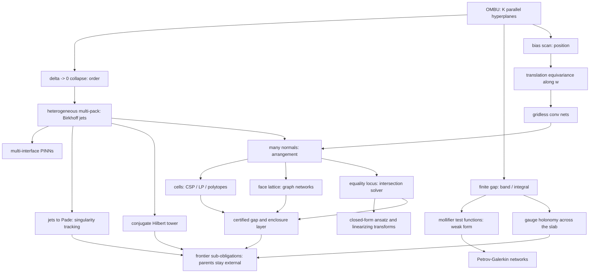

# omnibias theory program

This tree is the **forward-looking research program**: 54 implementation-ready
specs that extend the omnibias primitive beyond what ships today.

It is not the shipped documentation. [`docs/theory.md`](../docs/theory.md) is the
canonical, published primer for what the library *is*; this tree is what the
library *could become*, written so that each file can be handed to an
implementer (human or agent) as a standalone prompt.

## Why this tree lives outside `docs/`

[`tests/test_docs_snippets.py`](../tests/test_docs_snippets.py) executes every
fenced Python block it finds under

```
DOC_GLOBS = ("*.md", "docs/**/*.md", "packages/*/README.md")
```

Specs here describe API that does not exist yet, so putting them under `docs/`
would either break CI or bury every block under a `docs-test` opt-out directive.
`theory/**` is outside those globs. If a spec is later implemented and its
snippets become real, promote the runnable parts into `docs/` and leave the
design record here.

Everything else in the repo still applies: vendor-neutral language
(`packages/omnibias-core/tests/test_no_leakage.py` scans the whole readable
surface) and the terminology guards in
[`tests/test_terminology.py`](../tests/test_terminology.py).

## The one idea, and its four knobs

An OMBU channel is `K` **parallel hyperplanes**: with `z = w . x`, each bias
`b_k` puts a transition on `{x : w . x + b_k = 0}`, and changing `b_k` slides
that plane along `w` without rotating it. Every spec in this tree is a choice
about those planes.

| Knob | What moves | What you get | Specs |
|---|---|---|---|
| **Order** | pack spread `delta -> 0`, `K` planes coalesce | `sigma^(K-1)`, the transverse derivative tower | 01-01, 01-04, 01-11 |
| **Window** | gap held finite | `band` response, `integral` mass, gauge holonomy | 01-05, 02-06, 02-14 |
| **Position** | the pack mean slides / is scanned | translation-equivariant features along `w` | 01-02, 02-01 |
| **Region** | many normals, not one | arrangement cells, faces, polytopes | 01-03, 02-02, 03-02 |
| **Locus** | outputs forced equal | the shared level set as the solution manifold | 01-09, 02-12 |

Two limits are both called "collapse" in the literature around this repo and
must never be conflated:

- **Bias collapse** (the founding one): `K` biases coalesce as the spread
  `delta -> 0`; a finite difference becomes a derivative; the output is a smooth
  `sigma^(K-1)(z + b_mean)`.
- **Temperature collapse** (downstream): one gate is sharpened as
  `beta -> inf`; a soft indicator hardens into a 0/1 feasibility step.

Different limit, different output. Every spec that uses `beta -> inf` says so
explicitly.

## Dependency map



## Index

Status values: **concept** (idea recorded, math sketched), **designed** (math and
API settled, gates named), **gated** (an acceptance gate exists in
`benchmarks/`), **shipped** (code merged; spec becomes a design record).

### 01 Geometry and new primitives

| Spec | Status | One line |
|---|---|---|
| [01-01 multipack Birkhoff collapse](01-geometry/01-multipack-birkhoff-collapse.md) | gated | `MultiPackUnit` shipped; G1/G2/G3/G5 earned (float64 order ceiling recorded; G4 deferred) |
| [01-02 bias scan](01-geometry/02-bias-scan-transverse-convolution.md) | gated | `BiasScan` / `BankSpec`; G1–G3 earned; G4 earned on smoke (not CI-gated) |
| [01-03 arrangement geometry](01-geometry/03-hyperplane-arrangement-geometry.md) | gated | `omnibias.partition.arrangement`; temperature collapse, sampled subgraph, sound gap not P vs NP; G1–G4 CI; cost gates smoke-earned, not in CI `all_passed` |
| [01-04 irregular Birkhoff stencils](01-geometry/04-irregular-birkhoff-stencils.md) | gated | Exact-`Q` weights in `omnibias.difference`; G1–G4 earned |
| [01-05 mollifier calculus](01-geometry/05-mollifier-distribution-calculus.md) | gated | `MollifierSpec` / `tail_bound`; certified exponential tails, not compact support; G1–G3 earned; G4 deferred to VPINN |
| [01-06 OMBU wavelet frames](01-geometry/06-ombu-wavelet-frames.md) | gated | `FrameSpec`; `sigma'` not admissible; not orthonormal / not compactly supported; G1–G3 CI; G4 denoising smoke-earned, not in CI `all_passed` |
| [01-07 order as frequency](01-geometry/07-order-as-frequency-spectral-design.md) | gated | `BandPlan` / `peak_frequency`; pack order is a band selector, not Littlewood-Paley completeness; G1–G2 earned; G3 not in CI `all_passed` |
| [01-08 tropical-log homotopy](01-geometry/08-tropical-log-homotopy.md) | gated | `omnibias.struct._core.tropical`; reuses `logsumexp_gap_bound`; G4 `--full` only; cost gates smoke-earned, not in CI `all_passed` |
| [01-09 equality-locus calculus](01-geometry/09-equality-locus-and-intersection-calculus.md) | gated | Constraint manifold, not a PDE solver; `branch` / `condition` / `converged`; G1–G5 CI; G6 parity |
| [01-10 jet-bundle formalization](01-geometry/10-jet-bundle-formalization.md) | gated | Vocabulary / contact test, not a discovery and not a package |
| [01-11 rational exactness](01-geometry/11-rational-exactness-and-new-lean-obligations.md) | designed | Collapse weights are rationals, so the new math is Lean-checkable |
| [01-12 conjugate Hilbert tower](01-geometry/12-conjugate-hilbert-tower.md) | gated | Line Hilbert only; G1–G4 CI; G5 campaign-artifact, not in CI `all_passed` |

### 02 Architectures

| Spec | Status | One line |
|---|---|---|
| [02-01 scan-net](02-architectures/01-scan-net-gridless-cnn.md) | gated | Stacked scan banks; equivariance per-layer, on-lattice, not `R^D`; G1/G2/G5 earned; G3 cost and G4 k-NN recorded, not CI `all_passed` |
| [02-02 arrangement graph network](02-architectures/02-arrangement-graph-network.md) | gated | Sampled tope subgraph; temperature collapse; sound gap, not P vs NP; G3 vs k-NN smoke/`--full`; cost gates smoke-earned, not in CI `all_passed` |
| [02-03 jet-KAN](02-architectures/03-jet-kan-univariate-basis.md) | gated | Edge-wise univariate bases; exactness of the model jet, not the target; KA theorem does not justify; G2 cost not CI-gated |
| [02-04 weak-form VPINN](02-architectures/04-weak-form-vpinn-closed-test-functions.md) | gated | Exact integrals only for polynomial coeffs on boxes; boundary bound on by default |
| [02-05 multi-interface PINN](02-architectures/05-multi-interface-transmission-pinn.md) | gated | Parallel interfaces; `alpha -> inf` is sharpening, neither collapse |
| [02-06 potential theory and BEM-net](02-architectures/06-potential-theory-and-bem-net.md) | gated | PDE exact off-surface; BC approximated; linear constant-coeff homogeneous; G3 small-N if pack-tree crossover is high |
| [02-07 hierarchical pack tree](02-architectures/07-hierarchical-pack-tree-fmm.md) | gated | 1-D offsets; `eta=0` bit-identical to dense; G3 complexity smoke-recorded, not in CI `all_passed` |
| [02-08 equivariant and manifold scan](02-architectures/08-equivariant-and-manifold-scan.md) | gated | Gaussian-family steering only; discrete `C_L`, not SO(2)/SO(3) |
| [02-09 soliton tanh-method nets](02-architectures/09-soliton-tanh-method-networks.md) | gated | Tanh algebra, not a collapse; multi-kink is not the n-soliton formula; G4 `--full` |
| [02-10 Hermite ladder nets](02-architectures/10-hermite-ladder-oscillator-net.md) | gated | Raw tower is not the QHO eigenbasis; Rodrigues reweight required; G4 FermiNet `--full`; G5 may lose |
| [02-11 transfer-matrix layered media](02-architectures/11-transfer-matrix-layered-media.md) | gated | 1-D ABCD; `continuum_claim=False`; distinct from `geometry.gauge.transfer` |
| [02-12 equality-intersection nets](02-architectures/12-equality-intersection-ansatz-nets.md) | gated | Layer on 01-09; always `branch` / `condition` / `converged`; not a general PDE solver |
| [02-13 linearizing transforms](02-architectures/13-linearizing-transform-layers.md) | gated | Named Cole-Hopf / Miura / Bäcklund / Darboux; exactness to jet order N; 03-11 search stays designed |
| [02-14 Wilson-line holonomy band](02-architectures/14-wilson-line-holonomy-band.md) | gated | Closed form abelian + transverse-constant; open lines gauge-dependent; no YM / mass gap / continuum claim |

### 03 Algorithms and paradigms

| Spec | Status | One line |
|---|---|---|
| [03-01 soft-population evolution](03-algorithms/01-soft-population-evolution.md) | designed | Populations on the temperature axis with jet-informed variation |
| [03-02 arrangement LP](03-algorithms/02-arrangement-lp-and-learned-facets.md) | designed | Learned facets feeding an existing certified argmin |
| [03-03 constraint satisfaction collapse](03-algorithms/03-constraint-satisfaction-collapse.md) | designed | Systems of equalities and inequalities by temperature collapse |
| [03-04 sliced optimal transport](03-algorithms/04-sliced-optimal-transport-cdf.md) | designed | Closed-form directional quantiles make sliced transport exact |
| [03-05 morphology and level sets](03-algorithms/05-differentiable-morphology-levelsets.md) | designed | Layer cake plus scan gives dilation, erosion and level-set flow |
| [03-06 neural quadrature](03-algorithms/06-neural-quadrature-and-cubature.md) | designed | Learned rules whose error is certified, not hoped for |
| [03-07 scale flow and coarse-graining](03-algorithms/07-scale-flow-and-coarse-graining.md) | concept | Free energy, scale space, and schedules as geodesics |
| [03-08 certified scan localization](03-algorithms/08-certified-scan-localization.md) | designed | Sound "the feature is in this slab" statements |
| [03-09 differentiable topology](03-algorithms/09-differentiable-topology-of-arrangements.md) | concept | Euler characteristic and persistence of a soft arrangement |
| [03-10 jet-Pade singularity tracking](03-algorithms/10-jet-pade-singularity-tracking.md) | designed | High-order jets locate the nearest complex singularity |
| [03-11 Lie symmetry discovery](03-algorithms/11-lie-symmetry-discovery-and-equivariant-ansatz.md) | designed | Prolongations are jets, so symmetry search is a linear solve |
| [03-12 exact jet line search](03-algorithms/12-exact-jet-line-search.md) | designed | The step comes from rooting a Taylor polynomial, not backtracking |
| [03-13 adaptive pack refinement](03-algorithms/13-adaptive-pack-refinement.md) | designed | Residual-driven birth, promotion and death of packs |

### 04 Cross-domain bridges

| Spec | Status | One line |
|---|---|---|
| [04-01 information geometry](04-bridges/01-information-geometry-exponential-family.md) | gated | OMBU outputs as sufficient statistics with closed-form Fisher structure; G2 earned (`G_{delta,delta} ~ delta^2/720`) |
| [04-02 uncertainty and conformal slabs](04-bridges/02-uncertainty-calibration-and-conformal-slabs.md) | designed | Slab masses as calibrated, certifiable probabilities |

### 05 Applications

| Spec | Status | One line |
|---|---|---|
| [05-01 inverse problems and imaging](05-applications/01-inverse-problems-and-imaging.md) | gated | Where interfaces are and what kind of jump they carry; G7 earned for locally-seeded estimator (`sd ~ alpha^(n-5/2)`); global search earned for n=3 only |
| [05-02 beyond-PDE applications](05-applications/02-beyond-pde-applications.md) | gated | Tabular arrangements (G1/G2/G3 earned; G4 reported unearned), implicit shapes, causal transverse filters (G5 unearned) |

### 06 Program

| Spec | Status | One line |
|---|---|---|
| [06-01 acceptance gates](06-program/01-acceptance-gates-and-benchmarks.md) | designed | The shared protocol every spec in this tree must satisfy |
| [06-02 honesty and claim boundaries](06-program/02-honesty-and-claim-boundaries.md) | designed | The claim ladder and the forbidden-claims register |
| [06-03 packaging and rollout](06-program/03-packaging-and-rollout.md) | designed | Where each spec lands and in what order |
| [06-04 book outline](06-program/04-book-outline.md) | concept | The monograph spine |

### 07 Frontier sub-obligations

Ambition with the honesty stack intact. Every file in this group names its
external parent and states why the parent stays external.

| Spec | Status | One line |
|---|---|---|
| [07-01 sub-obligation ledger](07-frontier/01-sub-obligation-ledger.md) | designed | Parent, sub-obligation, gate, sealed scope, forbidden sentence |
| [07-02 Navier-Stokes adjacent](07-frontier/02-navier-stokes-adjacent.md) | designed | Finite, local certified statements; global regularity stays external |
| [07-03 CCF campaign acceleration](07-frontier/03-ccf-campaign-acceleration.md) | gated | A basis-level attack on the recorded dictionary floor |
| [07-04 Yang-Mills adjacent](07-frontier/04-yang-mills-adjacent-holonomy-and-gap.md) | gated | Holonomy trials on one fixed matrix, plus a two-plaquette Hamiltonian `λ1-λ0`; the mass gap stays external |
| [07-05 spectral floors and positivity](07-frontier/05-spectral-floors-and-positivity.md) | designed | Eigenvalue lower bounds with better trial spaces |
| [07-06 validated dynamics and orbits](07-frontier/06-validated-dynamics-and-orbits.md) | designed | Closed-form Jacobians inside validated flow |
| [07-07 Nobel-adjacent domains](07-frontier/07-nobel-adjacent-domain-programs.md) | concept | Tooling contributions to quantum many-body, plasma, materials |

## How to use a spec

1. Read section 3 ("Prior art") first. It names the exact modules that already
   exist. If the delta has shrunk since the spec was written, fix the spec
   before writing code.
2. Section 8 ("Acceptance gates") is the contract. If you cannot state the gate,
   the idea is not ready.
3. Section 10 ("Honesty and scope") is not decoration. It is what keeps a strong
   local result from being read as a claim it does not support.
4. Follow [`_TEMPLATE.md`](_TEMPLATE.md) when adding a new spec, and add a row to
   the index above.

## Wave-0 falsifier outcomes

Recorded per [`06-program/03-packaging-and-rollout.md`](06-program/03-packaging-and-rollout.md)
section 12. Ambiguous outcomes count as failure.

| Unit | Gate | Artifact | Outcome |
|---|---|---|---|
| A6 | 04-01 G2 (`G_{delta,delta}` exponent `2.00 +- 0.02`, prefactor `1/720`) | [`docs/benchmarks/information_geometry.json`](../docs/benchmarks/information_geometry.json) | **passed** — licenses D8; G1/G3–G5 unearned; `K>=3` Fisher recorded inapplicable (not a density) |
| A7 | 05-01 G7 (`sd(tau_hat) ~ alpha^(n-5/2)`, tol `0.1`, `n in {3,4}`) | [`docs/benchmarks/inverse_imaging.json`](../docs/benchmarks/inverse_imaging.json) | **passed** (locally seeded; 5 seeds, worst-seed) — licenses smallest-alpha design rule; worst deviations `0.016` / `0.031`; global search earned for n=3 only (n=4 boundary artifact); G1–G6 unearned |
| A4 | 05-02 G1 / G2 / G3 / G3b | [`docs/benchmarks/tabular_arrangement.json`](../docs/benchmarks/tabular_arrangement.json), [`docs/benchmarks/tabular_arrangement_public.json`](../docs/benchmarks/tabular_arrangement_public.json), [`docs/benchmarks/tabular_arrangement_capacity.json`](../docs/benchmarks/tabular_arrangement_capacity.json) | **passed** G1–G3 (G3 frozen W/L/T `2/5/1`); **G3b unearned** (`boost_h2` not-worse `4/8`, need `>=6/8`); G4 unearned; G5–G7 unearned |
| A5 | 05-02 G5 | — | not run |

## Wave-1 primitives

Code now exists for all three Wave-1 primitives (no new packages). **01-01**
is gated (G1/G2/G3/G5 earned; G4 deferred). **01-02** is gated (G1–G3 CI-gated;
G4 earned on smoke, not in CI `all_passed`). **01-04** is gated (G1–G4 earned).
