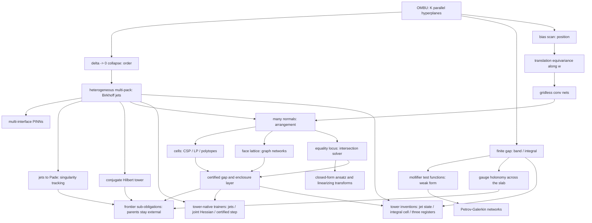

# omnibias theory program

This tree is the **forward-looking research program**: 94 implementation-ready
specs that extend the omnibias primitive beyond what ships today.

It is not the shipped documentation. [`docs/theory.md`](../docs/theory.md) is the
canonical, published primer for what the library *is*; this tree is what the
library *could become*, written so that each file can be handed to an
implementer (human or agent) as a standalone prompt.

## Why this tree lives outside `docs/`

[`tests/test_docs_snippets.py`](../tests/test_docs_snippets.py) executes every
fenced Python block it finds under

```
DOC_GLOBS = ("*.md", "docs/**/*.md", "packages/*/README.md")
```

Specs here describe API that does not exist yet, so putting them under `docs/`
would either break CI or bury every block under a `docs-test` opt-out directive.
`theory/**` is outside those globs. If a spec is later implemented and its
snippets become real, promote the runnable parts into `docs/` and leave the
design record here.

Everything else in the repo still applies: vendor-neutral language
(`packages/omnibias-core/tests/test_no_leakage.py` scans the whole readable
surface) and the terminology guards in
[`tests/test_terminology.py`](../tests/test_terminology.py).

## The one idea, and its four knobs

An OMBU channel is `K` **parallel hyperplanes**: with `z = w . x`, each bias
`b_k` puts a transition on `{x : w . x + b_k = 0}`, and changing `b_k` slides
that plane along `w` without rotating it. Every spec in this tree is a choice
about those planes.

| Knob | What moves | What you get | Specs |
|---|---|---|---|
| **Order** | pack spread `delta -> 0`, `K` planes coalesce | `sigma^(K-1)`, the transverse derivative tower | 01-01, 01-04, 01-11 |
| **Window** | gap held finite | `band` response, `integral` mass, gauge holonomy | 01-05, 02-06, 02-14 |
| **Position** | the pack mean slides / is scanned | translation-equivariant features along `w` | 01-02, 02-01 |
| **Region** | many normals, not one | arrangement cells, faces, polytopes | 01-03, 02-02, 03-02 |
| **Locus** | outputs forced equal | the shared level set as the solution manifold | 01-09, 02-12 |

Three limits are called "collapse" in the literature around this repo and
must never be conflated:

- **Bias collapse** (the founding one): `K` biases coalesce as the spread
  `delta -> 0`; a finite difference becomes a derivative; the output is a smooth
  `sigma^(K-1)(z + b_mean)`.
- **Temperature collapse** (downstream): one gate is sharpened as
  `beta -> inf`; a soft indicator hardens into a 0/1 feasibility step.
- **Enclosure Collapse** (verified register): a sound enclosure shrinks as
  `width -> 0`; the output is a point **plus a proof**, or `Inconclusive`.
  Not a derivative and not a 0/1 step (spec 01-14).

Different limit, different output. Every spec that uses `beta -> inf` says so
explicitly.

## Dependency map



## Index

Status values: **concept** (idea recorded, math sketched), **designed** (math and
API settled, gates named), **gated** (an acceptance gate exists in
`benchmarks/`), **shipped** (code merged; spec becomes a design record).

### 01 Geometry and new primitives

| Spec | Status | One line |
|---|---|---|
| [01-01 multipack Birkhoff collapse](01-geometry/01-multipack-birkhoff-collapse.md) | shipped | `MultiPackUnit` shipped; G1–G5 earned (float64 order ceiling recorded; two-interface span beats OperatorBlock / OMBU / JetMLP) |
| [01-02 bias scan](01-geometry/02-bias-scan-transverse-convolution.md) | shipped | `BiasScan` / `BankSpec`; G1–G4 in CI `all_passed`; 01-13 G5 earned |
| [01-03 arrangement geometry](01-geometry/03-hyperplane-arrangement-geometry.md) | shipped | `omnibias.partition.arrangement`; temperature collapse, sampled subgraph, sound gap not P vs NP; G1–G4 CI; cost vs `n`/`D` **leftover-recorded** (leftover #18; cutoff `n<=12`, `D<=4`), not in CI `all_passed` |
| [01-04 irregular Birkhoff stencils](01-geometry/04-irregular-birkhoff-stencils.md) | shipped | Exact-`Q` weights in `omnibias.difference`; G1–G4 earned |
| [01-05 mollifier calculus](01-geometry/05-mollifier-distribution-calculus.md) | shipped | `MollifierSpec` / `tail_bound`; certified exponential tails, not compact support; G1–G4 in CI `all_passed` |
| [01-06 OMBU wavelet frames](01-geometry/06-ombu-wavelet-frames.md) | shipped | `FrameSpec`; `sigma'` not admissible; not orthonormal / not compactly supported; G1–G3 CI; G4 denoising **leftover-recorded** (leftover #10; `5/5` MSE, `0/5` skill), not in CI `all_passed` |
| [01-07 order as frequency](01-geometry/07-order-as-frequency-spectral-design.md) | shipped | `BandPlan` / `peak_frequency`; pack order is a band selector, not Littlewood-Paley completeness; G1–G2/G4 earned; G3 **leftover-recorded** (leftover #40; `0/5` Mscale hits), not in CI `all_passed` |
| [01-08 tropical-log homotopy](01-geometry/08-tropical-log-homotopy.md) | shipped | `omnibias.struct._core.tropical`; reuses `logsumexp_gap_bound`; G4 path-following **earned** (leftover #32 closed; `path_follow` wired to `AnnealSchedule`); cost vs `n`/`D` **leftover-recorded** (leftover #19; refuses `n>10` or `D>3`), not in CI `all_passed` |
| [01-09 equality-locus calculus](01-geometry/09-equality-locus-and-intersection-calculus.md) | shipped | Constraint manifold, not a PDE solver; `branch` / `condition` / `converged`; G1–G5 CI; G6 parity |
| [01-10 jet-bundle formalization](01-geometry/10-jet-bundle-formalization.md) | shipped | Vocabulary / contact test, not a discovery and not a package; G1–G3 **earned** (`is_holonomic` 220/220, residual rates `~1/4` vs `~1/2`, dictionary terms in other specs) |
| [01-11 rational exactness](01-geometry/11-rational-exactness-and-new-lean-obligations.md) | shipped | Collapse weights are rationals; `C_j` / poisedness are Lean-checkable; G1–G5 earned (kernel pass in the Lean job); algebra only, not the collapse |
| [01-12 conjugate Hilbert tower](01-geometry/12-conjugate-hilbert-tower.md) | shipped | Line Hilbert only; G1–G4 CI; G5 campaign-artifact **leftover-recorded** (leftover #11; matched-width ratio `0.978`, need `10x`), not in CI `all_passed` |
| [01-13 operator family](01-geometry/13-operator-family.md) | gated | Scan of the six roles; catalog + rejects; not a seventh `op`; first spend `BiasScan(op="integral")` shipped; 09-14 gated |
| [01-14 Enclosure Collapse](01-geometry/14-enclosure-collapse-and-width-law.md) | shipped | Width Law + six `squeeze_*` wrappers; `width -> 0` of a sound enclosure (a point plus a proof); not a package; not bias collapse |

### 02 Architectures

| Spec | Status | One line |
|---|---|---|
| [02-01 scan-net](02-architectures/01-scan-net-gridless-cnn.md) | shipped | Stacked scan banks; equivariance per-layer, on-lattice, not `R^D`; G1/G2/G3/G5 earned (G3 wall/point vs named k-NN over two decades); G4 k-NN boundary **leftover-recorded** (leftover #17: Scan-Net lstsq wins `5/5`; k-NN is allowed to win), not CI `all_passed` |
| [02-02 arrangement graph network](02-architectures/02-arrangement-graph-network.md) | shipped | Sampled tope subgraph; temperature collapse; sound gap, not P vs NP; G3 vs k-NN **leftover-recorded** (leftover #28; 0-hop centroid; GNN / `RegionModels` stay `--full`); cost vs `n`/`D` **leftover-recorded** (leftover #20; cutoff `n<=12`, `D<=4`), not in CI `all_passed` |
| [02-03 jet-KAN](02-architectures/03-jet-kan-univariate-basis.md) | shipped | Edge-wise univariate bases; exactness of the model jet, not the target; KA theorem does not justify; G1/G3/G5 CI; G2 cost **leftover-recorded** (leftover #41; ~2.2x vs autodiff, need 5x), not CI `all_passed` |
| [02-04 weak-form VPINN](02-architectures/04-weak-form-vpinn-closed-test-functions.md) | shipped | Exact integrals only for polynomial coeffs on boxes; boundary bound on by default; G4 conditioning **earned** (`cond` strong/weak `>> 10x`) |
| [02-05 multi-interface PINN](02-architectures/05-multi-interface-transmission-pinn.md) | shipped | Parallel interfaces; `alpha -> inf` is sharpening, neither collapse; G3 vs PartitionedField / FBPINN **leftover-recorded** (leftover #37; linear stand-in); G4 hard vs penalized **leftover-recorded** (leftover #38; zero-coeff soft); training stays `--full`, not in CI `all_passed` |
| [02-06 potential theory and BEM-net](02-architectures/06-potential-theory-and-bem-net.md) | shipped | PDE exact off-surface; BC approximated; linear constant-coeff homogeneous; G2 disc-accuracy **earned** (leftover #24 closed; `circle_dirichlet_density` annulus L2); single-layer cost **leftover-recorded** (leftover #42); G3 exterior win **leftover-recorded** (leftover #30; pack-tree has a crossover; no volume PINN), not in CI `all_passed` |
| [02-07 hierarchical pack tree](02-architectures/07-hierarchical-pack-tree-fmm.md) | shipped | 1-D offsets; `eta=0` bit-identical to dense; G3 complexity **earned** (leftover #13 closed; cached `O(p)` multipole, dense crossover) |
| [02-08 equivariant and manifold scan](02-architectures/08-equivariant-and-manifold-scan.md) | shipped | Gaussian-family steering only; discrete `C_L`, not SO(2)/SO(3); G5 anisotropic-interface **leftover-recorded** (leftover #25; `--full`, no task loop); orbit cost **leftover-recorded** (leftover #43), not in CI `all_passed` |
| [02-09 soliton tanh-method nets](02-architectures/09-soliton-tanh-method-networks.md) | shipped | Tanh algebra, not a collapse; multi-kink is not the n-soliton formula; G4 PINN init-win **leftover-recorded** (leftover #22; `--full`, no train); algebraic cost **leftover-recorded** (leftover #44), not in CI `all_passed` |
| [02-10 Hermite ladder nets](02-architectures/10-hermite-ladder-oscillator-net.md) | shipped | Raw tower is not the QHO eigenbasis; Rodrigues reweight required; G4 FermiNet many-body **leftover-recorded** (leftover #21; `--full`); exact-ladder vs FD **leftover-recorded** (leftover #45); G5 anharmonic **leftover-recorded** (leftover #26; loses to FD grid), not in CI `all_passed` |
| [02-11 transfer-matrix layered media](02-architectures/11-transfer-matrix-layered-media.md) | shipped | 1-D ABCD; `continuum_claim=False`; distinct from `geometry.gauge.transfer`; G4 inverse-design **leftover-recorded** (leftover #23; `--full`, no optimizer); stack cost **leftover-recorded** (leftover #46); G5 conservation **leftover-recorded** (leftover #27; no MLP surrogate), not in CI `all_passed` |
| [02-12 equality-intersection nets](02-architectures/12-equality-intersection-ansatz-nets.md) | shipped | Layer on 01-09; always `branch` / `condition` / `converged`; not a general PDE solver; G4 Burgers RH **leftover-recorded** (leftover #29; clean speed from `affine_locus`; noisy contour stays `--full`), not in CI `all_passed` |
| [02-13 linearizing transforms](02-architectures/13-linearizing-transform-layers.md) | shipped | Named Cole-Hopf / Miura / Bäcklund / Darboux; exactness to jet order N; G1 jet identity CI; G3 Burgers **leftover-recorded** (leftover #39; no train vs direct PINN), not in CI `all_passed`; 03-11 search stays designed |
| [02-14 Wilson-line holonomy band](02-architectures/14-wilson-line-holonomy-band.md) | shipped | Closed form abelian + transverse-constant; open lines gauge-dependent; no YM / mass gap / continuum claim; G2 closed-form **earned** vs PRODUCT `substeps=4096`; G3 Magnus **leftover-recorded** (leftover #34; no Magnus holonomy API); G4 gauge covariance **earned** (leftover #35 closed; `random_u1_gauge`), not a YM / mass-gap claim |

### 03 Algorithms and paradigms

| Spec | Status | One line |
|---|---|---|
| [03-01 soft-population evolution](03-algorithms/01-soft-population-evolution.md) | shipped | Softmax selection + `log(P)/beta` gap; geometry mutation; exact-curvature polish; certify-loop stop; G1–G6 CI; temperature collapse, not founding bias collapse; not P vs NP |
| [03-02 arrangement LP](03-algorithms/02-arrangement-lp-and-learned-facets.md) | shipped | Learned-facet front end on `solve_lp` + NS bound; G1–G5 CI; temperature collapse, not founding bias collapse; not a new LP algorithm |
| [03-03 constraint satisfaction collapse](03-algorithms/03-constraint-satisfaction-collapse.md) | shipped | Finite-domain CSP + two `beta` schedules + soft AC; G1–G6 CI; temperature collapse, not founding bias collapse; not a complete solver; not P vs NP |
| [03-04 sliced optimal transport](03-algorithms/04-sliced-optimal-transport-cdf.md) | shipped | Exact 1-D `W_1` of activation mixtures + sliced average; G1–G6 CI; founding bias collapse, not temperature collapse; exact per slice, not sample-free; not Wasserstein |
| [03-05 morphology and level sets](03-algorithms/05-differentiable-morphology-levelsets.md) | shipped | Soft dilation / erosion via `logsumexp_beta`; G1–G6 CI; temperature collapse, not founding bias collapse; gap is worst-case; not a seventh OperatorBlock role |
| [03-06 neural quadrature](03-algorithms/06-neural-quadrature-and-cubature.md) | shipped | Moment-solved quadrature + Peano enclosure; G1–G5 CI; founding bias collapse, not temperature collapse; refuses without a derivative bound; no non-product cubature |
| [03-07 scale flow and coarse-graining](03-algorithms/07-scale-flow-and-coarse-graining.md) | shipped | Exact `alpha^n` rescaling + linear coarse-graining + derived band schedule; G1–G6 CI; `alpha` is a tempering scale, not a collapse; nonlinear flow is a recorded truncation |
| [03-08 certified scan localization](03-algorithms/08-certified-scan-localization.md) | shipped | Krawczyk unique-peak enclosure of a scan response; G1–G6 CI; founding bias collapse, not temperature collapse; `Inconclusive` is first-class; `local_box`; not `theorem_prover_verified` |
| [03-09 differentiable topology](03-algorithms/09-differentiable-topology-of-arrangements.md) | shipped | Soft Euler / component counts + 1-D Morse persistence; G1–G6 CI; temperature collapse, not founding bias collapse; no differentiable Betti number; `Inconclusive` when the gap does not separate |
| [03-10 jet-Pade singularity tracking](03-algorithms/10-jet-pade-singularity-tracking.md) | shipped | Domb-Sykes + Padé poles + certified `|x_s|` annulus; G1–G6 CI; founding bias collapse, not temperature collapse; diagnostic, not a blow-up proof |
| [03-11 Lie symmetry discovery](03-algorithms/11-lie-symmetry-discovery-and-equivariant-ansatz.md) | shipped | Point symmetries in a declared ansatz; G1–G6 CI; founding bias collapse, not temperature collapse; in-ansatz rank, not a classification |
| [03-12 exact jet line search](03-algorithms/12-exact-jet-line-search.md) | shipped | Certified radius + `verify=True` never-worse; G1/G2/G3/G6 CI; G4 step-count **leftover-recorded** (leftover #47; strong Wolfe, 1.83x, need 2x), G5 order×depth crossover **leftover-recorded** (leftover #48), not CI `all_passed` |
| [03-13 adaptive pack refinement](03-algorithms/13-adaptive-pack-refinement.md) | shipped | Birth/growth bit-identical; death reports a bound; G1–G6 CI; G4 **earned** (indicator birth vs matched-count fixed on the named BL) |

### 04 Cross-domain bridges

| Spec | Status | One line |
|---|---|---|
| [04-01 information geometry](04-bridges/01-information-geometry-exponential-family.md) | shipped | Pack-parameter Fisher in `omnibias.curvature.information`; G1–G5 earned (`G_{delta,delta} ~ delta^2/720`) |
| [04-02 uncertainty and conformal slabs](04-bridges/02-uncertainty-calibration-and-conformal-slabs.md) | shipped | Three guarantee kinds stay apart; G1–G6 CI; conformal is not sealable |

### 05 Applications

| Spec | Status | One line |
|---|---|---|
| [05-01 inverse problems and imaging](05-applications/01-inverse-problems-and-imaging.md) | shipped | `omnibias.pinn.inverse`; G1–G7 earned (locally-seeded `sd ~ alpha^(n-5/2)`; global search earned for n=3 only) |
| [05-02 beyond-PDE applications](05-applications/02-beyond-pde-applications.md) | shipped | Tabular arrangements (G1/G2/G3 earned; G3b leftover-recorded leftover #49 `4/8`, G4 leftover-recorded leftover #50 `0.25`, neither in CI `all_passed`); shape topology G6/G7 earned; sequence filter **earned** (G5 vs S4D; order-0 tail, width = horizon) |

### 06 Program

| Spec | Status | One line |
|---|---|---|
| [06-01 acceptance gates](06-program/01-acceptance-gates-and-benchmarks.md) | shipped | Shared protocol; enclosure / parity / cost helpers + artifact classifier |
| [06-02 honesty and claim boundaries](06-program/02-honesty-and-claim-boundaries.md) | shipped | Claim ladder + forbidden-claims register; guards in core tests |
| [06-03 packaging and rollout](06-program/03-packaging-and-rollout.md) | shipped | G1–G5 **earned** (42 packages, 94/94 homes, Wave-0 A4–A7 recorded; G4 vacuous; G5 vacuous — 2 consumers, 389 lines, not promoted); no new distribution |
| [06-04 book outline](06-program/04-book-outline.md) | concept | Monograph spine only; no `book/` tree; drafting still forbidden |
| [06-05 public primitive and citation path](06-program/05-public-primitive-and-citation-path.md) | shipped | Publish-and-use order for the shipped object; obligation-3 `jet_vs_nested_ad` earned; extract / paper / external stay later; CCF and Group 09 are not the public face |

### 07 Frontier sub-obligations

Ambition with the honesty stack intact. Every file in this group names its
external parent and states why the parent stays external.

| Spec | Status | One line |
|---|---|---|
| [07-01 sub-obligation ledger](07-frontier/01-sub-obligation-ledger.md) | shipped | Parent, sub-obligation, gate, sealed scope, never-write, distance; RH is a non-entry |
| [07-02 Navier-Stokes adjacent](07-frontier/02-navier-stokes-adjacent.md) | shipped | Weak-form width split + exact-jet Lohner; G1–G6 CI; founding bias collapse, not temperature collapse; not a continuum regularity claim |
| [07-03 CCF campaign acceleration](07-frontier/03-ccf-campaign-acceleration.md) | gated | A basis-level attack on the recorded dictionary floor |
| [07-04 Yang-Mills adjacent](07-frontier/04-yang-mills-adjacent-holonomy-and-gap.md) | shipped | Holonomy trials, 6j / 3-plaquette Hamiltonians, two-scale polymer, Lipschitz SU(3) Haar, and a 2+1-D strip; the mass gap stays external |
| [07-05 spectral floors and positivity](07-frontier/05-spectral-floors-and-positivity.md) | shipped | Multi-pack trial spaces + arrangement-adapted SOS; G1–G6 CI; founding bias collapse, not temperature collapse; not a continuum spectral gap or Yang-Mills mass gap |
| [07-06 validated dynamics and orbits](07-frontier/06-validated-dynamics-and-orbits.md) | shipped | Exact-Jacobian jet Lohner + width budget; G1–G6 CI; founding bias collapse, not temperature collapse; finite horizon, not a continuum existence theorem |
| [07-07 Nobel-adjacent domains](07-frontier/07-nobel-adjacent-domain-programs.md) | shipped | Exact ladder + Harris layer + exact `dT/dθ`; G0–G6 CI; tooling, not a discovery; founding bias collapse, not temperature collapse |

### 08 Tower-native training

Optimizers (how to step `theta` given `L`) and learning rules (what a layer
may use before `L` is known). The tower is Faà di Bruno — not a skip of the
chain rule, and not a global solver. CCF stretch stays an operator floor.

| Spec | Status | One line |
|---|---|---|
| [08-01 training-idea ledger](08-training/01-training-idea-ledger.md) | shipped | Taxonomy, rejects, recommended stack; trainers do not clear Hilbert stretch |
| [08-02 composed-curvature joint Newton](08-training/02-composed-curvature-joint-newton.md) | shipped | Order-2 chain rule on `(W_{ell-1}, W_ell)`; escape a slice min if the joint block is indefinite; G1–G4 CI |
| [08-03 depth-causal local jet](08-training/03-depth-causal-local-jet.md) | shipped | Forward `layer_jet` + local GN; `k` directions only; warm-start, not ImageNet; G1–G4 CI |
| [08-04 Kantorovich-accepted Newton](08-training/04-kantorovich-accepted-newton.md) | shipped | Take a GN/cubic step only if a unique-zero ball is nonempty; G1–G3 CI |
| [08-05 depth-causal residual](08-training/05-depth-causal-residual.md) | shipped | March the PDE residual in network depth; not CCF Hilbert; G1–G3 CI |
| [08-06 sharpness-scheduled step](08-training/06-sharpness-scheduled-step.md) | shipped | Exact HVP `lambda_max` sets cubic `sigma` / lr; G1–G3 CI |
| [08-07 block exact search](08-training/07-block-exact-search.md) | shipped | Structured 03-12 on OMBU / last linear / arrangement; G1–G4 CI |
| [08-08 implicit DEQ Newton](08-training/08-implicit-deq-newton.md) | shipped | `u = sigma(W u + x)` with exact-`sigma'` IFT; no unrolled BPTT; G1–G3 CI |
| [08-09 certified step](08-training/09-certified-step.md) | gated | Accept `theta'` only if a verify Lipschitz / output box stays in cap; G1–G3 CI |

### 09 Tower inventions

Architectures, learning rules, and exports that spend the unused `integral`
role, jet-valued state, or the three-register algebra, and that are not already
first-class specs in Groups 02–05 or 08. Entries and the ledger are gated.
Trainers that step `theta` given `L` stay in Group 08. CCF stretch stays an
operator floor.

| Spec | Status | One line |
|---|---|---|
| [09-01 invention ledger](09-inventions/01-invention-ledger.md) | gated | Already-specified map, rejects, first-bet ranking; inventions do not clear Hilbert stretch |
| [09-02 jet-token transformer](09-inventions/02-jet-token-transformer.md) | gated | `compose_jet` mix, not softmax-of-values; G1–G3 CI; model jet, not ImageNet; founding bias collapse, not temperature collapse |
| [09-03 FTC-Net](09-inventions/03-ftc-net.md) | gated | Integral cell + collapse head; G1–G3 CI; not a VPINN; founding bias collapse, not temperature collapse |
| [09-04 Frame-UNet](09-inventions/04-frame-unet.md) | gated | Order encoder + integral decoder; G1–G4 CI; band skip is not a collapse head; founding bias collapse, not temperature collapse |
| [09-05 Taylor-model neuron](09-inventions/05-taylor-model-neuron.md) | gated | Unit output is a `TaylorModel`; G1–G4 CI; remainder sound, not a deep-net certificate; founding bias collapse, not temperature collapse |
| [09-06 coupling Jet-Flow](09-inventions/06-coupling-jet-flow.md) | gated | Finite couplings; closed-form `sum log sigma'`; G1–G3 CI; not `integrate_cnf`; founding bias collapse, not temperature collapse |
| [09-07 Pack-MoE](09-inventions/07-pack-moe.md) | gated | Slab-mass router over pack experts; G1–G3 CI; not softmax; founding bias collapse, not temperature collapse |
| [09-08 Characteristic-Net](09-inventions/08-characteristic-net.md) | gated | Transport along learned `v` with a time integral; G1–G4 CI; shock flag; not 02-13; founding bias collapse, not temperature collapse |
| [09-09 sheaf-atlas net](09-inventions/09-sheaf-atlas-net.md) | gated | Jet transition maps; G1–G4 CI; cocycle residual to order N; founding bias collapse, not temperature collapse |
| [09-10 Riccati flow net](09-inventions/10-riccati-flow-net.md) | gated | Depth is Riccati time; G1–G4 CI; not DEQ and not CNF; founding bias collapse only for jets in `s0` |
| [09-11 Collapse-Net](09-inventions/11-collapse-net.md) | gated | Train stencils; infer by founding `delta -> 0` collapse; G1–G4 CI; not a continuum PDE |
| [09-12 holonomic layer](09-inventions/12-holonomic-layer.md) | gated | Block is an Ore annihilator; G1–G4 CI; D-finite class only |
| [09-13 jet-Hopfield](09-inventions/13-jet-hopfield.md) | gated | Memories are germs; G1–G4 CI; contact match, not vector Hopfield |
| [09-14 integral-kernel operator](09-inventions/14-integral-kernel-operator.md) | gated | Volumetric DeepONet kernel is an OMBU `integral`; G1–G4 CI; not BEM-Net; founding bias collapse, not temperature collapse |
| [09-15 q-OMBU / timescale](09-inventions/15-q-ombu-timescale.md) | gated | Hybrid q / Hilger layers; G1–G4 CI; named `q -> 1` / `mu -> 0`, not a continuum PDE |
| [09-16 exact MAML](09-inventions/16-exact-maml.md) | gated | Inner exact GN / HVP; IFT meta-grad; G1–G3 CI; not ImageNet; founding bias collapse, not temperature collapse |
| [09-17 dual-FTC training](09-inventions/17-dual-ftc-training.md) | gated | Dual `r_D`/`r_I` on the 09-03 cell; G1–G3 CI; not a VPINN; founding bias collapse, not temperature collapse |
| [09-18 remainder training](09-inventions/18-remainder-training.md) | gated | Loss is `R_N`; optional 03-13 birth hook; G1–G4 CI; not 03-10; founding bias collapse, not temperature collapse |
| [09-19 jet distillation](09-inventions/19-jet-distillation.md) | gated | Student matches a teacher N-jet; G1–G3 CI; not ImageNet KD; founding bias collapse, not temperature collapse |
| [09-20 homotopy continuation](09-inventions/20-homotopy-continuation.md) | gated | Path of problems; each step 08-04-accepted; G1–G4 CI; empty ball is a halt |
| [09-21 exact score matching](09-inventions/21-exact-score-matching.md) | gated | Hyvärinen on an OMBU score; G1–G4 CI; CNF exact `div` is prior art |
| [09-22 inverse-design](09-inventions/22-inverse-design.md) | gated | Newton-on-`x` with exact `sigma'`; G1–G4 CI; not 08-03 layer invert |
| [09-23 sharpness regularizer](09-inventions/23-sharpness-regularizer.md) | gated | Exact `lambda_max` / `Tr(H)` in the loss; G1–G4 CI; not 08-06 schedule |
| [09-24 proof-carrying forward](09-inventions/24-proof-carrying-forward.md) | gated | Forward returns `(y, box)`; G1–G4 CI; not 08-09; Lean flags unforged; founding bias collapse, not temperature collapse |
| [09-25 world-model-as-jet](09-inventions/25-world-model-jet.md) | gated | Next N-jet + Lohner remainder; G1–G4 CI; not NS global regularity |
| [09-26 net-to-annihilator](09-inventions/26-net-to-annihilator.md) | gated | Ore export + finite rational Lean only; G1–G4 CI; flags future-earned |
| [09-27 parameter-space jets](09-inventions/27-parameter-space-jets.md) | gated | Mixed `∂^{α,β} u / ∂x^α ∂μ^β`; G1–G5 CI; closed form iff `μ` enters the tower; not a ParamPINN package |
| [09-28 sliced-jet encoder](09-inventions/28-sliced-jet-encoder.md) | gated | Tokens are scan jets + named energy; G1–G5 CI; not a ViT; not `R^D` |

## How to use a spec

1. Read section 3 ("Prior art") first. It names the exact modules that already
   exist. If the delta has shrunk since the spec was written, fix the spec
   before writing code.
2. Section 8 ("Acceptance gates") is the contract. If you cannot state the gate,
   the idea is not ready.
3. Section 10 ("Honesty and scope") is not decoration. It is what keeps a strong
   local result from being read as a claim it does not support.
4. Follow [`_TEMPLATE.md`](_TEMPLATE.md) when adding a new spec, and add a row to
   the index above.

## Wave-0 falsifier outcomes

Recorded per [`06-program/03-packaging-and-rollout.md`](06-program/03-packaging-and-rollout.md)
section 12. Ambiguous outcomes count as failure.

| Unit | Gate | Artifact | Outcome |
|---|---|---|---|
| A6 | 04-01 G2 (`G_{delta,delta}` exponent `2.00 +- 0.02`, prefactor `1/720`) | [`docs/benchmarks/information_geometry.json`](../docs/benchmarks/information_geometry.json) | **passed** — licenses D8; G1/G3–G5 earned on the product API; `K>=3` Fisher recorded inapplicable (not a density) |
| A7 | 05-01 G7 (`sd(tau_hat) ~ alpha^(n-5/2)`, tol `0.1`, `n in {3,4}`) | [`docs/benchmarks/inverse_imaging.json`](../docs/benchmarks/inverse_imaging.json) | **passed** (locally seeded; 5 seeds, worst-seed) — licenses smallest-alpha design rule; worst deviations `0.016` / `0.031`; global search earned for n=3 only (n=4 boundary artifact); G1–G6 earned on `omnibias.pinn.inverse` |
| A4 | 05-02 G1 / G2 / G3 / G3b | [`docs/benchmarks/tabular_arrangement.json`](../docs/benchmarks/tabular_arrangement.json), [`docs/benchmarks/tabular_arrangement_public.json`](../docs/benchmarks/tabular_arrangement_public.json), [`docs/benchmarks/tabular_arrangement_capacity.json`](../docs/benchmarks/tabular_arrangement_capacity.json) | **passed** G1–G3 (G3 frozen W/L/T `2/5/1`); **G3b unearned** (`boost_h2` not-worse `4/8`, need `>=6/8`); G4 unearned; G5 **earned** (see A5); G6/G7 **earned** on [`shape_topology_smoke.json`](../docs/benchmarks/shape_topology_smoke.json) |
| A5 | 05-02 G5 (filter `R^2` within `0.02` of S4D, 5 seeds, worst-seed) | [`docs/benchmarks/sequence_transverse_smoke.json`](../docs/benchmarks/sequence_transverse_smoke.json) | **earned** — worst-seed `R^2` gap `0.0013` (filter `0.9984` vs S4D `0.9998`); order-0 logistic tail, `width=T`; first protocol (order-1 bump, `W=24`) was a miss; sequence submodule shipped |

No Wave-0 unit is marked **failed** and no index row is `retired`
(06-03 G4: vacuous deletion discipline; unearned leftover gates
are not spec-killing failures). Index check, not a same-commit proof.

## Wave-1 primitives

Code now exists for all three Wave-1 primitives (no new packages). **01-01**
is shipped (G1–G5 earned). **01-02** is shipped (G1–G4 CI-gated;
01-13 G5 earned). **01-04** is shipped (G1–G4 earned).
